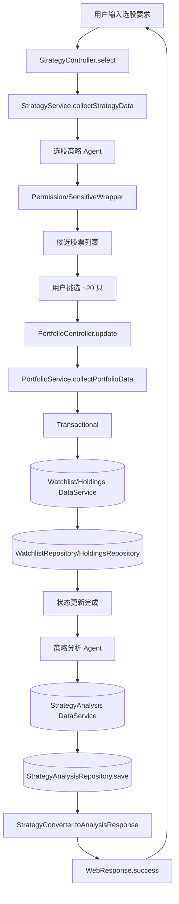

# 股票分析多 Agent 框架设计说明

> 目标：实现一个可扩展、可记忆、可调度的股票分析系统，覆盖公司信息收集、行情获取、选股与策略分析、资金投资建议、阶段性总结；数据优先读取数据库，缺失时通过 MCP 适配层拉取并落库。

> 文档导航（单一事实来源 SSoT）
> - 当前项目权威版本：`docs/prd-v1.md`（项目设计与解决方案 PRD v1）
> - 数据库表结构：`docs/db-schema-v1.md`
> - 参考文档：
>   - `docs/one-page-stock-center.md`（单页股票中心与 Modal 编排；核心信息已并入 PRD v1）
>   - `docs/multi-user-multi-account.md`（多用户/多账户设计；核心信息已并入 PRD v1）
> - 说明：如与 PRD v1 存在不一致，以 `docs/prd-v1.md` 为准。

## 架构总览
- 多入口统一模式：`Controller/Facade/MQListener → Service → DataService/Repository`
- 防腐与工具层：`Converter`（静态）、`Rule`（静态）、`Wrapper`（静态）
- 外部服务接入：`Adapter（MCP）` 负责协议转换、异常与重试
- 关键原则：
  - Controller 方法 ≤ 5 行，仅接收参数 → 调 Service.collect{Domain}Data → Converter.toResponse → 返回 `WebResponse.success()`
  - Service 为业务逻辑防腐层，协调流程、规则校验、权限包装；不直接操作基础设施
  - DataService 统一聚合访问多数据源（Repository/Redis/ES），无业务逻辑
  - Repository 仅负责数据库访问与事务
  - 严禁跨层调用与魔法值；工具类（Converter/Rule/Wrapper）全部静态方法

## 多 Agent 角色
- 公司信息 Agent：公司概况、行业、财务关键指标、基本面评价
- 行情价格 Agent：最新价格、涨跌幅、成交量、盘口数据
- 选股策略 Agent：根据要求输出候选股票与打分（因子/行业/风险约束）
- 策略分析 Agent：对关注/持有进行进出场、仓位、风控建议
- 投资建议 Agent：根据预算与标的集合生成买卖计划与仓位分配
- 阶段总结 Agent：周期性总结表现、命中率、风险敞口与改进点
- 调度 Agent（MQListener/定时任务）：定时触发行情与策略检查，生成操作建议

## 分层职责与约束
- Controller 层：只接参、调用 Service、返回响应；禁止业务逻辑、数据处理、复杂校验
- Service 层：业务流程协调、防腐封装、统一异常处理；禁止直接调用 Repository/外部服务
- Converter 层：静态数据转换、格式标准化、按规则计算；禁止数据收集与外部调用
- Rule 层：静态参数与业务规则校验，失败抛 `BusinessException`
- Wrapper 层：静态权限控制、敏感信息过滤、缓存友好处理
- DataService 层：统一管理多数据源访问与聚合；禁止业务逻辑
- Repository 层：数据库访问、SQL、事务；禁止业务逻辑
- Adapter 层：外部服务（MCP）协议适配、异常处理、重试；禁止业务逻辑

## 关键流程设计
1) 公司信息 + 当前价格 + 好坏判断
- Controller：接收 `symbol|name`
- Service：编排公司信息 Agent 与价格 Agent
- Rule：校验入参与数据完整性
- DataService：优先读库，缺失时通过 MCP Adapter 拉取并落库
- Converter：整合响应并给出好坏判断（依据规则与因子）

2) 选股要求 → 你挑选 20 个 → 关注/持有 → 策略分析入库
- Controller：接收选股要求
- Service：选股策略 Agent 产出候选，Wrapper 做权限与敏感过滤
- 你选择后：Service 更新 watchlist/holdings
- 策略分析 Agent 跑分析 → DataService 落库分析结果

3) 输入资金 → 选择股票 → 投资建议
- Controller：接收资金与股票集合
- Service：投资建议 Agent 编排；Rule 校验仓位上限、流动性与风险敞口
- Converter：输出买入/卖出建议与仓位分配

4) 定时通过 MCP 查询 → 判断是否操作
- Scheduler/MQListener：触发行情 Agent
- Service：策略分析 Agent 跑信号 → Rule 生成操作建议
- DataService：落库并产生通知任务 → Converter 输出阶段总结/操作清单

## 数据模型与枚举（TypeScript）
- 枚举：`WatchTier`（A/B/C）、`PositionStatus`（watch/hold）、`StrategySignal`（buy/sell/hold）、`MarketSource`（db/mcp）、`RiskLevel`（low/medium/high）
- 判别联合：
```ts
export type AgentOutcome =
  | { kind: 'company_info'; data: CompanyData }
  | { kind: 'price'; data: PriceData }
  | { kind: 'strategy'; data: StrategyAnalysisData }
  | { kind: 'investment'; data: InvestmentPlanData }
  | { kind: 'summary'; data: StageSummaryData };
```
- 接口（复杂对象用 interface，strict 模式）：
```ts
export interface CompanyRequest { symbol?: string; name?: string }
export interface CompanyResponse { company: CompanyData; price: PriceData; rating: 'good' | 'bad' | 'neutral' }
export interface StockData { company: CompanyData; price: PriceData }
export interface StrategyAnalysisData { symbol: string; signal: StrategySignal; confidence: number; factors: Record<string, number>; stopLoss?: number; takeProfit?: number; rationale?: string }
export interface InvestmentPlanRequest { budget: number; symbols: string[] }
export interface InvestmentAllocation { symbol: string; action: StrategySignal; weight: number; quantity?: number }
export interface InvestmentPlanResponse { budget: number; allocations: InvestmentAllocation[] }
export interface StageSummaryData { period: string; pnl: number; maxDrawdown: number; hitRate: number; notes?: string }
```

## 存储设计（建议 Postgres/MySQL + Redis）
- `company_info`：公司资料、行业、财务关键指标、刷新时间
- `price_snapshots`：`symbol`、`price`、`volume`、`change_percent`、`as_of`、`source`
- `watchlist`：`user_id`、`symbol`、`tier`、`status`（watch/hold）、备注、时间戳
- `holdings`：`user_id`、`symbol`、`quantity`、`avg_cost`、`risk_level`、`updated_at`
- `strategy_analysis`：`symbol`、`factors`（JSON）、`signal`、`confidence`、`stop_loss`、`take_profit`、`rationale`、`created_at`
- `investment_plans`：`user_id`、`budget`、`allocations`（JSON）、`created_at`
- `agent_tasks`：调度任务、来源、状态、执行摘要
- 索引：`symbol`、`user_id+symbol`、时间序列；Redis 存热点价格与短期分析缓存

## 外部服务适配（MCP Adapter）
- `MarketDataAdapter`：行情/报价/盘口；带重试与限流；统一错误：`BusinessException('行情服务不可用')`
- `NewsAdapter`：新闻与舆情摘要；轻度 NLP 清洗
- `FinancialsAdapter`：财报数据；字段对齐与单位换算
- `BrokerageAdapter`：模拟下单（如需）；严格权限与风控
- DataService 策略：`db 命中 → 返回；miss → 通过 Adapter 拉取并持久化 → 返回`，含 TTL 与刷新策略

## 业务规则与异常
- Rule 静态方法示例：`InputRule.validateSymbol`、`PositionRule.validateMaxExposure`、`LiquidityRule.ensureTradable`、`RiskRule.validateBudgetAndBuffer`
- 统一异常：`BusinessException(message)`；Controller 不分散 try/catch，交由全局异常中间件处理
- 事务管理：在 Service 方法上使用事务，确保关注/持有变更与分析落库的原子性

## 权限包装与缓存
- `PermissionWrapper.wrapForUser(user, data)`、`SensitiveWrapper.filterPII`、`CacheWrapper.tagCacheable(data)`
- 对个人数据（关注/持仓）在响应前做敏感信息过滤与权限检查

## 调度与 MQ
- 使用 `Cron/Quartz/BullMQ` 实现定时；MQListener 监听行情更新/策略分析事件
- 配置频率（5m/15m/1d），避免过度触发；可加分布式锁/去重

## 统一命名示例
- Controller：`StockController`、`PortfolioController`、`StrategyController`、`SummaryController`
- Facade：`AgentFacade`
- Service：`StockService.collectStockData`、`StrategyService.collectStrategyData`、`InvestmentService.collectPlanData`
- Converter：`StockConverter.toResponse`、`StrategyConverter.toAnalysisResponse`
- Rule：`InputRule`、`RiskRule`、`PositionRule`
- Wrapper：`PermissionWrapper`、`SensitiveWrapper`
- DataService：`MarketDataService`、`PortfolioDataService`、**`EventDataService`**
- Repository：`CompanyRepository`、`PriceRepository`、`WatchlistRepository`、`HoldingsRepository`、`StrategyAnalysisRepository`、**`EventRepository`、`EventImpactRepository`**
- Adapter：`MarketDataAdapter`、`NewsAdapter`、**`EventAdapter`**、`FinancialsAdapter`、`BrokerageAdapter`

## TypeScript 设计要点（严格模式）
- `strict: true`；复杂对象用 `interface`，避免 `any`，必要时用 `unknown` 并在 Rule/Converter 处类型收窄
- 异步统一 `Promise<T>` 返回；错误使用 `throw new Error('具体消息')` 或 `BusinessException('清晰信息')`
- 判别联合管理 Agent 输出与状态，提升类型安全

## API 草案
- `GET /stocks/:symbol` → 公司信息 + 当前价格 + 好坏判断
- `POST /strategy/select` → 输入选股要求，返回候选列表
- `POST /watchlist` → 存入关注（含等级）
- `POST /holdings` → 存入持有
- `POST /strategy/analyze` → 对关注/持有跑策略分析并入库
- `POST /investment/plan` → 输入金额与股票集合 → 投资建议
- `POST /scheduler/run` → 手动触发一次定时策略检查

## 最小骨架示例（TypeScript 片段）
```ts
// 业务异常
export class BusinessException extends Error {
  constructor(message: string) { super(message); this.name = 'BusinessException'; }
}

// Controller（薄）
export class StockController {
  async get(req: { params: { symbol: string } }) {
    const data = await StockService.collectStockData(req.params.symbol);
    return WebResponse.success(StockConverter.toResponse(data));
  }
}

// Service（编排与防腐）
export class StockService {
  static async collectStockData(symbol: string): Promise<StockData> {
    InputRule.validateSymbol(symbol);
    const company = await MarketDataService.getCompany(symbol);
    const price = await MarketDataService.getPrice(symbol);
    return PermissionWrapper.wrapForUser({ role: 'owner' }, { company, price });
  }
}

// DataService（先库后 MCP）
export class MarketDataService {
  static async getPrice(symbol: string): Promise<PriceData> {
    const db = await PriceRepository.findLatest(symbol);
    if (db) return db;
    const mcp = await MarketDataAdapter.fetchPrice(symbol);
    await PriceRepository.save(mcp);
    return mcp;
  }
}
```

## 阶段总结设计
- 维度：收益率、最大回撤、命中率、信号收益分布、风险敞口、经验与改进
- 周期：周/月/季；落库为 `strategy_summary`，供后续复盘与优化

## 落地计划（建议执行顺序）
1. 初始化 TypeScript 项目与 `strict` 配置；按分层建目录
2. 定义接口与枚举；实现 `BusinessException`、`WebResponse`
3. 实现 Repository（公司、价格、关注、持仓、分析）
4. 实现 Adapter（至少行情），打通“优库后 MCP 拉取”路径
5. 实现 DataService 聚合与缓存策略
6. 实现 Service 编排与核心 Rule/Wrapper
7. 实现 Controller 与 Converter；覆盖 4 个流程端到端
8. 加入调度与 MQListener，跑周期检查与阶段总结
9. 端到端测试与观测优化

---

如需，我可以在 `src/` 内进一步搭建最小可运行骨架并先打通流程 1。

## 业务流程图（Mermaid）

### 流程 1：公司信息 + 当前价格 + 好坏判断

```mermaid
flowchart TD
    U[用户输入 symbol 或公司名] --> C1[StockController.get]
    C1 --> S1[StockService.collectStockData]
    S1 --> R1[InputRule.validateSymbol]
    S1 --> D1[MarketDataService]

    subgraph MarketDataService
      D1c[获取公司信息] --> Qc[(CompanyRepository)]
      Qc -->|命中| COK[CompanyData]
      Qc -->|未命中| Ac[MarketDataAdapter.fetchCompany]
      Ac --> CNEW[CompanyData]
      CNEW --> Pc[CompanyRepository.save]

      D1p[获取最新价格] --> Qp[(PriceRepository)]
      Qp -->|命中| POK[PriceData]
      Qp -->|未命中| Ap[MarketDataAdapter.fetchPrice]
      Ap --> PNEW[PriceData]
      PNEW --> Pp[PriceRepository.save]
    end

    D1 -->|company+price| S1done[编排完成]
    S1done --> Conv1[StockConverter.toResponse]
    Conv1 --> RuleEval1[StrategyRule.evaluateBasic]
    RuleEval1 --> Resp1[WebResponse.success(company, price, rating)]
    Resp1 --> U
```

### 流程 2：选股要求 → 你挑选 → 关注/持有 → 策略分析入库



### 流程 3：输入资金 → 选择股票 → 投资建议（买入/卖出/仓位）

```mermaid
flowchart TD
    U3[用户输入预算与股票集合] --> C3[InvestmentController.plan]
    C3 --> S3[InvestmentService.collectPlanData]
    S3 --> R3a[RiskRule.validateBudgetAndBuffer]
    S3 --> R3b[PositionRule.validateMaxExposure]
    S3 --> R3c[LiquidityRule.ensureTradable]
    S3 --> A3[投资建议 Agent]
    A3 --> Conv3[InvestmentConverter.toResponse]
    Conv3 --> Resp3[WebResponse.success(allocations)]
    Resp3 --> U3
```

### 流程 4：定时（MCP）查询 → 判断是否操作

```mermaid
flowchart TD
    Sch[Scheduler/Cron] --> MQ[MQListener]
    MQ --> S4[StrategyService.collectStrategyData]
    S4 --> D4[(MarketDataService: 优库后 MCP 拉取价格)]
    D4 --> A4[策略分析 Agent]
    A4 --> R4[StrategyRule.generateSignals]
    R4 --> D4b[(StrategyAnalysis DataService)]
    D4b --> Repo4[(StrategyAnalysisRepository.save + 通知任务)]
    Repo4 --> Sum4[SummaryConverter.toResponse]
    Sum4 --> Resp4[WebResponse.success(阶段总结/操作清单)]
    Resp4 --> Sch
```

---

校对要点：
- Controller 是否只做接参→调 Service→返回响应（无 if/else/循环）
- Service 是否统一编排并调用 DataService/Adapter（不直接触达基础设施）
- DataService 是否先库后 MCP、并在 miss 时持久化回填
- Converter/Rule/Wrapper 是否全部静态方法，且规则校验在 Rule 内集中
- 事务是否在关注/持有状态更新与分析落库时覆盖
- 异常是否统一为 `BusinessException('清晰信息')`

## OCR 持仓识别设计

### 场景需求
- 从图片（或截图）中识别当前已持有的股票及其关键信息（公司/代码、持股数量、成本价格）。
- 校验数据库中是否已有该公司信息与持有记录：
  - 存在则更新（例如成本价格、持股数量等变动），
  - 不存在则插入。
- 动态计算盈亏金额与盈亏百分比（通过最新价格计算，不落库，仅在响应中计算与呈现）。
- 对这些持有股票生成策略分析：
  - 若在设定周期内已存在策略分析则跳过，
  - 否则生成新的策略分析并落库。

### 分层与角色
- Controller：`HoldingsController.importFromOcr`（薄）
- Service：`PortfolioService.collectOcrImportData`（编排与防腐）
- DataService：`PortfolioDataService`（持仓/公司聚合访问）、`MarketDataService`（最新价格）、`StrategyDataService`（策略分析）
- Adapter：`OcrAdapter`（MCP OCR 服务接入）
- Converter（静态）：`HoldingsConverter.toImportResponse`（映射并计算盈亏）
- Rule（静态）：`InputRule.validateImagePayload`、`OcrRule.normalizeSymbolName`、`DuplicateRule.ensureUniqueHolding`、`StrategyRule.shouldGenerate`
- Wrapper（静态）：`PermissionWrapper`、`SensitiveWrapper`

### 数据模型扩展建议
- `holdings` 增加字段：`source`（ocr/manual）、`last_import_at`（最近导入时间）
- 动态盈亏相关不落库：在响应阶段计算 `profitAmount = (latest_price - avg_cost) * quantity`、`profitPct = (latest_price - avg_cost) / avg_cost * 100`
- 维持既有 `strategy_analysis` 表，基于周期判断是否生成：如 `period='daily'`，判断当日是否已有记录。

### 判别联合与接口（TypeScript）
```ts
export interface OcrHoldingsRequest { imageUrl?: string; imageBase64?: string }
export interface OcrParsedHolding { symbol: string; name?: string; quantity: number; avgCost: number }
export interface OcrImportResultItem {
  symbol: string;
  action: 'insert' | 'update';
  quantity: number;
  avgCost: number;
  latestPrice: number;
  profitAmount: number;
  profitPct: number;
  strategyGenerated: boolean;
}
export interface OcrImportResponse { items: OcrImportResultItem[] }
```

### 规则设计（静态 Rule）
- `InputRule.validateImagePayload(payload: unknown)`：校验 `imageUrl` 或 `imageBase64` 是否存在且合法
- `OcrRule.normalizeSymbolName(text: string)`：将 OCR 文本映射到标准化 `symbol` 与公司名（含去噪与常见别名）
- `DuplicateRule.ensureUniqueHolding(userId: string, symbol: string)`：查询是否有持仓记录，返回存在/不存在，后续更新或插入由 Service 编排
- `StrategyRule.shouldGenerate(symbol: string, period: 'daily'|'weekly'|'monthly')`：判断在指定周期内是否已有策略分析，决定是否生成
- `RiskRule`/`PositionRule` 可对解析结果做约束（例如异常数量或成本价离谱）
- 异常统一：`throw new BusinessException('具体失败原因')`

### 编排流程（Mermaid）

```mermaid
flowchart TD
    Uocr[用户上传持仓图片] --> Cocr[HoldingsController.importFromOcr]
    Cocr --> S5[PortfolioService.collectOcrImportData]
    S5 --> R5a[InputRule.validateImagePayload]
    S5 --> Aocr[OcrAdapter.parseHoldings]
    Aocr --> Conv5a[OcrConverter.toParsedHoldings]
    Conv5a --> L5[列表: symbol, quantity, avgCost]

    subgraph PortfolioDataService
      L5 --> Qc5[(CompanyRepository)]
      Qc5 -->|命中| C5ok[CompanyData]
      Qc5 -->|未命中| Ac5[MarketDataAdapter.fetchCompany]
      Ac5 --> C5new[CompanyData]
      C5new --> Pc5[CompanyRepository.save]

      L5 --> Qh5[(HoldingsRepository)]
      Qh5 -->|存在| H5upd[更新 avgCost/quantity/source/last_import_at]
      Qh5 -->|不存在| H5ins[插入持仓]
    end

    H5upd --> M5[MarketDataService.getPrice]
    H5ins --> M5
    M5 --> R5p[ProfitRule.computeMetrics]
    R5p --> D5[(StrategyDataService)]
    D5 --> R5s[StrategyRule.shouldGenerate(period='daily')]
    R5s -->|需要| A5gen[策略分析 Agent]
    A5gen --> Repo5a[(StrategyAnalysisRepository.save)]
    R5s -->|已有| Skip5[跳过生成]

    Repo5a --> Conv5b[HoldingsConverter.toImportResponse]
    Skip5 --> Conv5b
    Conv5b --> Resp5[WebResponse.success(items)]
    Resp5 --> Uocr
```

### API 草案（新增）
- `POST /holdings/ocr-import`：请求体 `OcrHoldingsRequest`（`imageUrl` 或 `imageBase64`），返回 `OcrImportResponse`
- 事务：持仓插入/更新与策略生成作为一个事务块（确保原子性）

### 关键实现要点
- 优先数据库：公司与持仓查询命中直接使用；未命中通过 `MarketDataAdapter` 或 `FinancialsAdapter` 拉取公司基础信息回填
- OCR 解析不可信：对 symbol/name 做标准化与校验（`OcrRule.normalizeSymbolName`），必要时引入模糊匹配与人工确认机制
- 盈亏指标动态计算：通过 `MarketDataService.getPrice(symbol)` 提供最新价计算，不写入库，仅在响应呈现
- 周期策略判断：以 `period` + `symbol` + 最近时间窗做存在性检查；存在则跳过生成，避免重复
- 全局异常与重试：`OcrAdapter` 具备重试与限流；失败统一为 `BusinessException('OCR服务不可用或解析失败')`

## 前端页面信息架构与线框图（共 7 页）

> 前端仅做输入、展示与调用后端 API；所有业务判断与数据收集在后端完成。以下以简化 ASCII 线框图表示布局，便于快速讨论。

### 1) 首页（总览）

```
┌───────────────────────────────────────────────────────────────┐
│ 顶部导航：首页 | 股票详情 | 选股&关注 | 持仓 | 投资建议 | 策略/总结 │
├───────────────────────────────────────────────────────────────┤
│ [全站搜索输入框: symbol/公司名]                               │
├───────────────────────────────────────────────────────────────┤
│ 最近浏览卡片 | 关注概览 | 持仓概览 | 最新策略摘要 | 调度状态     │
└───────────────────────────────────────────────────────────────┘
```
- 内容：搜索入口、最近浏览列表、关注/持仓的关键指标、最新策略摘要、任务调度状态。
- 操作：搜索跳转详情、查看摘要跳转策略/总结页面。
- 功能：轻量概览与导航；不承载复杂业务逻辑。

### 2) 股票详情

```
┌───────────────────────────────────────────────────────────────┐
│ 顶部导航 + 搜索                                              │
├───────────────────────────────────────────────────────────────┤
│ 公司信息卡片 | 价格/涨跌幅 | 评级徽章 | 来源(db/mcp)          │
├───────────────────────────────────────────────────────────────┤
│ [价格图表（日/周/月，均线可选）]                              │
├───────────────────────────────────────────────────────────────┤
│ [新闻/财务摘要]                                               │
├───────────────────────────────────────────────────────────────┤
│ 操作区：加入关注(等级) | 加入持有(数量/成本) | 触发策略分析    │
└───────────────────────────────────────────────────────────────┘
```
- 内容：公司资料、最新价格、评级、图表、摘要。
- 操作：加入关注/持有、立即分析。
- 功能：展示数据与快捷操作；调用 `/stocks/:symbol`、`/watchlist`、`/holdings`、`/strategy/analyze`。

### 3) 选股 & 关注

```
┌───────────────────────────────────────────────────────────────┐
│ 条件表单：行业 | 因子 | 风险约束 | 其他筛选                  │
├───────────────────────────────────────────────────────────────┤
│ [候选列表表格：symbol | 打分 | 行业 | 风险 | 价格 | 操作]     │
├───────────────────────────────────────────────────────────────┤
│ [关注列表（分级）]                                            │
└───────────────────────────────────────────────────────────────┘
```
- 内容：条件表单、候选列表、关注列表。
- 操作：提交条件获取候选、勾选加入关注或持有、批量触发分析。
- 功能：类型化表单校验；调用 `/strategy/select`、`/watchlist`、`/strategy/analyze`。

### 4) 持仓（含 OCR 导入）

```
┌───────────────────────────────────────────────────────────────┐
│ [持仓表格：symbol | 数量 | 成本 | 最新价 | 盈亏¥ | 盈亏%]      │
├───────────────────────────────────────────────────────────────┤
│ [OCR 导入面板：上传 imageUrl/base64 → 解析预览(插入/更新)]     │
├───────────────────────────────────────────────────────────────┤
│ [变更历史/最近导入时间]                                       │
└───────────────────────────────────────────────────────────────┘
```
- 内容：持仓列表与动态盈亏展示、OCR 导入入口、历史记录。
- 操作：上传图片→审核解析结果→确认提交；生成策略（周期存在跳过，不存在生成）。
- 功能：调用 `/holdings/ocr-import`；盈亏为动态计算（不落库）；事务保证插入/更新与策略生成原子性。

### 5) 投资建议（买卖与仓位）

```
┌───────────────────────────────────────────────────────────────┐
│ 表单：预算 | 选择股票(全部/部分) | 风险/流动性约束           │
├───────────────────────────────────────────────────────────────┤
│ [建议结果：每标的仓位/买卖建议/数量]                          │
├───────────────────────────────────────────────────────────────┤
│ 操作：下载/应用到持仓                                          │
└───────────────────────────────────────────────────────────────┘
```
- 内容：资金预算、标的集合、建议分配与交易建议。
- 操作：生成方案、应用到持仓。
- 功能：类型化校验；调用 `/investment/plan`；可联动持仓更新接口。

### 6) 定时策略 / 总结

```
┌───────────────────────────────────────────────────────────────┐
│ Period 选择（日/周/月）                                       │
├───────────────────────────────────────────────────────────────┤
│ [策略信号汇总表] | [收益曲线/最大回撤/命中率图表]             │
├───────────────────────────────────────────────────────────────┤
│ 操作：手动触发调度 | 导出报告                                  │
└───────────────────────────────────────────────────────────────┘
```
- 内容：周期性策略结果与总结指标。
- 操作：手动运行、下载报告、查看单标的历史。
- 功能：调用 `/scheduler/run`、`/strategy/summary?period=...`。

### 7) 系统设置

```
┌───────────────────────────────────────────────────────────────┐
│ 用户设置 | 接入配置(MCP/Adapter) | 缓存TTL | 权限显示         │
└───────────────────────────────────────────────────────────────┘
```
- 内容：账号与外部服务配置、缓存策略、可见性设置。
- 操作：保存配置、测试连接。
- 功能：只影响后端配置项（通过安全接口），前端不包含业务逻辑。

### 组件与状态
- 组件：`SearchBar`、`PriceCard`、`RatingBadge`、`Chart*`、`DataTable*`、`Form*`、`OcrImportPanel`。
- 状态：类型安全的全局状态（`stock/strategy/watchlist/holdings/investment/scheduler`）；价格与策略结果短 TTL 自动刷新。
- 判别联合：`{ kind: 'loading' | 'success' | 'error', data?: T, error?: Error }`。

### 交互与校验
- 表单在前端做基本校验（类型/边界），后端 Rule 做严格校验与异常。
- 详情页加入关注/持有：弹窗确认等级或数量/成本；成功后局部刷新。
- OCR 导入：逐条显示拟插入/更新差异，确认后提交并展示策略生成/跳过结果。

### 可视化与性能
- 图表：价格曲线（区间/均线）、策略信号标注、收益/回撤/命中率。
- 性能：路由级代码分割、列表分页/虚拟滚动、图表库按需加载；可选 `SSE/WebSocket` 订阅轻量实时更新。

---

若你认可以上页面与内容，我们可以：
- 先在 `README` 再补充交互时序图（Controller→Service→DataService→Adapter→Repository）。
- 或直接在 `src/` 初始化一个 `Vite+React+TS` 的前端骨架，先实现“股票详情”和“持仓（OCR 导入）”。

### 相关设计文档
- 单页股票中心（Modal 编排，一页完成关注/持仓/选股/购买）：`docs/one-page-stock-center.md`
- 多用户、多账户（多租户）设计：`docs/multi-user-multi-account.md`
- **✅ PRD v3.1（包含完整事件分析体系）：`docs/prd-v3-investment-management.md`** ⭐ 主文档
- **事件分析增强设计（详细版，已合并到PRD v3.1）：`docs/event-analysis-enhancement.md`** 📄 参考
- **EventAdapter 实现设计（技术实现细节）：`docs/event-adapter-implementation.md`** 📄 参考
- **AI事件集成设计（各场景集成方案）：`docs/ai-event-integration.md`** 📄 参考
- **合并总结（v3.1更新说明）：`docs/MERGE_SUMMARY.md`** 📋 更新日志

## 股票为中心的整合设计（投资建议/策略/总结强关联）

为降低割裂感，将投资建议、策略分析与阶段总结紧密绑定到“股票详情页”和“持仓页”，同时提供组合视角的“投资组合概览”。前端以“股票为中心”的信息架构呈现，后端提供聚合接口一次返回相关数据。

### 页面改造建议
- 股票详情页（增加 3 个关联区块）：
  - 关联策略区块：展示最近一次策略分析结果（信号、置信度、止损/止盈、依据因子），支持“立即重新分析”。
  - 关联投资建议区块：依据当前用户设定的预算（小面板输入）与该股票的约束，给出买入/卖出建议与建议仓位；支持“加入计划”。
  - 关联阶段总结区块：展示该股票在所选周期（如日/周/月）的收益曲线与命中率摘要，支持查看历史记录。
- 持仓页（每行持仓项展开联动）：
  - 展开面板同时展示：最新策略结果、周期总结 mini 视图、当前投资建议（依据总预算或单标预算）。
  - 支持批量操作：对全部持仓或选中持仓一键“重新分析”或“生成建议”。
- 投资组合概览（Portfolio Overview）：
  - 将“持仓 + 关注”作为集合，在单页内展示每只标的的策略/总结/建议卡片（网格布局），同时提供组合级汇总指标与建议（总仓位分配）。

### 聚合 API 设计（Controller 薄、Service 编排）
- `GET /stocks/:symbol/overview`：一次返回公司信息、最新价格、最近策略分析、该标的在选定周期的总结、（可选）基于默认/输入预算的该标的投资建议。
  - Controller：接参（symbol、period、budget?）→ Service.collectStockOverview → Converter.toOverviewResponse → WebResponse.success。
  - Service：
    - 读取公司与价格（DataService，优库后 MCP）。
    - 读取最近策略分析（StrategyDataService）。
    - 读取周期总结（SummaryDataService）。
    - 可选计算单标的投资建议（InvestmentService.collectPlanData with symbols=[symbol]）。
  - Converter：统一映射为概览响应。Rule：校验 period、budget、symbol。
- `GET /portfolio/overview`：返回“关注 + 持仓”的聚合视图，每个标的含价格、最近策略、周期总结、（可选）投资建议；支持分页/筛选。
  - Controller：接参（scope、period、budget?、filters）→ Service.collectPortfolioOverview → Converter.toPortfolioOverview。
  - Service：协调 PortfolioDataService（关注与持仓列表）、MarketDataService（价格）、StrategyDataService（最近策略）、SummaryDataService（周期总结）、InvestmentService（组合级或单标建议）。
- `POST /strategy/analyze/batch`：对选定的“关注/持仓/自选”集合进行批量策略分析；Service 使用事务控制与并发队列。
- `POST /investment/plan` 扩展：增加 `scope`（`holdings|watchlist|selection|symbols`）与 `period`（可选）用于组合级建议，返回单标与组合两层的建议结构。

### 概览响应接口（TypeScript 示例）
```ts
export interface StockOverviewResponse {
  symbol: string;
  company: CompanyData;
  price: PriceData;
  strategy?: StrategyAnalysisData; // 最近一次
  summary?: StageSummaryData;      // 指定周期
  investment?: InvestmentAllocation; // 单标建议（可选）
}

export interface PortfolioOverviewItem extends StockOverviewResponse {
  positionStatus: PositionStatus; // watch/hold
  tier?: WatchTier;               // 仅 watch
  holdingQuantity?: number;       // 仅 hold
  avgCost?: number;               // 仅 hold
  profitAmount?: number;          // 动态计算
  profitPct?: number;             // 动态计算
}

export interface PortfolioOverviewResponse {
  items: PortfolioOverviewItem[];
  portfolioInvestment?: { budget: number; allocations: InvestmentAllocation[] };
  metrics?: { pnl: number; maxDrawdown: number; hitRate: number };
}
```

### 聚合编排流程图（Mermaid）

#### 股票概览（详情页聚合）
```mermaid
flowchart TD
  Uo[用户进入 /stocks/:symbol] --> COV[StockController.overview]
  COV --> SOV[StockService.collectStockOverview]
  SOV --> ROV[InputRule.validateSymbol/period/budget]
  SOV --> Dcmp[MarketDataService.getCompany]
  SOV --> Dprc[MarketDataService.getPrice]
  SOV --> Dstr[StrategyDataService.getLatest]
  SOV --> Dsum[SummaryDataService.getByPeriod]
  SOV --> Dinv[InvestmentService.collectPlanData(symbol)]
  SOV --> CONV1[StockConverter.toOverviewResponse]
  CONV1 --> RESP1[WebResponse.success]
  RESP1 --> Uo
```

#### 投资组合概览（持仓/关注聚合）
```mermaid
flowchart TD
  Upf[用户进入 /portfolio/overview] --> CPF[PortfolioController.overview]
  CPF --> SPF[PortfolioService.collectPortfolioOverview]
  SPF --> Dlist[PortfolioDataService.getHoldingsAndWatchlist]
  Dlist --> Dprc2[MarketDataService.getPrices]
  Dlist --> Dstr2[StrategyDataService.getLatestBatch]
  Dlist --> Dsum2[SummaryDataService.getByPeriodBatch]
  SPF --> Dinv2[InvestmentService.collectPlanData(scope=list)]
  SPF --> CONV2[PortfolioConverter.toOverviewResponse]
  CONV2 --> RESP2[WebResponse.success]
  RESP2 --> Upf
```

### 前端改造点（与页面联动）
- 股票详情：新增 3 个卡片区块（策略、投资建议、周期总结）；加载时一次请求 `GET /stocks/:symbol/overview`。
- 持仓页：表格每行支持“展开”显示策略/总结/建议；批量操作栏提供“重新分析”“生成建议”；顶部汇总显示组合级指标与建议。
- 投资组合概览：合并“关注 + 持仓”，以网格卡片展示每只标的的三类信息；预算输入影响组合与单标建议。
- 交互：从任一卡片可跳转到详尽视图（策略历史、总结详情、投资计划详情）。

### 规则与性能考虑
- Rule：对组合预算、period 与集合大小做约束；策略/总结的批量接口需限流与分页；
- 缓存：对 `overview` 接口结果设置短 TTL（如 30–60s），策略与总结按周期缓存；
- 并发：批量策略分析使用队列与幂等键，避免重复计算；
- 响应大小：`portfolio/overview` 支持 `fields` 选择与分页，避免一次返回过大。