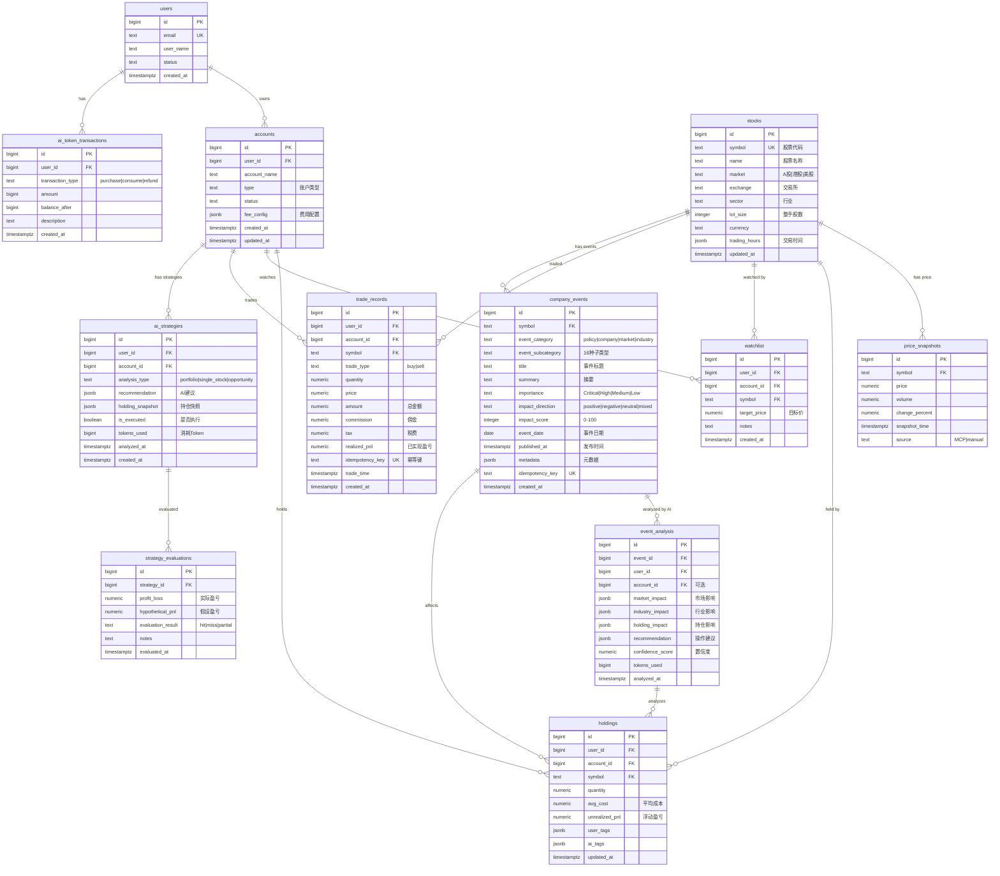

# 数据库 ER 图

> 投资管理系统 v3.1 数据库实体关系图
>
> **版本**: v1.0
> **日期**: 2025-01-15
> **基于**: PRD v3.1 + schema-v1.md

---

## 📊 PRD v3.1 核心 ER 图

### 概览

**核心表数量**: 13张
**设计原则**: 虚拟外键、账户隔离、幂等性保证



---

## 🔗 核心关系说明

### 1. 用户-账户关系（一对多）
```
users (1) ──< accounts (N)
```
- 一个用户可以有多个投资账户
- 账户属于唯一用户（user_id）

### 2. 账户-持仓关系（一对多）
```
accounts (1) ──< holdings (N)
stocks (1) ──< holdings (N)
```
- 一个账户可以持有多只股票
- 同一只股票可以被多个账户持有
- 唯一约束：`(user_id, account_id, symbol)`

### 3. 账户-交易记录（一对多）
```
accounts (1) ──< trade_records (N)
```
- 一个账户有多笔交易记录
- 交易记录关联股票（symbol）
- 幂等键：`idempotency_key` 防重复

### 4. 账户-AI策略（一对多）
```
accounts (1) ──< ai_strategies (N)
ai_strategies (1) ──< strategy_evaluations (N)
```
- 一个账户有多个 AI 策略分析
- 一个策略可以有多次评估记录

### 5. 股票-事件关系（一对多）⭐ v3.1
```
stocks (1) ──< company_events (N)
company_events (1) ──< event_analysis (N)
```
- 一只股票可以有多个相关事件
- 一个事件可以有多次 AI 分析（针对不同用户/账户）

### 6. 事件-持仓影响（多对多）⭐ v3.1
```
company_events (N) ──< holdings (N)
```
- 一个事件可能影响多个持仓
- 一个持仓可能受多个事件影响
- 通过 `event_analysis.holding_impact` 记录关联

---

## 📐 设计特点

### 虚拟外键
- **不使用数据库级外键约束**
- 通过 `NOT NULL` + 索引维护引用完整性
- 删除采用软删除（`is_deleted` 字段）或审计留存

### 账户隔离
- 核心表携带 `user_id + account_id`（除公共表如 stocks, price_snapshots）
- 查询时必须带账户条件，避免跨账户数据泄露

### 幂等性保证
- 事件/交易类表使用 `idempotency_key` 唯一约束
- 防止重复入账、重复事件记录

### JSONB 灵活性
- `fee_config`：账户费用配置
- `recommendation`：AI 建议内容
- `holding_snapshot`：持仓快照
- `metadata`：事件元数据
- `market_impact`/`industry_impact`：AI 分析结果

---

## 📊 扩展：完整 Schema ER 图（所有表）

### 概览

**总表数**: 33张（包含量化 Agent 相关表 + v3.1新增4张核心表）

```mermaid
erDiagram
    %% 核心业务表（已在上图）
    users ||--o{ accounts : owns
    users ||--o{ ai_token_transactions : has
    accounts ||--o{ holdings : holds
    accounts ||--o{ watchlist : watches
    accounts ||--o{ trade_records : trades
    accounts ||--o{ ai_strategies : "has strategies"
    stocks ||--o{ price_snapshots : "has price"
    stocks ||--o{ company_events : "has events"
    company_events ||--o{ event_analysis : "analyzed by"
    ai_strategies ||--o{ strategy_evaluations : evaluated

    %% 扩展表 - 量化Agent相关（schema-v1.md）
    accounts ||--o{ agent_reference_config : "configures"
    agent_reference_config {
        bigint id PK
        bigint user_id FK
        bigint account_id FK
        text scope "watchlist|holdings|custom"
        text granularity "minute_1|hour_1|daily"
        integer lookback_days
    }

    agent_reference_config ||--o{ agent_reference_series : "generates"
    agent_reference_series {
        bigint id PK
        bigint config_id FK
        text symbol FK
        jsonb data_series "时序数据"
        timestamptz generated_at
    }

    %% 特征与模型
    feature_definitions {
        bigint id PK
        text feature_name UK
        text category "technical|fundamental|sentiment"
        jsonb parameters
    }

    feature_definitions ||--o{ feature_values : "computed"
    feature_values {
        bigint id PK
        bigint feature_id FK
        text symbol FK
        numeric value
        timestamptz computed_at
    }

    model_versions {
        bigint id PK
        text model_name
        text version
        jsonb hyperparameters
        timestamptz trained_at
    }

    model_versions ||--o{ agent_runs : "executes"
    agent_runs {
        bigint id PK
        bigint model_id FK
        bigint account_id FK
        text run_status "pending|running|done|failed"
        timestamptz started_at
        timestamptz completed_at
    }

    agent_runs ||--o{ agent_signals : "generates"
    agent_signals {
        bigint id PK
        bigint run_id FK
        text symbol FK
        text signal "buy|sell|hold"
        numeric confidence
        timestamptz signaled_at
    }

    agent_signals ||--o{ order_intents : "creates"
    order_intents {
        bigint id PK
        bigint signal_id FK
        text symbol FK
        text side "buy|sell"
        numeric quantity
        text status "new|placed|filled|canceled"
        text idempotency_key UK
    }

    %% 风险管理
    accounts ||--o{ risk_limits : "has limits"
    risk_limits {
        bigint id PK
        bigint account_id FK
        text limit_type "position|drawdown|leverage"
        numeric limit_value
    }

    risk_limits ||--o{ risk_violations : "violates"
    risk_violations {
        bigint id PK
        bigint limit_id FK
        text violation_type
        numeric actual_value
        timestamptz violated_at
    }

    %% 辅助表
    trading_calendar {
        bigint id PK
        date trade_date
        text market "A|HK|US"
        boolean is_trading_day
    }

    fx_rates {
        bigint id PK
        text from_currency
        text to_currency
        numeric rate
        date rate_date
    }

    accounts ||--o{ portfolio_metrics_daily : "daily metrics"
    portfolio_metrics_daily {
        bigint id PK
        bigint account_id FK
        date snapshot_date
        numeric total_value
        numeric cash_balance
        numeric total_pnl
    }

    data_quality_issues {
        bigint id PK
        text table_name
        text issue_type
        text description
        timestamptz detected_at
    }
```



---

## 📋 表分类

### 核心业务表（13张）- PRD v3.1

**说明**：Schema 中部分表名与概念名不同，映射关系见 schema-v1.md

| ER图/PRD表名 | Schema实际表名 | 用途 | 优先级 | 状态 |
|-------------|--------------|------|--------|------|
| users | users | 用户账号 | P0 | ✅ 已实现 |
| accounts | accounts | 投资账户 | P0 | ✅ 已实现 |
| ai_token_transactions | ai_token_transactions | AI Token管理 | P0 | ✅ 已实现 |
| stocks | company_info | 股票信息 | P0 | ✅ 已实现 |
| price_snapshots | price_snapshots | 价格快照 | P0 | ✅ 已实现 |
| holdings | holdings | 持仓 | P0 | ✅ 已实现 |
| watchlist | watchlist | 关注列表 | P0 | ✅ 已实现 |
| trade_records | trade_events | 交易记录 | P0 | ✅ 已实现 |
| ai_strategies | strategy_analysis | AI策略 | P0 | ✅ 已实现 |
| strategy_evaluations | strategy_evaluations | 策略评估 | P1 | ✅ 已实现 |
| **company_events** | **company_events** | 公司事件 | **P0** | ✅ 已实现 ⭐ |
| **event_analysis** | **event_analysis** | 事件AI分析 | **P0** | ✅ 已实现 ⭐ |
| account_preferences | account_preferences | 账户偏好 | P1 | ✅ 已实现 |

### 量化 Agent 扩展表（20张）- schema-v1.md
| 表名 | 用途 | 状态 |
|------|------|------|
| agent_reference_config | Agent参考配置 | 可选 |
| agent_reference_series | Agent时序数据 | 可选 |
| feature_definitions | 特征定义 | 可选 |
| feature_values | 特征值 | 可选 |
| model_versions | 模型版本 | 可选 |
| agent_runs | Agent运行 | 可选 |
| agent_signals | 信号生成 | 可选 |
| order_intents | 订单意图 | 可选 |
| risk_limits | 风险限额 | 可选 |
| risk_violations | 风险违规 | 可选 |
| trading_calendar | 交易日历 | 可选 |
| fx_rates | 汇率 | 可选 |
| portfolio_metrics_daily | 每日指标 | 可选 |
| data_quality_issues | 数据质量 | 可选 |
| market_rules | 交易规则 | 可选 |
| investment_plans | 投资计划 | 可选 |
| investment_allocations | 投资分配 | 可选 |
| realized_pnl | 已实现盈亏 | 可选 |
| strategy_summary | 策略汇总 | 可选 |
| agent_tasks | Agent任务 | 可选 |

---

## 🔑 索引策略

### 高频查询索引
```sql
-- 用户查询账户
CREATE INDEX idx_accounts_user ON accounts(user_id);

-- 账户查询持仓
CREATE INDEX idx_holdings_account ON holdings(account_id, symbol);

-- 价格时序查询
CREATE INDEX idx_price_symbol_time ON price_snapshots(symbol, snapshot_time DESC);

-- 交易记录查询
CREATE INDEX idx_trades_account_time ON trade_records(account_id, trade_time DESC);

-- 事件查询（v3.1）
CREATE INDEX idx_events_symbol_date ON company_events(symbol, event_date DESC);
CREATE INDEX idx_events_importance ON company_events(importance, event_date DESC);

-- AI分析查询
CREATE INDEX idx_analysis_event ON event_analysis(event_id, analyzed_at DESC);
CREATE INDEX idx_analysis_account ON event_analysis(account_id, analyzed_at DESC);
```

---

## 📝 版本历史

| 版本 | 日期 | 变更 |
|------|------|------|
| v1.1 | 2025-01-15 | 补充缺失的P0核心表（ai_token_transactions, company_events, event_analysis, strategy_evaluations），添加表名映射说明，总表数：29→33 |
| v1.0 | 2025-01-15 | 初版ER图，包含PRD v3.1核心表 + Schema扩展表 |

---

## 🔗 相关文档

- **PRD v3.1**: [../../prd/v3/main.md](../../prd/v3/main.md)
- **数据库设计**: [schema-v1.md](schema-v1.md)
- **技术架构**: [../architecture/tech-stack.md](../architecture/tech-stack.md)

---

**创建者**: Claude Code
**工具**: Mermaid ER Diagram
**用途**: 数据库设计可视化、开发参考
