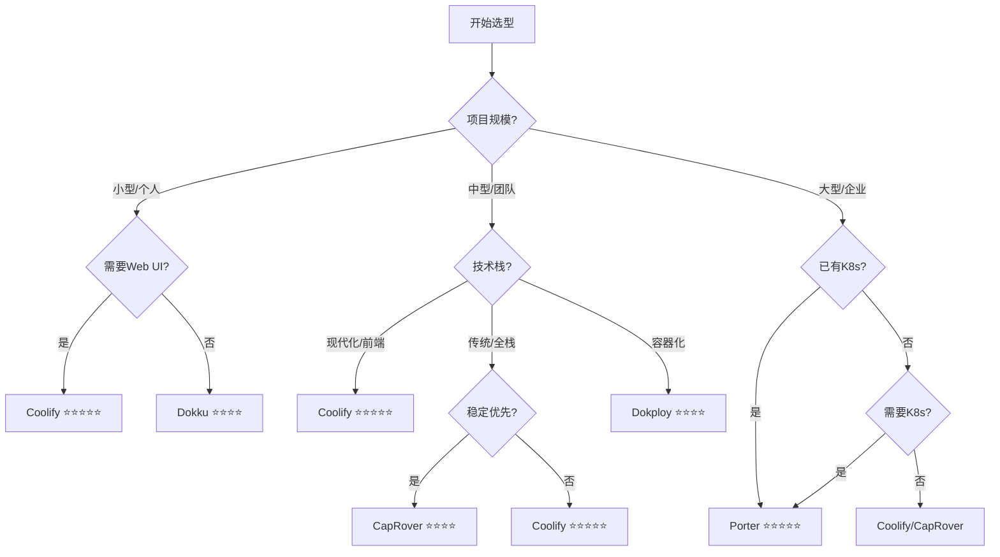

# 开源PaaS平台深度对比分析报告

> **调研日期**: 2025-11-20
> **版本**: v1.0
> **目的**: 为项目选择合适的自托管PaaS平台

---

## 📋 执行摘要

本报告深度调研了5个主流开源PaaS平台，重点关注**MIT协议**和**Apache 2.0协议**的解决方案：

| 平台 | 开源协议 | 成熟度 | 推荐指数 | 适用场景 |
|------|---------|--------|---------|---------|
| **Dokku** | MIT ✅ | ⭐⭐⭐⭐⭐ | ★★★★☆ | 小型项目、个人开发者 |
| **Porter** | MIT (部分) ✅ | ⭐⭐⭐⭐ | ★★★★★ | 企业级、需要K8s |
| **CapRover** | Apache 2.0 | ⭐⭐⭐⭐⭐ | ★★★★☆ | 中小型项目、团队协作 |
| **Coolify** | Apache 2.0 | ⭐⭐⭐⭐ | ★★★★★ | 现代化应用、全栈团队 |
| **Dokploy** | Apache 2.0 | ⭐⭐⭐ | ★★★☆☆ | Docker高级用户 |

---

## 1️⃣ Dokku - 最小化的Heroku替代品

### 📊 基本信息

- **GitHub Stars**: ~27K
- **开源协议**: MIT License ✅
- **首次发布**: 2013年 (12年历史)
- **核心技术**: Docker + Heroku Buildpacks
- **官网**: https://dokku.com

### ✨ 核心特性

#### 优势
1. **轻量级架构** - 可运行在任何硬件上（笔记本、VPS、裸机）
2. **零停机部署** - 新容器构建完成后自动切换，销毁旧容器
3. **Git Push部署** - `git push dokku main` 即可部署
4. **插件生态** - 可通过插件系统扩展功能
5. **ARM64支持** - 2025年新增ARM64架构支持（Dokku Pro）
6. **成本控制** - 完全免费，适合个人项目和小团队

#### 技术架构
```
Git Push → Dokku → Buildpack/Docker → Container → nginx → SSL (Let's Encrypt)
```

#### 支持的应用类型
- Node.js, Python, PHP, Ruby, Go
- 多种数据库（通过插件）
- 静态网站

### ⚠️ 限制与缺点

1. **缺少管理界面** - 主要依赖CLI，无Web UI
2. **单服务器限制** - 原生不支持多节点集群
3. **运维负担** - 需要自行管理服务器更新、安全、备份
4. **需要技术能力** - 对命令行和服务器管理有一定要求

### 💰 成本分析

| 项目 | 成本 |
|------|------|
| 软件授权 | 免费 (MIT) |
| 服务器 | $5-20/月 (VPS) |
| 维护成本 | 中等 (自行运维) |
| 总体TCO | ⭐⭐⭐⭐⭐ (极低) |

### 📈 生产案例

- Meeting Room 365: 扩展至**数十亿月请求**，TB级流量
- 适合个人项目和中小型应用

### 🎯 适用场景

✅ **推荐使用**:
- 个人开发者、Side Project
- 技术团队，习惯命令行
- 预算有限的初创公司
- 简单的Web应用

❌ **不推荐使用**:
- 需要多区域高可用
- 大规模企业应用
- 非技术团队
- 复杂的微服务架构

---

## 2️⃣ Porter - Kubernetes驱动的企业级PaaS

### 📊 基本信息

- **GitHub Stars**: ~4K
- **开源协议**: MIT License (核心代码) + 企业功能单独协议
- **首次发布**: 2020年
- **核心技术**: Kubernetes + Helm + Docker
- **官网**: https://www.porter.run
- **背景**: YC S20孵化项目

### ✨ 核心特性

#### 优势
1. **Kubernetes原生** - 在AWS/GCP/Azure上自动创建生产级K8s集群
2. **三种部署模式**:
   - Porter Cloud (全托管)
   - 自有云账户 (推荐)
   - 完全自托管
3. **图形化界面** - Web GUI + CLI双重支持
4. **一键附加组件** - 数据库、缓存等服务的Marketplace
5. **CI/CD自动化** - 自动配置GitHub Actions
6. **可视化Helm管理** - 通过GUI管理Helm Charts
7. **生产就绪** - 自动配置VPC、负载均衡、镜像仓库

#### 技术架构
```
Porter Dashboard → Kubernetes (EKS/GKE/AKS) → Docker/Buildpacks → Helm Charts → 云资源
```

#### 基础设施自动化
Porter在AWS上自动创建：
- VPC (虚拟私有云)
- Network Load Balancer
- EKS集群（系统/监控/应用工作负载节点组）
- 镜像仓库

### ⚠️ 限制与缺点

1. **复杂度较高** - 基于Kubernetes，学习曲线陡峭
2. **资源消耗大** - K8s集群本身需要较多资源
3. **成本较高** - 云资源 + 潜在的Porter Cloud费用
4. **过度设计风险** - 小项目可能不需要K8s的复杂性

### 💰 成本分析

| 部署模式 | 成本估算 |
|---------|---------|
| Porter Cloud | $20-100+/月 |
| 自有云账户 | $50-500+/月 (K8s集群成本) |
| 完全自托管 | 中等 (需K8s运维能力) |
| 总体TCO | ⭐⭐⭐ (中高) |

### 📈 生产案例

- Y Combinator孵化项目
- 适合需要快速扩展的初创公司
- 企业级应用迁移

### 🎯 适用场景

✅ **推荐使用**:
- 已使用或计划使用Kubernetes
- 需要多云部署能力
- 企业级应用
- 需要高可用和自动扩展
- 有DevOps预算的团队

❌ **不推荐使用**:
- 小型项目（过度设计）
- 预算有限的个人开发者
- 不熟悉Kubernetes的团队
- 简单的单体应用

---

## 3️⃣ CapRover - 成熟稳定的Docker PaaS

### 📊 基本信息

- **Docker Hub下载**: 100M+
- **GitHub Stars**: ~14K
- **开源协议**: Apache 2.0
- **核心技术**: Docker Swarm + nginx + Let's Encrypt + NetData
- **官网**: https://caprover.com

### ✨ 核心特性

#### 优势
1. **成熟稳定** - 广泛使用，久经考验
2. **Web GUI + CLI** - 双重管理界面
3. **一键应用市场** - MySQL, MongoDB, WordPress等
4. **自动负载均衡** - 基于Docker Swarm
5. **水平扩展** - 轻松指定副本数量
6. **内置监控** - NetData监控CPU、内存、网络
7. **免费SSL** - 自动Let's Encrypt证书

#### 技术栈
```
CapRover Web UI/CLI → Docker Swarm → nginx (负载均衡) → Let's Encrypt (SSL) → NetData (监控)
```

#### 支持的服务
- Node.js, Python, PHP, ASP.NET, Ruby
- MySQL, MongoDB, PostgreSQL, Redis
- WordPress, Ghost等预配置应用

### ⚠️ 限制与缺点

1. **文档质量一般** - 社区反馈文档基础、有时过时
2. **UI有缺陷** - 界面基础，偶有Bug
3. **Docker Compose支持有限** - 使用自定义格式，非标准语法
4. **扩展性瓶颈** - 中小型项目OK，大规模应用需额外工作

### 💰 成本分析

| 项目 | 成本 |
|------|------|
| 软件授权 | 免费 (Apache 2.0) |
| 服务器 | $10-50/月 (VPS，需>=2GB RAM) |
| 维护成本 | 低-中等 |
| 总体TCO | ⭐⭐⭐⭐ (低) |

### 📈 生产案例

- 100M+ Docker下载量
- 广泛用于中小型团队
- 适合传统Web应用

### 🎯 适用场景

✅ **推荐使用**:
- 中小型团队
- 需要Web管理界面
- 传统Web应用（非云原生）
- 稳定性优先的项目
- 需要一键部署数据库

❌ **不推荐使用**:
- 严重依赖Docker Compose原生语法
- 需要现代化CI/CD集成
- 大规模微服务架构
- 对UI/UX要求高的团队

---

## 4️⃣ Coolify - 现代化Vercel替代品

### 📊 基本信息

- **GitHub Stars**: 44.7K+ 🔥
- **开源协议**: Apache 2.0
- **核心技术**: Docker + Traefik
- **官网**: https://coolify.io
- **定位**: Vercel/Netlify/Heroku的自托管替代品

### ✨ 核心特性

#### 优势
1. **社区活跃** - GitHub星标最多（44.7K）
2. **现代化UI** - 简洁美观的Web界面
3. **完全免费** - 所有功能永久免费
4. **280+一键服务** - 丰富的应用模板
5. **原生Docker Compose支持** - 完全兼容标准语法
6. **Git集成** - 自动CI/CD
7. **多应用类型**:
   - 静态网站
   - Node.js/Python/PHP等全栈应用
   - Docker容器
   - 数据库（PostgreSQL, Redis, MinIO等）
8. **SSL自动化** - 证书、备份自动管理
9. **内置监控** - 实时资源监控

#### 技术架构
```
Git Push → Coolify → Docker/Compose → Traefik (反向代理) → SSL → 应用
```

#### 部署速度
- 自托管版本**1分钟内**完成安装
- 现代化的开发者体验

### ⚠️ 限制与缺点

1. **相对年轻** - 虽然发展迅速，但历史较短
2. **依赖Docker** - 团队需熟悉容器技术
3. **服务器管理** - 仍需处理基础设施
4. **资源要求** - 最低2GB RAM

### 💰 成本分析

| 项目 | 成本 |
|------|------|
| 软件授权 | 完全免费 (Apache 2.0) |
| 服务器 | $5-30/月 (VPS) |
| 维护成本 | 低 (界面友好) |
| 总体TCO | ⭐⭐⭐⭐⭐ (极低) |

### 📈 生产案例

- 44.7K+ GitHub Stars
- 快速增长的社区
- 适合现代化Web应用

### 🎯 适用场景

✅ **推荐使用**:
- 全栈开发团队
- 需要自托管Vercel/Netlify
- Docker熟练用户
- 前端为主的项目
- 需要美观UI的团队
- 多项目管理

❌ **不推荐使用**:
- 关键任务应用（平台仍在快速迭代）
- 不熟悉Docker的团队
- 需要企业级支持

---

## 5️⃣ Dokploy - 新兴的Docker优先PaaS

### 📊 基本信息

- **GitHub Stars**: 24K+
- **Docker Hub下载**: 4M+
- **开源协议**: Apache 2.0 (推测)
- **首次发布**: 2023年 (2年历史)
- **核心技术**: Docker + Traefik
- **官网**: https://dokploy.com

### ✨ 核心特性

#### 优势
1. **Docker原生** - Nixpacks、Buildpacks、Dockerfile全支持
2. **实时监控** - CPU、内存、网络使用率
3. **原生Docker Compose** - 完整支持标准语法
4. **多服务器部署** - 轻松扩展到多节点
5. **回滚功能** - v0.24.0引入
6. **Volume备份** - Docker卷自动备份
7. **组织功能** - v0.19.0引入多组织支持
8. **AI辅助部署** - 最新版本特性
9. **成本低** - 托管版仅$4.50/月起

#### 最新更新 (2025)
- **v0.25.0**: 环境变量管理、Traefik v3.5.0支持
- **v0.24.0**: 回滚、Volume备份
- **v0.19.0**: 组织、AI部署

### ⚠️ 限制与缺点

1. **年轻平台** - 仅2年历史，成熟度不如Dokku/CapRover
2. **文档可能不完善** - 快速迭代中
3. **社区规模** - 虽然增长快，但仍小于Coolify
4. **生产验证** - 大规模案例相对较少

### 💰 成本分析

| 部署模式 | 成本 |
|---------|------|
| 自托管 | 免费 + VPS成本 |
| 托管版 | $4.50/月起 |
| 总体TCO | ⭐⭐⭐⭐ (低) |

### 📈 对比优势

**vs Coolify**:
- Dokploy: 更好的监控、扩展性
- Coolify: 社区更大 (44.7K vs 24K stars)

**vs Dokku**:
- Dokploy: 更现代、Web UI、Docker Compose原生
- Dokku: 更成熟 (12年 vs 2年)

### 🎯 适用场景

✅ **推荐使用**:
- Docker熟练用户
- 需要高级监控
- 容器化工作流团队
- 中小型项目
- 愿意尝试新技术

❌ **不推荐使用**:
- 关键业务应用（成熟度考量）
- 保守型企业
- 需要长期稳定的项目

---

## 🔄 平台横向对比

### 功能对比矩阵

| 功能特性 | Dokku | Porter | CapRover | Coolify | Dokploy |
|---------|-------|--------|----------|---------|---------|
| **开源协议** | MIT ✅ | MIT (部分) | Apache 2.0 | Apache 2.0 | Apache 2.0 |
| **Web界面** | ❌ | ✅ | ✅ | ✅ | ✅ |
| **CLI支持** | ✅ | ✅ | ✅ | ✅ | ✅ |
| **Git部署** | ✅ | ✅ | ✅ | ✅ | ✅ |
| **Docker Compose** | 插件 | ✅ | 受限 | ✅ (原生) | ✅ (原生) |
| **多服务器** | ❌ | ✅ | ✅ | ❌ | ✅ |
| **Kubernetes** | ❌ | ✅ | ❌ | ❌ | ❌ |
| **监控** | 插件 | ✅ | ✅ (NetData) | ✅ | ✅ (高级) |
| **SSL自动化** | ✅ | ✅ | ✅ | ✅ | ✅ |
| **一键应用** | 插件 | ✅ | ✅ | 280+ | ✅ |
| **成熟度** | ⭐⭐⭐⭐⭐ | ⭐⭐⭐⭐ | ⭐⭐⭐⭐⭐ | ⭐⭐⭐⭐ | ⭐⭐⭐ |
| **社区规模** | 27K ⭐ | 4K ⭐ | 14K ⭐ | 44.7K ⭐ | 24K ⭐ |
| **学习曲线** | 中等 | 陡峭 | 简单 | 简单 | 中等 |

### 技术栈对比

| 平台 | 核心技术 | 容器编排 | 负载均衡 |
|------|---------|---------|---------|
| Dokku | Docker + Buildpacks | 单机 | nginx |
| Porter | Kubernetes + Helm | K8s | 云LB |
| CapRover | Docker | Swarm | nginx |
| Coolify | Docker | 单机 | Traefik |
| Dokploy | Docker | Docker | Traefik |

### 部署复杂度

```
简单 ←――――――――――――――――――――――――――→ 复杂

Coolify → CapRover → Dokploy → Dokku → Porter
```

### 成本对比 (月度估算)

| 平台 | 最小配置 | 推荐配置 | 企业级 |
|------|---------|---------|--------|
| Dokku | $5 | $10-20 | $50-100 |
| Porter | - | $50-200 | $500+ |
| CapRover | $10 | $20-50 | $100-300 |
| Coolify | $5 | $10-30 | $50-150 |
| Dokploy | $5 ($4.5托管) | $10-30 | $50-200 |

---

## 🎯 选型决策树



---

## 💡 选型建议

### 场景1: 个人开发者 / Side Project

**推荐**: **Coolify** > Dokku

**理由**:
- Coolify提供最佳的开发体验
- 免费且功能齐全
- 简单易用的Web界面
- 如果习惯CLI，选Dokku (MIT协议)

### 场景2: 小型初创公司 (2-5人)

**推荐**: **Coolify** > Dokploy

**理由**:
- Coolify: 社区最活跃，文档丰富
- Dokploy: 如果团队Docker能力强，需要高级监控
- 两者成本都很低

### 场景3: 中型团队 (5-20人)

**推荐**: **CapRover** > Coolify

**理由**:
- CapRover: 久经考验，稳定性强
- Coolify: 功能更现代，但需接受快速迭代
- 避免Dokku（缺少UI，团队协作不便）

### 场景4: 企业级应用

**推荐**: **Porter** (如需K8s) 或 **商业PaaS**

**理由**:
- Porter提供Kubernetes能力
- 企业级支持和SLA保障
- 自动化运维和监控
- 如果不需要K8s复杂度，考虑商业方案（Railway, Render等）

### 场景5: 已有Kubernetes集群

**推荐**: **Porter** (唯一选择)

**理由**:
- 其他平台不支持K8s
- Porter提供K8s之上的PaaS抽象

### 场景6: 必须MIT协议

**推荐**: **Dokku** > Porter

**理由**:
- Dokku: 完全MIT，成熟稳定
- Porter: 核心MIT，但企业功能单独协议
- 其他都是Apache 2.0

---

## 🏆 总体推荐排名

### 综合评分 (满分5星)

| 排名 | 平台 | 易用性 | 功能性 | 稳定性 | 社区 | 成本 | 总分 |
|------|------|-------|-------|-------|------|------|------|
| 🥇 | **Coolify** | ⭐⭐⭐⭐⭐ | ⭐⭐⭐⭐⭐ | ⭐⭐⭐⭐ | ⭐⭐⭐⭐⭐ | ⭐⭐⭐⭐⭐ | **4.8** |
| 🥈 | **Porter** | ⭐⭐⭐ | ⭐⭐⭐⭐⭐ | ⭐⭐⭐⭐⭐ | ⭐⭐⭐ | ⭐⭐⭐ | **3.8** |
| 🥉 | **CapRover** | ⭐⭐⭐⭐ | ⭐⭐⭐⭐ | ⭐⭐⭐⭐⭐ | ⭐⭐⭐⭐ | ⭐⭐⭐⭐ | **4.2** |
| 4 | **Dokku** | ⭐⭐⭐ | ⭐⭐⭐ | ⭐⭐⭐⭐⭐ | ⭐⭐⭐⭐ | ⭐⭐⭐⭐⭐ | **4.0** |
| 5 | **Dokploy** | ⭐⭐⭐⭐ | ⭐⭐⭐⭐ | ⭐⭐⭐ | ⭐⭐⭐ | ⭐⭐⭐⭐ | **3.6** |

### 针对本项目的建议

基于您的**AI驱动个人投资管理系统**项目特点：

#### 项目需求分析
- **技术栈**: FastAPI (后端) + Vue 3 (前端)
- **数据库**: PostgreSQL
- **规模**: 个人/小型
- **预算**: 有限
- **现状**: 设计阶段

#### 最佳选择: **Coolify** 🏆

**推荐理由**:
1. ✅ **完美匹配**: 支持FastAPI、Vue 3、PostgreSQL一键部署
2. ✅ **开发友好**: 现代化UI，快速迭代
3. ✅ **成本最优**: 完全免费 + 低VPS成本
4. ✅ **Docker原生**: 契合现代开发流程
5. ✅ **社区活跃**: 44.7K stars，问题解决快
6. ✅ **扩展性**: 项目增长后仍可继续使用

#### 备选方案: **Dokku** (如需MIT协议)

**理由**:
- ✅ MIT协议，商业友好
- ✅ 轻量级，资源占用小
- ⚠️ 缺少Web UI，纯CLI操作
- ⚠️ 适合技术型开发者

#### 不推荐方案
- ❌ **Porter**: 过度设计（项目不需要K8s）
- ❌ **Dokploy**: 太新，风险较高
- ⚠️ **CapRover**: 功能够用，但Coolify更现代

---

## 📚 延伸阅读

### 官方文档
- Coolify: https://coolify.io/docs
- Dokku: https://dokku.com/docs
- Porter: https://docs.porter.run
- CapRover: https://caprover.com/docs
- Dokploy: https://docs.dokploy.com

### 社区资源
- [Coolify GitHub](https://github.com/coollabsio/coolify)
- [Dokku GitHub](https://github.com/dokku/dokku)
- [CapRover GitHub](https://github.com/caprover/caprover)
- [Porter GitHub](https://github.com/porter-dev/porter)

### 对比文章
- [Coolify vs Vercel 2025](https://uibakery.io/blog/vercel-vs-coolify)
- [CapRover/Coolify/Dokploy对比](https://roozbehsam.com/posts/comparing-cokploy-dokku-coolify-caprover/)
- [开源PaaS选型指南](https://www.techtarget.com/searchcloudcomputing/feature/6-open-source-PaaS-options-developers-should-know)

---

## 🔖 总结

对于**AI驱动投资管理系统**项目，**强烈推荐使用Coolify**作为PaaS平台：

### 关键优势
1. ✨ **零成本开始** - 免费开源 + 便宜VPS
2. 🚀 **快速上线** - 1分钟部署，专注业务开发
3. 🎨 **现代体验** - 美观UI，Git自动部署
4. 📈 **可持续** - 项目增长后无需迁移
5. 🛡️ **社区支持** - 44.7K stars，活跃生态

### 实施路径
1. **Phase 1** (当前): 本地Docker开发环境
2. **Phase 2**: 部署Coolify到$5 VPS (DigitalOcean/Vultr)
3. **Phase 3**: 一键部署前后端 + PostgreSQL
4. **Phase 4**: 配置域名、SSL、监控
5. **Phase 5**: 根据增长扩展资源

### 风险控制
- ⚠️ **定期备份**: Coolify支持自动备份
- ⚠️ **监控告警**: 内置监控Dashboard
- ⚠️ **退出策略**: Docker标准，可迁移到任何平台

---

**报告作者**: Claude
**最后更新**: 2025-11-20
**版本**: v1.0
