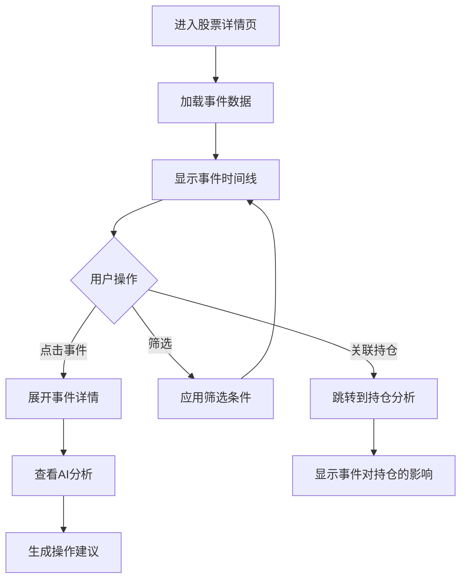

# 股票详情页 原型图

> **页面**: 股票详情页
> **功能**: 股票信息、价格走势、事件时间线、持仓详情、AI分析

---

## 布局结构

```
┌─────────────────────────────────────────────────────────────────────────┐
│  ← 返回    600600 青岛啤酒                              [AI分析] [添加] [⋮] │
├─────────────────────────────────────────────────────────────────────────┤
│                                                                           │
│  ┌─ 基本信息 ────────────────────────────────────────────────────────┐ │
│  │                                                                       │ │
│  │  600600 青岛啤酒 (A股/消费/啤酒)                                     │ │
│  │                                                                       │ │
│  │  ┌──────────────────┐  ┌──────────────────────────────────────┐    │ │
│  │  │   ¥62.50         │  │  今开: ¥63.20   最高: ¥64.50         │    │ │
│  │  │   -3.20 (-4.87%) │  │  最低: ¥61.80   昨收: ¥65.70         │    │ │
│  │  │   实时更新        │  │  成交量: 2.3M   成交额: ¥145M         │    │ │
│  │  └──────────────────┘  └──────────────────────────────────────┘    │ │
│  │                                                                       │ │
│  └───────────────────────────────────────────────────────────────────┘ │
│                                                                           │
│  ┌─ Tabs ──────────────────────────────────────────────────────────┐   │
│  │  [走势图] [事件时间线] [我的持仓] [AI分析] [公司信息] [财务数据]   │   │
│  └────────────────────────────────────────────────────────────────┘   │
│                                                                           │
│  ┌─ 事件时间线 ────────────────────────────────────────────────────┐   │
│  │                                                                     │   │
│  │  📅 近90天相关事件 (8条)          [筛选: 全部▼] [重要性: 全部▼]   │   │
│  │                                                                     │   │
│  │  ┌───────────────────────────────────────────────────────────┐   │   │
│  │  │ 🟠 2025-10-29  财报发布                                    │   │   │
│  │  │                                                             │   │   │
│  │  │ Q3营收+5%，净利润-3%（不及预期）                           │   │   │
│  │  │                                                             │   │   │
│  │  │ AI影响分析:                                                │   │   │
│  │  │ • 影响: 利空 (65/100)                                      │   │   │
│  │  │ • 股价影响: 已下跌-5% (¥65.8 → ¥62.5)                     │   │   │
│  │  │ • 关键因素: 成本上升、销量疲软                             │   │   │
│  │  │ • 建议: 等待回调至¥60以下可考虑加仓                        │   │   │
│  │  │                                                             │   │   │
│  │  │ [查看完整分析] [关联我的持仓]                              │   │   │
│  │  └───────────────────────────────────────────────────────────┘   │   │
│  │                                                                     │   │
│  │  ┌───────────────────────────────────────────────────────────┐   │   │
│  │  │ ✅ 2025-09-15  股东增持                                    │   │   │
│  │  │                                                             │   │   │
│  │  │ 控股股东增持1000万股                                       │   │   │
│  │  │                                                             │   │   │
│  │  │ AI影响分析:                                                │   │   │
│  │  │ • 影响: 利好 (68/100)                                      │   │   │
│  │  │ • 股价影响: +3% (当日)                                     │   │   │
│  │  │ • 建议: 管理层看好长期价值，可持续关注                     │   │   │
│  │  │                                                             │   │   │
│  │  │ [查看完整分析]                                             │   │   │
│  │  └───────────────────────────────────────────────────────────┘   │   │
│  │                                                                     │   │
│  │  ┌───────────────────────────────────────────────────────────┐   │   │
│  │  │ 🟡 2025-08-15  行业政策                                    │   │   │
│  │  │                                                             │   │   │
│  │  │ 消费刺激政策出台                                           │   │   │
│  │  │                                                             │   │   │
│  │  │ AI影响分析:                                                │   │   │
│  │  │ • 影响: 利好 (75/100)                                      │   │   │
│  │  │ • 预期股价: +5% ~ +8%                                      │   │   │
│  │  │ • 置信度: 70%                                              │   │   │
│  │  │                                                             │   │   │
│  │  └───────────────────────────────────────────────────────────┘   │   │
│  │                                                                     │   │
│  │  [显示更多事件...]                                              │   │
│  │                                                                     │   │
│  └─────────────────────────────────────────────────────────────────┘   │
│                                                                           │
│  ┌─ 我的持仓 ──────────────────────────────────────────────────────┐   │
│  │                                                                     │   │
│  │  账户: 华泰证券 (8888)                                             │   │
│  │                                                                     │   │
│  │  持仓数量: 1600股                                                  │   │
│  │  成本价格: ¥78.40                                                  │   │
│  │  当前价格: ¥62.50                                                  │   │
│  │  持仓市值: ¥100,000                                                │   │
│  │  盈亏金额: -¥25,440                                                │   │
│  │  盈亏比例: -20.3% 📉                                               │   │
│  │                                                                     │   │
│  │  ┌─ 操作历史 ────────────────────────────────────────────┐       │   │
│  │  │                                                         │       │   │
│  │  │  2025-08-10  买入 500股 @ ¥71.00                       │       │   │
│  │  │  2025-07-05  买入 300股 @ ¥75.00                       │       │   │
│  │  │  2025-04-28  买入 800股 @ ¥74.00                       │       │   │
│  │  │                                                         │       │   │
│  │  │  平均成本: ¥78.40                                       │       │   │
│  │  │                                                         │       │   │
│  │  └─────────────────────────────────────────────────────┘       │   │
│  │                                                                     │   │
│  │  [记录交易] [设置提醒] [AI建议]                                    │   │
│  │                                                                     │   │
│  └─────────────────────────────────────────────────────────────────┘   │
│                                                                           │
│  ┌─ AI综合分析 ────────────────────────────────────────────────────┐   │
│  │                                                                     │   │
│  │  基于近90天事件和当前持仓的综合分析:                               │   │
│  │                                                                     │   │
│  │  ✅ 利好因素 (2条):                                                │   │
│  │  • 股东增持 (+68分)                                                │   │
│  │  • 消费刺激政策 (+75分)                                            │   │
│  │                                                                     │   │
│  │  ❌ 利空因素 (1条):                                                │   │
│  │  • Q3财报不及预期 (-65分)                                          │   │   │
│  │                                                                     │   │
│  │  📊 综合判断: 短期承压，中长期谨慎乐观                             │   │
│  │                                                                     │   │
│  │  💡 操作建议:                                                      │   │
│  │  1. 当前阶段: 持有观望                                             │   │
│  │  2. 加仓时机: 回调至¥58-60区间                                    │   │
│  │  3. 止损位: 跌破¥55 (成本-30%)                                    │   │
│  │  4. 目标位: ¥75-80 (回归均值)                                     │   │
│  │                                                                     │   │
│  │  ⚠️ 风险提示:                                                      │   │
│  │  • 短期业绩压力仍存                                                │   │
│  │  • 宏观消费环境未明显改善                                          │   │
│  │  • 建议不超过组合10%仓位                                           │   │
│  │                                                                     │   │
│  │  最后更新: 2025-11-14 15:30                                        │   │
│  │  [刷新分析] [保存到策略]                                           │   │
│  │                                                                     │   │
│  └─────────────────────────────────────────────────────────────────┘   │
│                                                                           │
└─────────────────────────────────────────────────────────────────────────┘
```

---

## 功能模块说明

### 1. 页面头部
- **返回按钮**: 返回上一页
- **股票代码 + 名称**: 主标题
- **操作按钮**:
  - [AI分析]: 触发AI深度分析
  - [添加]: 添加到自选/持仓
  - [⋮]: 更多操作（分享、导出等）

### 2. 基本信息区域
**左侧 - 实时价格**:
- 当前价格（大字号）
- 涨跌额 + 涨跌幅（带颜色）
- 实时更新标识

**右侧 - 行情数据**:
- 今开、最高、最低、昨收
- 成交量、成交额

### 3. Tab导航
- **走势图**: K线图、分时图
- **事件时间线**: v3.1核心功能 ⭐
- **我的持仓**: 显示该股票的持仓详情
- **AI分析**: 综合分析和建议
- **公司信息**: 基本面信息
- **财务数据**: 财报数据

### 4. 事件时间线 (v3.1核心)

**事件卡片结构**:
```
┌─────────────────────────────┐
│ 🟠 日期  事件类型            │
│                              │
│ 事件标题/摘要                │
│                              │
│ AI影响分析:                  │
│ • 影响方向和强度             │
│ • 对股价的实际/预期影响      │
│ • 关键因素                   │
│ • 操作建议                   │
│                              │
│ [查看完整分析] [关联持仓]    │
└─────────────────────────────┘
```

**事件分类颜色**:
- 🔴 Critical (极重要)
- 🟠 High (高度重要)
- 🟡 Medium (中度重要)
- 🟢 Low (一般关注)

**筛选功能**:
- 按事件类型筛选（政策/公司/市场/行业）
- 按重要性筛选
- 按时间范围筛选

### 5. 我的持仓区域

**显示内容**:
- 账户信息
- 持仓数量、成本价、当前价
- 持仓市值、盈亏金额、盈亏比例
- 操作历史（买入/卖出记录）
- 平均成本计算

**快速操作**:
- [记录交易]: 添加买入/卖出记录
- [设置提醒]: 价格提醒
- [AI建议]: 触发针对该持仓的建议

### 6. AI综合分析

**分析内容**:
- 利好因素汇总
- 利空因素汇总
- 综合判断
- 具体操作建议（持有/加仓/减仓）
- 关键价格位（加仓位/止损位/目标位）
- 风险提示

**交互**:
- [刷新分析]: 重新生成分析
- [保存到策略]: 保存为策略记录

---

## 事件时间线交互流程



---

## 移动端布局

```
┌───────────────────────┐
│ ← 600600 青岛啤酒  ⋮ │
├───────────────────────┤
│ ¥62.50               │
│ -3.20 (-4.87%) 📉    │
│                       │
│ [走势] [事件] [持仓]  │
├───────────────────────┤
│ 📅 事件时间线         │
│                       │
│ ┌───────────────────┐│
│ │🟠 10-29 财报      ││
│ │                   ││
│ │Q3营收+5%,利润-3%  ││
│ │影响: 利空 (65)    ││
│ │已跌-5%            ││
│ │                   ││
│ │[详情]             ││
│ └───────────────────┘│
│                       │
│ ┌───────────────────┐│
│ │✅ 09-15 股东增持  ││
│ │[详情]             ││
│ └───────────────────┘│
│                       │
│ [显示更多...]         │
└───────────────────────┘
```

---

## 数据更新策略

1. **实时数据** (WebSocket):
   - 股票价格
   - 涨跌幅

2. **定时刷新** (每10分钟):
   - 事件列表
   - AI分析缓存

3. **手动刷新**:
   - 下拉刷新
   - [刷新分析] 按钮

---

## 状态处理

### 加载状态
- 事件加载中: 骨架屏
- AI分析中: 进度提示

### 空状态
- 无事件: "该股票暂无相关事件"
- 无持仓: "您还未持有该股票"

### 错误状态
- 事件加载失败: 重试按钮
- AI分析失败: 错误提示

---

## 相关页面

- [Dashboard](01-dashboard.md)
- [事件中心](04-event-center.md)
- [持仓分析](05-portfolio-analysis.md)
