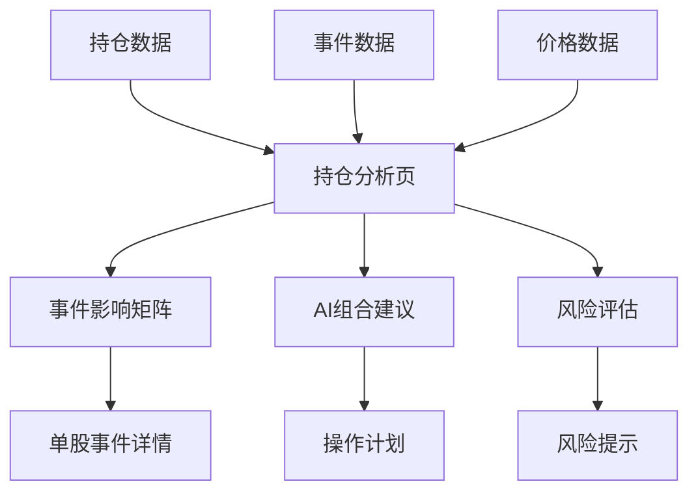

# 持仓分析页 原型图

> **页面**: AI持仓分析
> **功能**: 综合持仓分析、事件影响矩阵、操作建议、风险评估

---

## 布局结构

```
┌─────────────────────────────────────────────────────────────────────────┐
│  投资管理系统 > AI持仓分析                 账户: [华泰证券▼]  [刷新] [导出] │
├─────────────────────────────────────────────────────────────────────────┤
│                                                                           │
│  ┌─ 账户概况 ─────────────────────────────────────────────────────────┐ │
│  │                                                                       │ │
│  │  华泰证券 (8888)                      最后更新: 2025-11-14 15:30     │ │
│  │                                                                       │ │
│  │  ┌──────────┐  ┌──────────┐  ┌──────────┐  ┌──────────┐            │ │
│  │  │ 总资金    │  │ 已投资    │  │ 流动资金  │  │ 总盈亏    │            │ │
│  │  │ ¥300,000 │  │ ¥145,000 │  │ ¥155,000 │  │ +¥12,850 │            │ │
│  │  │          │  │ 48.3%    │  │ 51.7%    │  │ +9.71%   │            │ │
│  │  └──────────┘  └──────────┘  └──────────┘  └──────────┘            │ │
│  │                                                                       │ │
│  └───────────────────────────────────────────────────────────────────┘ │
│                                                                           │
│  ┌─ 🚨 事件告警 (近30天影响持仓的重要事件) ──────────────────────────┐ │
│  │                                                                       │ │
│  │  ⚠️ 重要提示 (2条)                                                   │ │
│  │                                                                       │ │
│  │  🔴 美联储加息25bp (2025-11-07)                                      │ │
│  │     影响您的腾讯持仓，预期-2.5%                                       │ │
│  │     建议: 考虑减仓10-20%，降低港股敞口                               │ │
│  │     [查看详情]                                                        │ │
│  │                                                                       │ │
│  │  🟠 青岛啤酒Q3财报不及预期 (2025-10-29)                              │ │
│  │     已下跌-5%，建议回调至¥60以下加仓                                 │ │
│  │     [查看详情]                                                        │ │
│  │                                                                       │ │
│  │  [查看全部事件 (8条) →]                                              │ │
│  │                                                                       │ │
│  └───────────────────────────────────────────────────────────────────┘ │
│                                                                           │
│  ┌─ 持仓明细 ─────────────────────────────────────────────────────────┐ │
│  │                                                                       │ │
│  │  持仓: 3只  |  市值: ¥145,000  |  成本: ¥132,150  |  盈亏: +9.71%   │ │
│  │                                                                       │ │
│  │  代码    名称    数量   成本价   现价   市值     盈亏    占比  操作  │ │
│  │  ────────────────────────────────────────────────────────────────  │ │
│  │  00700  腾讯控股  150  620.00  650.00  ¥97,500  +4.8%   67%  [▼] │ │
│  │  600600 青岛啤酒 1600   78.40   62.50  ¥25,000 -20.3%   17%  [▼] │ │
│  │  002594 比亚迪    100  245.00  280.00  ¥22,500 +14.3%   16%  [▼] │ │
│  │                                                                       │ │
│  └───────────────────────────────────────────────────────────────────┘ │
│                                                                           │
│  ┌─ 📊 持仓事件影响矩阵 ──────────────────────────────────────────────┐ │
│  │                                                                       │ │
│  │  基于近30天事件对各持仓的综合影响评估:                                │ │
│  │                                                                       │ │
│  │  股票      相关事件  利好  利空  净影响   AI建议                      │ │
│  │  ────────────────────────────────────────────────────────────────  │ │
│  │  腾讯控股    5      2     3    -1.0%   减仓10% 📉                   │ │
│  │  青岛啤酒    4      2     2    -0.5%   持有 ⏸️                       │ │
│  │  比亚迪      3      2     1    +1.5%   持有 ✅                       │ │
│  │                                                                       │ │
│  │  [查看详细分析]                                                       │ │
│  │                                                                       │ │
│  │  ┌─ 腾讯控股 (00700) 事件详情 ─────────────────────────────────┐   │ │
│  │  │                                                               │   │ │
│  │  │  利好事件:                                                    │   │ │
│  │  │  ✅ Q3财报超预期 (+85分) - 游戏业务回暖                       │   │ │
│  │  │  ✅ 公司回购300万股 (+68分) - 管理层看好                      │   │ │
│  │  │                                                               │   │ │
│  │  │  利空事件:                                                    │   │ │
│  │  │  ❌ 美联储加息 (-75分) - 港股科技股承压                       │   │ │
│  │  │  ❌ 港府考虑提高印花税 (-45分) - 交易成本增加                 │   │ │
│  │  │  ⚠️  监管政策不确定性 (-30分)                                │   │ │
│  │  │                                                               │   │ │
│  │  │  综合评估:                                                    │   │ │
│  │  │  • 公司基本面优秀，但外部环境承压                             │   │ │
│  │  │  • 近期利好已反映在股价中                                     │   │ │
│  │  │  • 美联储加息影响尚未完全消化                                 │   │ │
│  │  │                                                               │   │ │
│  │  │  操作建议:                                                    │   │ │
│  │  │  • 当前: 在¥660-680减仓20股                                  │   │ │
│  │  │  • 加仓: 回调至¥620-630加仓50股                              │   │ │
│  │  │  • 止损: 跌破¥580 (-10%)                                     │   │ │
│  │  │                                                               │   │ │
│  │  └───────────────────────────────────────────────────────────┘   │ │
│  │                                                                       │ │
│  └───────────────────────────────────────────────────────────────────┘ │
│                                                                           │
│  ┌─ 💡 组合层面AI建议 (基于事件分析) ────────────────────────────────┐ │
│  │                                                                       │ │
│  │  综合近30天重大事件对组合的影响:                                      │ │
│  │                                                                       │ │
│  │  正面事件 (3条):                                                     │ │
│  │  ✅ 腾讯Q3财报超预期 → 对持仓影响 +3.2%                              │ │
│  │  ✅ 比亚迪获大额订单 → 对持仓影响 +1.5%                              │ │
│  │  ✅ 消费刺激政策 → 对持仓影响 +0.8%                                  │ │
│  │                                                                       │ │
│  │  负面事件 (2条):                                                     │ │
│  │  ❌ 美联储加息25bp → 对持仓影响 -1.8%                                │ │
│  │  ❌ 青岛啤酒Q3财报不及预期 → 对持仓影响 -0.9%                        │ │
│  │                                                                       │ │
│  │  净影响: +2.8% (正面因素占优)                                        │ │
│  │                                                                       │ │
│  │  ━━━━━━━━━━━━━━━━━━━━━━━━━━━━━━━━━━━━━━━━━━━━━━━━━━━━━━━━━━━  │ │
│  │                                                                       │ │
│  │  🎯 短期策略 (1-2周):                                                │ │
│  │  1. 减仓腾讯控股 20股 (从150股减至130股)                            │ │
│  │     理由: 降低港股敞口，规避美联储加息压力                           │ │
│  │     预期释放资金: ¥13,000                                            │ │
│  │                                                                       │ │
│  │  2. 等待青岛啤酒回调                                                 │ │
│  │     目标价位: ¥58-60                                                 │ │
│  │     加仓计划: 200股                                                  │ │
│  │     理由: 短期业绩承压，但长期价值稳定                               │ │
│  │                                                                       │ │
│  │  3. 保持流动资金充足                                                 │ │
│  │     当前流动资金: ¥155,000 (51.7%)                                  │ │
│  │     建议保持: 40-50%                                                 │ │
│  │                                                                       │ │
│  │  ━━━━━━━━━━━━━━━━━━━━━━━━━━━━━━━━━━━━━━━━━━━━━━━━━━━━━━━━━━━  │ │
│  │                                                                       │ │
│  │  🎯 中期配置 (1-3月):                                                │ │
│  │  1. 关注国内宽松政策受益股                                           │ │
│  │  2. 增持高股息防御板块                                               │ │
│  │  3. 平衡港股和A股配置 (当前过度集中港股)                             │ │
│  │                                                                       │ │
│  │  ━━━━━━━━━━━━━━━━━━━━━━━━━━━━━━━━━━━━━━━━━━━━━━━━━━━━━━━━━━━  │ │
│  │                                                                       │ │
│  │  📅 事件追踪日历:                                                    │ │
│  │  • 2025-11-22: 美联储11月会议纪要公布                               │ │
│  │  • 2025-12-13: 美联储12月议息会议 (关键!)                           │ │
│  │  • 2026-01-20: 青岛啤酒Q4财报 (提前3天提醒)                         │ │
│  │  • 2026-03-15: 腾讯全年财报                                         │ │
│  │                                                                       │ │
│  │  ━━━━━━━━━━━━━━━━━━━━━━━━━━━━━━━━━━━━━━━━━━━━━━━━━━━━━━━━━━━  │ │
│  │                                                                       │ │
│  │  ⚠️ 风险控制:                                                        │ │
│  │  • 当前组合Beta: 1.2 → 建议降至 1.0                                 │ │
│  │  • 单只股票最大仓位: 67% (腾讯) → 建议≤50%                          │ │
│  │  • 市场集中度: 港股67% → 建议分散至50%                              │ │
│  │  • 设置止损: 组合回撤达-15%时减仓                                    │ │
│  │                                                                       │ │
│  │  [保存为策略] [生成操作计划] [设置提醒]                              │ │
│  │                                                                       │ │
│  └───────────────────────────────────────────────────────────────────┘ │
│                                                                           │
│  ┌─ 组合指标 ────────────────────────────────────────────────────────┐ │
│  │                                                                       │ │
│  │  ┌──────────────┐  ┌──────────────┐  ┌──────────────┐              │ │
│  │  │ 组合收益率    │  │ 市场集中度    │  │ 行业集中度    │              │ │
│  │  │ +9.71%       │  │ 港股 67%     │  │ 科技 67%     │              │ │
│  │  │ (超沪深300)  │  │ A股  33%     │  │ 消费 33%     │              │ │
│  │  └──────────────┘  └──────────────┘  └──────────────┘              │ │
│  │                                                                       │ │
│  │  ┌──────────────┐  ┌──────────────┐  ┌──────────────┐              │ │
│  │  │ 夏普比率      │  │ 最大回撤      │  │ 持仓周期      │              │ │
│  │  │ 1.25         │  │ -20.3%       │  │ 平均 89天    │              │ │
│  │  └──────────────┘  └──────────────┘  └──────────────┘              │ │
│  │                                                                       │ │
│  └───────────────────────────────────────────────────────────────────┘ │
│                                                                           │
└─────────────────────────────────────────────────────────────────────────┘
```

---

## 功能模块说明

### 1. 账户选择器
- 下拉选择不同账户
- 显示当前账户的关键指标
- 快速切换账户查看

### 2. 事件告警区域 🚨

**显示逻辑**:
- 仅显示影响当前持仓的事件
- 按重要性排序（Critical > High）
- 最多显示5条，其余折叠

**告警卡片**:
```
🔴 事件标题 (日期)
   对持仓的影响描述
   AI建议摘要
   [查看详情]
```

### 3. 持仓明细表格

**基本信息**:
- 股票代码、名称
- 持仓数量、成本价、现价
- 持仓市值、盈亏
- 占比

**展开详情** (点击 [▼]):
- 买入历史
- 平均成本计算
- 分红记录
- 快速操作按钮

### 4. 持仓事件影响矩阵 ⭐

**矩阵表格**:
```
股票 | 相关事件数 | 利好 | 利空 | 净影响 | AI建议
```

**详细分析** (可展开):
- 列出所有相关事件
- 按利好/利空分类
- 每个事件的影响分数
- 综合评估
- 具体操作建议（加仓/减仓/止损位）

**核心价值**:
- 一目了然看到事件对各持仓的影响
- AI给出的建议有事件支撑
- 可追溯为什么给出这个建议

### 5. 组合层面AI建议 💡

**近期事件汇总**:
- 正面事件列表 + 对组合影响
- 负面事件列表 + 对组合影响
- 净影响计算

**短期策略** (1-2周):
- 3-5条具体操作建议
- 每条建议包含：
  - 操作内容（买/卖/持有）
  - 具体数量/价位
  - 理由（基于事件）
  - 预期效果

**中期配置** (1-3月):
- 行业配置建议
- 市场配置建议
- 防御/进攻策略

**事件追踪日历**:
- 未来重要事件日期
- 持仓股票财报日期
- 自动提醒设置

**风险控制**:
- 组合Beta值
- 单只股票仓位警告
- 市场/行业集中度警告
- 止损建议

### 6. 组合指标

**收益指标**:
- 组合收益率
- 对比基准（沪深300/恒指等）

**风险指标**:
- 夏普比率
- 最大回撤
- Beta值

**其他指标**:
- 市场集中度
- 行业集中度
- 平均持仓周期

---

## 数据关联图



---

## AI分析触发时机

1. **进入页面时**: 自动触发分析
2. **切换账户时**: 重新分析
3. **手动刷新**: [刷新] 按钮
4. **定时更新**: 每小时检查新事件并更新
5. **事件推送**: 收到Critical事件时实时更新

---

## 移动端布局

```
┌───────────────────────┐
│ 持仓分析 [华泰▼] 🔄   │
├───────────────────────┤
│ 总资金: ¥300,000      │
│ 已投资: ¥145,000 48%  │
│ 盈亏: +¥12,850 +9.7%  │
├───────────────────────┤
│ 🚨 事件提醒 (2)       │
│ • 美联储加息影响腾讯  │
│ • 青岛啤酒财报不佳    │
│ [查看全部]            │
├───────────────────────┤
│ 💼 持仓 (3只)         │
│ ┌───────────────────┐│
│ │ 腾讯控股 +4.8%    ││
│ │ ¥97,500  67%     ││
│ │ [详情]            ││
│ └───────────────────┘│
│ ┌───────────────────┐│
│ │ 青岛啤酒 -20.3%   ││
│ │ [详情]            ││
│ └───────────────────┘│
├───────────────────────┤
│ 💡 AI建议             │
│ 1. 减仓腾讯20股       │
│ 2. 等待青岛回调       │
│ 3. 保持流动资金       │
│ [查看完整分析]        │
└───────────────────────┘
```

---

## 导出功能

**支持格式**:
- PDF: 完整分析报告
- Excel: 持仓数据 + 事件列表
- 图片: 分享到社交媒体

**导出内容**:
- 账户概况
- 持仓明细
- 事件影响矩阵
- AI建议
- 组合指标

---

## 状态处理

### 加载状态
- 首次分析: "AI正在分析您的持仓... (约30秒)"
- 进度提示: 分析进度条

### 空状态
- 无持仓: "暂无持仓，去添加第一只股票"
- 无事件: "近期无重大事件影响"

### 错误状态
- AI分析失败: 重试按钮
- 数据加载失败: 错误提示

---

## 相关页面

- [Dashboard](01-dashboard.md)
- [股票详情页](03-stock-detail.md)
- [事件中心](04-event-center.md)
