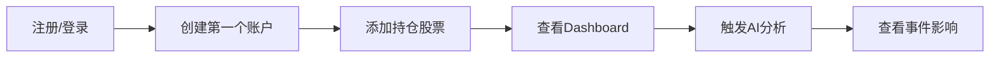
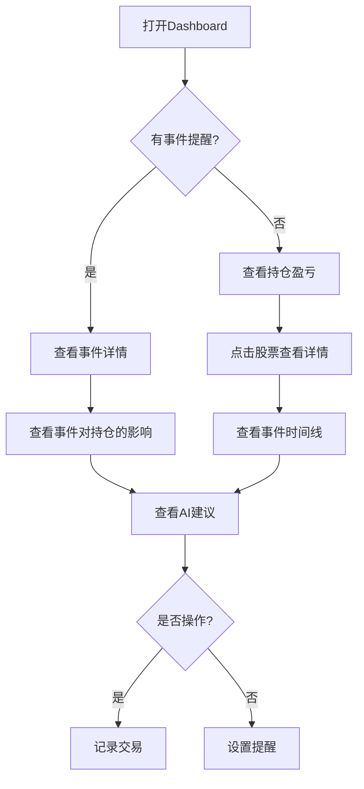
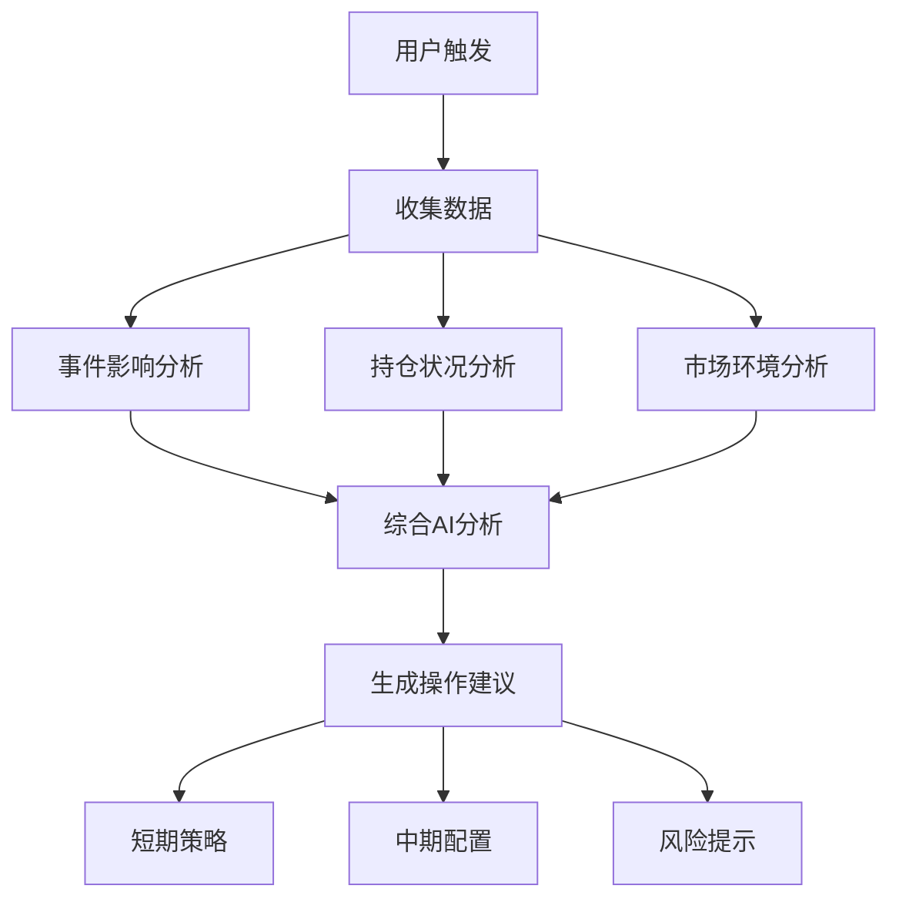
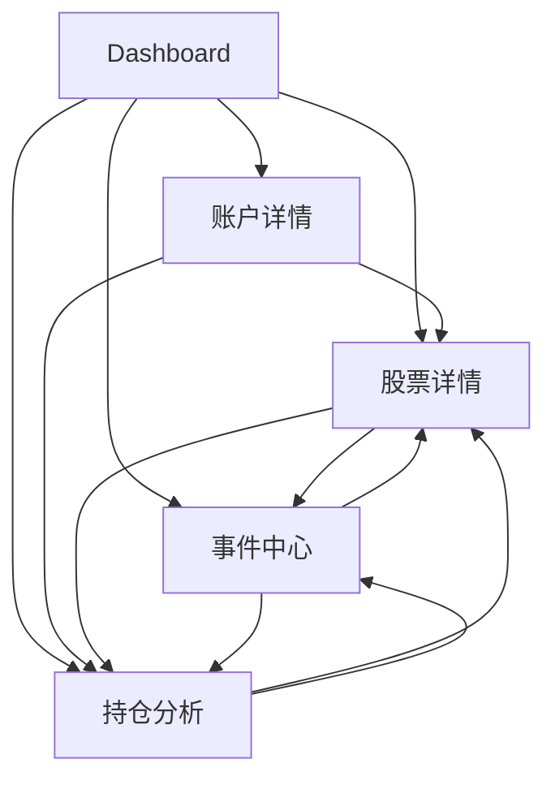

# UI原型图索引

> 投资管理系统 v3.1 UI原型图集
>
> **设计理念**: 事件驱动 + AI赋能 + 数据可视化

---

## 📑 原型图导航

### 核心页面

| 序号 | 页面名称 | 文件 | 核心功能 | 优先级 |
|------|---------|------|---------|--------|
| 01 | Dashboard | [01-dashboard.md](01-dashboard.md) | 账户概览、持仓快览、事件提醒 | P0 |
| 02 | 账户详情 | [02-account-detail.md](02-account-detail.md) | 账户资金、交易记录、绩效分析 | P0 |
| 03 | 股票详情 | [03-stock-detail.md](03-stock-detail.md) | 事件时间线、持仓详情、AI分析 | P0 |
| 04 | 事件中心 | [04-event-center.md](04-event-center.md) | 事件浏览、筛选、批量分析 | P0 |
| 05 | 持仓分析 | [05-portfolio-analysis.md](05-portfolio-analysis.md) | 事件影响矩阵、AI组合建议 | P0 |

### 待设计页面

| 页面名称 | 优先级 | 说明 |
|---------|--------|------|
| 策略管理 | P1 | AI策略保存、执行、复盘 |
| 交易记录 | P1 | 手动记录买入/卖出 |
| 设置页面 | P2 | 账户管理、通知设置、数据导入 |
| 用户中心 | P2 | 个人信息、订阅管理 |

---

## 🎯 用户旅程

### 新用户首次使用



### 日常使用流程



### AI分析流程



---

## 🎨 设计系统

### 颜色规范

#### 功能色
- **主色调**: 蓝色 `#1890ff` (专业、信任)
- **成功/涨**: 绿色 `#52c41a`
- **危险/跌**: 红色 `#ff4d4f`
- **警告**: 橙色 `#fa8c16`
- **中性**: 灰色 `#8c8c8c`

#### 事件重要性色彩
- 🔴 **Critical** (极重要): `#ff4d4f` - 红色
- 🟠 **High** (高度重要): `#fa8c16` - 橙色
- 🟡 **Medium** (中度重要): `#fadb14` - 黄色
- 🟢 **Low** (一般关注): `#52c41a` - 绿色

#### AI分析色彩
- **利好**: 绿色系 `#52c41a`
- **利空**: 红色系 `#ff4d4f`
- **中性**: 灰色系 `#8c8c8c`

### 字体规范

#### 字号
- **特大标题**: 24px - 页面主标题
- **大标题**: 20px - 区块标题
- **中标题**: 16px - 卡片标题
- **正文**: 14px - 常规文本
- **小字**: 12px - 辅助信息

#### 字重
- **Bold (700)**: 重要数据、标题
- **Medium (500)**: 次要标题
- **Regular (400)**: 正文

### 布局规范

#### 间距
- **大间距**: 24px - 区块之间
- **中间距**: 16px - 元素之间
- **小间距**: 8px - 元素内部

#### 圆角
- **大圆角**: 8px - 卡片
- **中圆角**: 4px - 按钮
- **小圆角**: 2px - 标签

#### 阴影
- **浮起**: `0 2px 8px rgba(0,0,0,0.1)` - 卡片
- **悬浮**: `0 4px 12px rgba(0,0,0,0.15)` - 悬停态

### 组件规范

#### 按钮
```
┌─────────┐  主按钮 (Primary)
│ [操作]   │  蓝色背景 #1890ff
└─────────┘

┌─────────┐  次要按钮 (Default)
│ [操作]   │  白色背景，灰色边框
└─────────┘

┌─────────┐  文本按钮 (Text)
│  操作    │  无背景，蓝色文字
└─────────┘
```

#### 卡片
```
┌─ 卡片标题 ─────────────────┐
│                              │
│  卡片内容区域                │
│                              │
│  [操作按钮]                  │
└──────────────────────────┘
```

#### 数据卡片
```
┌──────────────┐
│ 指标名称      │
│ ¥123,456     │  大号数据
│ +12.3% 📈    │  变化和趋势
└──────────────┘
```

#### 事件卡片
```
┌─────────────────────────────┐
│ 🟠 2025-10-29  事件类型      │
│                              │
│ 事件标题和摘要               │
│                              │
│ AI影响分析:                  │
│ • 影响方向和强度             │
│ • 具体数据                   │
│ • 操作建议                   │
│                              │
│ [查看详情] [关联持仓]        │
└─────────────────────────────┘
```

---

## 📊 数据展示规范

### 价格显示
- **股价**: 保留2位小数 `¥62.50`
- **大额资金**: 千分位分隔 `¥850,000`
- **极大金额**: 使用单位 `¥1.2M` / `¥8.5万`

### 涨跌显示
```
+¥3.20 (+4.87%) 📈  涨 - 红色
-¥3.20 (-4.87%) 📉  跌 - 绿色
 ¥0.00 (0.00%)  ⏸️   平 - 灰色
```

### 百分比显示
- **盈亏**: 带符号 `+12.3%` / `-8.5%`
- **占比**: 不带符号 `48.3%`
- **精度**: 保留1-2位小数

### 日期时间
- **日期**: `2025-11-14` (年-月-日)
- **时间**: `15:30` (时:分)
- **日期时间**: `2025-11-14 15:30`
- **相对时间**: `3天前` / `2小时前`

---

## 🔄 页面关联关系



### 跳转路径说明

| 起点 | 终点 | 触发操作 | 携带参数 |
|-----|------|---------|---------|
| Dashboard | 账户详情 | 点击账户卡片 | `account_id` |
| Dashboard | 股票详情 | 点击持仓行 | `stock_code` |
| Dashboard | 事件中心 | 点击事件提醒 | `event_id` (可选) |
| Dashboard | 持仓分析 | 点击AI分析按钮 | `account_id` (可选) |
| 账户详情 | 股票详情 | 点击持仓行 | `stock_code`, `account_id` |
| 股票详情 | 事件中心 | 点击事件详情 | `stock_code`, `event_id` |
| 事件中心 | 股票详情 | 点击关联股票 | `stock_code` |
| 持仓分析 | 股票详情 | 点击持仓行 | `stock_code`, `account_id` |

---

## 💡 交互规范

### 加载状态

#### 骨架屏
```
┌─ 标题 ─────────────────┐
│ ████████░░░░░░░░░░      │
│                         │
│ ████░░░░  ████░░░░      │
│ ████░░░░  ████░░░░      │
│                         │
└─────────────────────┘
```

#### 进度提示
```
AI正在分析您的持仓...

[████████░░░░░░░░] 45%

预计还需要 15 秒
```

### 空状态

#### 无数据
```
┌─────────────────────┐
│                     │
│      📭             │
│                     │
│   暂无相关数据      │
│                     │
│  [去添加第一条]     │
│                     │
└─────────────────────┘
```

### 错误状态

#### 加载失败
```
┌─────────────────────┐
│                     │
│      ⚠️             │
│                     │
│   数据加载失败      │
│                     │
│  [重新加载]         │
│                     │
└─────────────────────┘
```

### 反馈提示

#### Toast 消息
```
┌─────────────────────┐
│ ✅ 操作成功          │
└─────────────────────┘

┌─────────────────────┐
│ ❌ 操作失败: 原因    │
└─────────────────────┘

┌─────────────────────┐
│ ⚠️  警告: 提示信息   │
└─────────────────────┘
```

---

## 📱 响应式设计

### 断点
- **Desktop**: ≥ 1200px
- **Tablet**: 768px - 1199px
- **Mobile**: < 768px

### 布局策略

#### Desktop (≥ 1200px)
- 三栏布局: 侧边栏 + 主内容 + 右侧栏
- 多列卡片展示
- 完整表格

#### Tablet (768px - 1199px)
- 两栏布局: 主内容 + 右侧栏
- 双列卡片展示
- 简化表格

#### Mobile (< 768px)
- 单栏布局
- 单列卡片堆叠
- 卡片式表格（每行一个卡片）
- 底部导航栏

---

## 🎬 动画效果

### 过渡动画
- **页面切换**: 淡入淡出 `0.3s ease`
- **卡片展开**: 高度过渡 `0.2s ease`
- **数据更新**: 数字滚动效果

### 加载动画
- **骨架屏**: 脉冲闪烁
- **进度条**: 从左到右填充
- **Spinner**: 旋转加载

### 交互动画
- **按钮悬停**: 阴影加深 `0.15s ease`
- **卡片悬停**: 轻微上浮 `0.2s ease`
- **列表项选中**: 背景色渐变

---

## 🔗 与PRD的对应关系

| 原型图 | PRD章节 | 核心需求 |
|-------|---------|---------|
| 01-dashboard | [2.1 账户管理](../../prd/v3/prd-section-2.1-accounts.md) | R-ACC-001 ~ R-ACC-003 |
| 02-account-detail | [2.1 账户管理](../../prd/v3/prd-section-2.1-accounts.md) | R-ACC-004 ~ R-ACC-006 |
| 03-stock-detail | [2.9 事件分析](../../prd/v3/prd-section-2.9-events.md) | R-EVT-002, R-EVT-006 |
| 04-event-center | [2.9 事件分析](../../prd/v3/prd-section-2.9-events.md) | R-EVT-001 ~ R-EVT-005 |
| 05-portfolio-analysis | [2.8 AI分析](../../prd/v3/prd-section-2.8-ai-analysis.md) | R-AI-001 ~ R-AI-004 |

---

## 🚀 实现优先级

### P0 - MVP必须 (v3.1)
- ✅ Dashboard (01)
- ✅ 账户详情 (02)
- ✅ 股票详情 (03)
- ✅ 事件中心 (04)
- ✅ 持仓分析 (05)

### P1 - 重要功能
- ⏳ 策略管理
- ⏳ 交易记录页

### P2 - 优化体验
- ⏳ 设置页面
- ⏳ 用户中心

---

## 📝 设计原则

### 1. 事件驱动
- 事件是第一公民
- 所有分析基于事件
- 事件与持仓强关联

### 2. AI赋能
- AI分析贯穿始终
- 可解释的AI建议
- 基于数据的决策支持

### 3. 数据可视化
- 关键数据突出显示
- 趋势一目了然
- 复杂数据简单呈现

### 4. 用户体验
- 响应式设计
- 流畅的交互
- 友好的提示

### 5. 可扩展性
- 模块化设计
- 统一的组件库
- 灵活的布局

---

## 🛠 技术实现建议

### 前端技术栈
- **框架**: Vue 3 + Composition API
- **语言**: TypeScript
- **样式**: TailwindCSS
- **UI库**: Element Plus / Naive UI
- **图表**: ECharts / D3.js
- **状态管理**: Pinia
- **路由**: Vue Router
- **HTTP客户端**: Axios

### 后端技术栈
- **框架**: FastAPI
- **语言**: Python 3.11+
- **ORM**: SQLAlchemy 2.0
- **迁移**: Alembic
- **验证**: Pydantic
- **异步**: asyncio + asyncpg
- **任务调度**: APScheduler / Celery
- **缓存**: Redis
- **数据库**: PostgreSQL 15+

### 图表需求
| 页面 | 图表类型 | 库推荐 |
|-----|---------|-------|
| 账户详情 | 净值曲线、柱状图 | ECharts |
| 股票详情 | K线图、分时图 | TradingView |
| 持仓分析 | 饼图、雷达图 | ECharts |
| 事件中心 | 时间线、日历 | 自定义组件 |

### 性能优化
- **虚拟滚动**: 长列表优化
- **懒加载**: 图片、图表按需加载
- **缓存策略**: AI分析结果缓存
- **防抖节流**: 搜索、筛选操作

---

## 📚 参考资源

### 设计参考
- [Ant Design 设计语言](https://ant.design/docs/spec/introduce-cn)
- [Material Design 指南](https://material.io/design)

### 金融产品参考
- 雪球、富途牛牛、老虎证券

### 事件时间线参考
- GitHub Timeline
- Twitter Timeline
- Linear Roadmap

---

## 📅 更新日志

| 日期 | 版本 | 更新内容 |
|------|-----|---------|
| 2025-11-14 | v1.0 | 初版完成，包含5个核心页面 |

---

## 🤝 贡献指南

### 添加新原型图
1. 使用统一的文档模板
2. 包含桌面端和移动端布局
3. 标注功能模块和交互流程
4. 更新本索引文档

### 原型图命名规范
- 格式: `{序号}-{页面名称}.md`
- 序号: 两位数字 `01`, `02`, ...
- 页面名称: 中文短名称，无空格

### 文档结构要求
```markdown
# {页面名称} 原型图

> **页面**: 页面类型
> **功能**: 核心功能摘要

---

## 布局结构
(ASCII布局图)

---

## 功能模块说明
(详细说明)

---

## 相关页面
(交叉引用)
```

---

## 联系方式

如有问题或建议，请通过以下方式反馈:
- 项目Issue: (待补充)
- 文档维护: (待补充)
