# PRD v3 — AI驱动的个人投资管理与复盘系统

**版本**: v3.1
**状态**: 待评审
**日期**: 2025-01-14
**范围**: 多账户投资管理、AI策略生成、策略复盘、资金流动性管理、事件分析与追踪

**v3.1 更新**:
- ✨ 新增完整的事件分析与追踪体系（2.9章节）
  - 四大类事件（政策/公司/市场/行业）、16种子类型
  - AI事件影响分析与预测
  - 事件时间线与可视化
  - 事件与持仓/策略的深度集成
  - 定时任务与智能提醒

---

## 1. 背景与目标

### 1.1 背景
基于用户实际投资管理需求，构建一个**数据库驱动的投资管理系统**，核心解决：
- 多券商账户的统一管理
- 基于流动资金的智能操作建议
- AI策略的生成、记录与复盘
- 全市场（A股、港股、美股等）股票管理
- 投资决策的可追溯与复盘分析

### 1.2 目标
1. **账户资金管理**：精确追踪每个账户的总资金、已投资、流动资金
2. **AI智能建议**：基于流动资金和持仓情况生成操作策略
3. **策略复盘**：记录每日AI策略，支持历史回顾和效果评估
4. **多市场支持**：A股、港股、美股等全球市场
5. **数据驱动**：完全基于数据库，无需维护文档

---

## 2. 核心功能需求

### 2.1 用户与认证

#### 2.1.1 用户注册与登录
- 邮箱注册
- 用户名/邮箱 + 密码登录
- JWT Token认证

#### 2.1.2 AI Token管理
- **Token套餐**：用户购买AI调用额度
  - 基础套餐：10万tokens（约100次分析）
  - 标准套餐：50万tokens（约500次分析）
  - 高级套餐：200万tokens（约2000次分析）
- **Token消耗追踪**：
  - 每次AI调用记录消耗量
  - 实时显示剩余额度
  - 余额不足时提醒充值
- **消耗明细**：
  - 分析类型、消耗量、时间
  - 按日/周/月统计

---

### 2.2 账户管理

#### 2.2.1 账户基本信息
每个账户包含：
- **账户名称**：华泰证券、中信证券等
- **券商名称**：券商标识
- **账号后四位**：用于区分
- **总资金**：该账户投入的总资金（如30万）
- **已投资金额**：当前持仓市值
- **流动资金**：可用于新建仓或加仓的资金
- **冻结资金**：待交割资金（可选）
- **账户状态**：活跃、归档

#### 2.2.1.1 交易费用配置
不同券商、不同市场的交易费用不同，需为每个账户配置：

**佣金（Commission）**
- **佣金率**（commission_rate）：按交易金额的百分比
  - A股典型范围：0.02% - 0.03%（万2 - 万3）
  - 港股典型范围：0.03% - 0.25%
  - 美股典型范围：固定费用（如$0.99/笔）或按股数
- **最低佣金**（min_commission）：单笔最低收费
  - A股典型：5元
  - 港股典型：100港元
  - 美股典型：$0.99

**印花税（Stamp Duty）** - 仅卖出时收取
- **A股**：0.1%（千分之一）- 国家规定，固定
- **港股**：0.13%（千分之1.3）- 固定
- **美股**：无

**过户费（Transfer Fee）**
- **A股**：0.001%（万分之一）- 固定
- **港股**：按股数收取（如每股HKD 0.002）
- **美股**：无（或极低）

**其他费用**
- **证管费**：A股0.002%（买卖双向）
- **证券交易经手费**：A股0.00487%（买卖双向）
- **平台使用费**：部分券商收取（可选）

**费用配置示例**：
```json
// 华泰证券A股账户
{
  "commission_rate": 0.0003,      // 万3
  "min_commission": 5.0,          // 最低5元
  "stamp_duty_rate": 0.001,       // 印花税0.1%（卖出）
  "transfer_fee_rate": 0.00001,   // 过户费0.001%
  "other_fees": {
    "regulatory_fee": 0.00002,    // 证管费0.002%
    "handling_fee": 0.0000487     // 经手费0.00487%
  }
}

// 富途证券港股账户
{
  "commission_rate": 0.0003,      // 0.03%
  "min_commission": 15.0,         // 最低15港元
  "stamp_duty_rate": 0.0013,      // 印花税0.13%（卖出）
  "other_fees": {
    "transaction_levy": 0.000027, // 交易征费0.0027%
    "trading_fee": 0.00005,       // 交易费0.005%
    "settlement_fee": 0.00002     // 结算费0.002%
  }
}
```

**费用计算逻辑**：
```
买入总成本 = 成交金额 + 佣金 + 其他费用
卖出净收入 = 成交金额 - 佣金 - 印花税 - 过户费 - 其他费用

佣金 = max(成交金额 × 佣金率, 最低佣金)

实际收益 = 卖出净收入 - 买入总成本
```

#### 2.2.2 资金计算逻辑
```
总资金 = 已投资金额 + 流动资金 + 冻结资金
已投资金额 = Σ(持仓股票市值)
流动资金 = 总资金 - 已投资金额 - 冻结资金
```

#### 2.2.3 资金管理功能
- **充值/提现记录**：记录资金变动
- **资金流水**：所有资金变动历史
- **资金分配建议**：AI根据流动资金建议操作
  - 流动资金充足（>30%）→ 建议新建仓或加仓
  - 流动资金适中（10-30%）→ 建议等待机会
  - 流动资金不足（<10%）→ 建议持有或减仓

---

### 2.3 股票信息库

#### 2.3.1 全市场支持
- **A股**：沪深交易所（代码格式：000001, 600000等）
- **港股**：港交所（代码格式：00700, 09988等）
- **美股**：纳斯达克、纽交所（代码格式：AAPL, TSLA等）
- **其他市场**：可扩展（日本、欧洲等）

#### 2.3.2 股票基础信息
- **基本信息**：代码、名称、市场、交易所、行业、市值
- **交易规则**：
  - **最小交易单位**（lot_size）：
    - A股：100股（1手）
    - 港股：按股票不同（腾讯=100股，比亚迪=500股）
    - 美股：1股
  - **价格涨跌幅限制**：
    - A股：±10%（ST股±5%，科创板/创业板±20%）
    - 港股：无限制
    - 美股：无限制
  - **交易时间**：开盘/收盘时间
  - **货币**：CNY/HKD/USD

#### 2.3.3 公司信息
- 主营业务
- 核心竞争力
- 主要风险
- 财务指标（市盈率、ROE、负债率等）

#### 2.3.4 数据来源
- **MCP服务**：通过Model Context Protocol获取
  - akshare MCP：A股数据
  - 港股/美股MCP：港股、美股数据
  - 第三方MCP服务器（可配置）

---

### 2.4 持仓管理

#### 2.4.1 持仓信息
- **股票代码、名称、市场**
- **持仓数量**（quantity）
- **可用数量**（available_quantity）：可卖出数量
- **平均成本**（avg_cost）：加权平均成本
- **当前价格**（current_price）：最新价格
- **持仓市值**：quantity × current_price
- **未实现盈亏**：(current_price - avg_cost) × quantity
- **盈亏比例**：未实现盈亏 / (avg_cost × quantity)
- **持仓占比**：持仓市值 / 账户总资金
- **用户标签**：核心持仓、长期持有、短线等
- **AI标签**：长期持有、注意操作、建议减仓等
- **持仓状态**：持有中、已清仓

#### 2.4.2 持仓操作
- **添加持仓**：手动输入或导入
- **更新持仓**：调整数量、成本
- **刷新价格**：通过MCP获取最新价格（手动触发）
- **查看持仓**：列表、详情、分组
- **持仓导入**：
  - CSV批量导入
  - OCR图片识别（Phase 2）

#### 2.4.3 关注列表
- **关注股票**：未持有但关注的股票
- **目标价位**：期望买入价格
- **关注理由**：备注说明
- **状态**：关注中、已建仓

---

### 2.5 交易记录

#### 2.5.1 交易类型
- **买入**（buy）
- **卖出**（sell）
- **分红**（dividend）
- **送股/转增**（stock_dividend）
- **拆股/并股**（split）

#### 2.5.2 交易信息
- 交易时间、股票代码、交易类型
- 数量、价格、金额
- 手续费、印花税、过户费
- 备注说明
- 幂等键（防重复）

#### 2.5.3 交易记录功能
- **新增交易**：手动录入
  - 用户输入：股票代码、数量、价格
  - 系统自动计算费用（基于账户的fee_config）：
    ```
    成交金额 = 数量 × 价格
    佣金 = max(成交金额 × 佣金率, 最低佣金)
    印花税 = 成交金额 × 印花税率（仅卖出）
    过户费 = 成交金额 × 过户费率
    其他费用 = 成交金额 × (证管费率 + 经手费率)
    总费用 = 佣金 + 印花税 + 过户费 + 其他费用

    买入实际成本 = 成交金额 + 总费用
    卖出实际收入 = 成交金额 - 总费用
    ```
  - 用户可手动调整费用（如券商有优惠）

- **批量导入**：从券商导出的交易记录
  - 支持CSV格式
  - 自动解析交易类型、数量、价格、费用

- **交易历史**：按时间、股票、类型查询

- **已实现盈亏计算**：卖出时计算盈亏
  - 采用先进先出（FIFO）原则
  - 已实现盈亏 = 卖出净收入 - 对应批次的买入成本
  - 考虑所有交易费用

- **费用统计**：
  - 按月/年统计总交易费用
  - 分析不同券商的费用差异
  - 优化交易策略降低费用

---

### 2.6 AI策略生成

#### 2.6.1 整体持仓分析
**触发方式**：用户点击"分析持仓"

**AI分析内容**：
```
【账户概览】
- 总资金：30万
- 已投资：14.5万（48.3%）
- 流动资金：15.5万（51.7%）
- 未实现盈亏：+0.7万（+4.8%）

【持仓明细分析】
对每只股票（示例：青岛啤酒）：
  - 当前价：65.8元，成本：78.4元，盈亏：-16.1%
  - 持仓占比：7.3%（偏高）
  - AI操作建议：
    * 持有：等待消费复苏
    * 加仓：62-64元区间加仓500股
    * 止损：跌破58元止损
  - 理由：消费行业底部，品牌价值稳固

【资金运用建议】
- 流动资金15.5万充足（>50%）
- 建议操作：
  1. 青岛啤酒回调至62-64元可加仓（使用3万）
  2. 关注腾讯控股620-630港元（使用6万）
  3. 预留6.5万等待其他机会

【组合层面建议】
- 行业配置：消费50%，科技20%，金融15%，其他15%
- 风险评估：单股集中度偏高（青岛啤酒7.3%）
- 再平衡建议：分散到其他消费股

【风险提示】
- 青岛啤酒浮亏较大，需关注基本面
- 市场波动加大，控制仓位
```

#### 2.6.2 单股深度分析
**触发方式**：点击某只股票 → "AI深度分析"

**AI分析内容**：
```
【我的持仓】
- 青岛啤酒（600600）
- 持有：1600股，成本：78.4元，现价：65.8元
- 盈亏：-20,169元（-16.1%）

【公司基本面】（从MCP获取）
- 主营业务：啤酒生产与销售
- 核心竞争力：品牌、渠道
- 最新财务：Q3营收+5%，净利润-3%
- 行业地位：行业第二，市占率15%

【AI深度分析】
- 基本面评分：75/100（中等）
  * 营收稳健，但净利润承压
  * 高端化转型进展缓慢
  * 原材料成本上升
- 技术面分析：
  * 趋势：下降趋势，接近支撑位
  * 支撑位：65元、60元、55元
  * 阻力位：70元、75元、80元
- 估值分析：
  * 市盈率：22倍（行业平均25倍）
  * 市净率：2.8倍（合理）
  * 股息率：2.5%（偏低）

【投资建议】
- 当前阶段：持有等待，不建议加仓
- 具体操作：
  * 加仓时机：跌破60元且基本面改善
  * 止盈时机：回升至85元
  * 止损位：52元
- 长期观点：中性
  * 看好：品牌价值、行业集中度提升
  * 担忧：高端化进展慢、成本压力

【基于流动资金的建议】
- 当前流动资金：15.5万（充足）
- 是否建议加仓：不建议（基本面未改善）
- 建议用途：等待更好标的或青岛啤酒跌至55元

【具体交易计划】

买入策略：
| 买入点 | 买入数量 | 买入条件 | 触发事件 |
|--------|----------|----------|----------|
| 62-64元 | 300股 | 价格回落至62-64元区间 | 基本面改善，消费数据回暖 |
| 58-60元 | 500股 | 价格回落至58-60元区间 | 技术支撑位，估值低估 |
| 55-58元 | 500股 | 价格回落至55-58元区间 | 深度低估，基本面未恶化 |

卖出策略：
| 卖出点 | 卖出数量 | 卖出条件 | 触发事件 |
|--------|----------|----------|----------|
| 75-78元 | 500股 | 价格达到75-78元区间 | 回本区域，减仓降低风险 |
| 82-85元 | 600股 | 价格达到82-85元区间 | 估值合理偏高，锁定利润 |
| 90-95元 | 500股 | 价格达到90-95元区间 | 估值泡沫化，全部清仓 |

风险控制：
| 止损位 | 操作 | 触发条件 |
|--------|------|----------|
| 52元 | 清仓 | 基本面严重恶化或行业重大利空 |
| 跌破50元 | 紧急加仓 | 非理性下跌，价值严重低估 |
```

#### 2.6.3 投资机会发现
**触发方式**：用户点击"发现投资机会"

**用户输入**：
- 行业：科技、消费、医疗等（可选）
- 风险偏好：保守、稳健、激进
- 市值范围：大盘、中盘、小盘
- 投资期限：短期、中期、长期
- 最大投资金额：基于当前流动资金

**AI推荐输出**：
```
基于你的账户情况：
- 流动资金：15.5万
- 风险偏好：稳健
- 投资期限：中长期

推荐5个投资机会：

1. 【腾讯控股 (00700)】- 评分：90/100
   - 推荐理由：互联网龙头，估值合理，业绩稳健
   - 当前价：650港元
   - 目标价：750港元（+15%）
   - 建议仓位：6万港元（约100股）
   - 风险等级：中
   - 最小交易：100股

2. 【中国神华 (601088)】- 评分：85/100
   - 推荐理由：高股息（8%），能源安全受益
   - 当前价：43元
   - 目标价：50元（+16%）
   - 建议仓位：4万元（约900股）
   - 风险等级：低
   - 最小交易：100股

3. 【宁德时代 (300750)】- 评分：82/100
   - 推荐理由：新能源龙头，技术领先
   - 当前价：385元
   - 目标价：450元（+17%）
   - 建议仓位：3万元（约77股）
   - 风险等级：中高
   - 最小交易：100股（需投资38,500元）

...

【资金分配建议】
- 总流动资金：15.5万
- 建议分配：
  * 腾讯控股：6万（38.7%）
  * 中国神华：4万（25.8%）
  * 宁德时代：3万（19.4%）
  * 预留资金：2.5万（16.1%）
```

#### 2.6.4 AI Token消耗
- 快速分析（整体持仓）：约2000 tokens
- 深度分析（单股）：约5000 tokens
- 投资机会发现：约3000 tokens
- 实时显示本次消耗和剩余额度

---

### 2.7 策略记录与复盘

#### 2.7.1 策略记录
**每次AI分析自动记录：**
- 策略生成时间
- 策略类型（整体分析、单股分析、机会发现）
- 股票代码（如果是单股分析）
- AI建议内容（JSON格式存储）
  - 操作建议：持有/加仓/减仓/清仓
  - 目标价位
  - 止损位
  - 建议理由
- 当时的持仓情况快照
  - 持仓数量、成本、当前价、盈亏
- 当时的价格快照
  - 股票价格、成交量
- 当时的资金情况
  - 流动资金、已投资金额

#### 2.7.2 策略回顾看板
**功能**：查看历史AI策略，对比实际执行情况

**视图1：策略列表**
```
| 日期 | 股票 | AI建议 | 建议价位 | 当时价格 | 当前价格 | 是否执行 | 执行效果 |
|------|------|--------|---------|----------|----------|----------|----------|
| 2025-11-01 | 青岛啤酒 | 加仓500股 | 62-64元 | 65.8元 | 66.5元 | 未执行 | N/A |
| 2025-11-02 | 腾讯控股 | 买入100股 | 620-630港元 | 632港元 | 650港元 | 已执行 | +2.8% |
| 2025-11-03 | 中国神华 | 持有 | - | 43元 | 42.5元 | 已执行 | -1.2% |
```

**视图2：策略详情**
```
【策略详情】
- 生成时间：2025-11-01 15:00
- 股票：青岛啤酒（600600）
- 类型：单股深度分析

【AI建议】
- 操作：加仓500股
- 目标价位：62-64元
- 理由：消费底部，估值修复空间大
- 止损位：58元

【当时情况】
- 股票价格：65.8元
- 持仓：1600股 @ 78.4元
- 盈亏：-16.1%
- 流动资金：15.5万

【执行情况】
- 是否执行：未执行
- 未执行原因：价格未到目标区间

【策略效果评估】
- 当前价格：66.5元
- 如果执行的收益：+1.1%（假设在63元买入）
- 实际结果：未操作
```

#### 2.7.3 复盘功能
**周度/月度复盘：**

**1. 策略执行率**
- 总策略数：20条
- 已执行：12条（60%）
- 未执行：8条（40%）
  - 价格未到：5条
  - 流动资金不足：2条
  - 手动放弃：1条

**2. 策略准确率**
- 已执行策略中：
  - 盈利：8条（66.7%）
  - 亏损：4条（33.3%）
- 平均收益率：+3.2%

**3. 未执行策略分析**
- 如果执行的收益：
  - 青岛啤酒加仓未执行：错过+1.1%
  - 宁德时代建仓未执行：错过+5.2%

**4. AI建议质量评估**
```
| 指标 | 数值 |
|------|------|
| 总建议数 | 20 |
| 盈利建议 | 13（65%） |
| 亏损建议 | 7（35%） |
| 平均预测准确率 | 68% |
| 最佳建议 | 宁德时代买入（+12%） |
| 最差建议 | 万科A加仓（-8%） |
```

**5. 资金利用率**
- 平均流动资金占比：45%
- 最高持仓占比：70%
- 最低持仓占比：30%
- 建议：保持40-60%持仓

**6. 改进建议**
- 执行纪律：严格按AI建议价位操作
- 风险控制：设置止损并严格执行
- 仓位管理：避免单股占比过高

---

### 2.8 价格管理

#### 2.8.1 价格获取方式
- **手动刷新**：用户点击"刷新价格"按钮
  - 可单个股票刷新
  - 可全部持仓刷新
  - 可按账户刷新
- **批量更新**：一键更新所有持仓价格
- **数据来源**：通过MCP服务获取实时行情

#### 2.8.2 价格历史
- **历史价格记录**：每次刷新保存快照
- **价格走势图**：显示历史价格曲线
- **价格提醒**：
  - 达到目标价提醒
  - 跌破止损位提醒
  - 涨跌幅超过X%提醒

---

### 2.9 事件分析与追踪

> **设计目标**: 构建完整的事件管理体系，让AI参考政策事件、公司事件、市场事件和行业事件来分析整个股市和个股，提供更全面、更准确的投资建议。

#### 2.9.1 事件类型体系

系统支持四大类事件,16种子类型：

**1. 政策事件 (Policy Events)**
- **货币政策** (policy_monetary)
  - 利率调整（美联储加息/降息、央行降准降息）
  - LPR利率调整
  - 公开市场操作（逆回购、MLF等）
  - 存款准备金率调整

- **财政政策** (policy_fiscal)
  - 财政刺激计划
  - 税收政策调整（减税、退税）
  - 政府工作报告
  - 专项债发行

- **监管政策** (policy_regulatory)
  - 行业监管政策（房地产、互联网、教育等）
  - 金融监管政策
  - 环保政策
  - 反垄断政策
  - 上市规则、交易规则调整

- **国际政策** (policy_international)
  - 中美贸易谈判
  - 关税政策
  - 国际制裁
  - 国际协议

**2. 公司事件 (Company Events)**
- **财报相关** (company_earnings)
  - 财报发布（年报、季报、半年报）
  - 业绩预告/业绩快报
  - 业绩修正
  - 分红派息公告

- **公司治理** (company_governance)
  - 高管变动（董事长、CEO、CFO等）
  - 股东大会决议
  - 董事会决议
  - 股权变动（增持、减持、股权转让）

- **资本运作** (company_capital)
  - 并购收购
  - 战略合作
  - 融资事件（增发、配股、发债）
  - IPO/退市
  - 股票回购

- **业务变化** (company_business)
  - 重大合同签订
  - 新产品发布
  - 产能扩张/新工厂投产
  - 业务重组/资产重组

**3. 市场事件 (Market Events)**
- **指数调整** (market_index)
  - 指数成分股调整
  - 权重变化
  - 新指数发布

- **资金流动** (market_flow)
  - 北向资金/南下资金流入流出
  - 外资流入流出
  - 大宗交易
  - 融资融券变化

- **市场情绪** (market_sentiment)
  - VIX指数、恐慌指数
  - 投资者情绪指标
  - 市场氛围转变

- **技术突破** (market_technical)
  - 关键点位突破
  - 趋势变化
  - 成交量异常

**4. 行业事件 (Industry Events)**
- **技术突破** (industry_tech)
  - 新技术发布
  - 专利突破
  - 技术标准制定

- **竞争格局** (industry_competition)
  - 市场份额变化
  - 新进入者
  - 竞争对手动态

- **供需关系** (industry_supply)
  - 原材料价格变化
  - 产能变化
  - 需求变化
  - 供应链变化

- **行业政策** (industry_policy)
  - 行业专项政策
  - 补贴政策
  - 准入门槛调整

---

#### 2.9.2 事件记录功能

**手动记录事件**

```
【添加事件】
- 事件类型：政策事件 > 货币政策
- 事件标题：美联储加息25个基点至5.25%-5.50%
- 事件时间：2025-11-07 02:00
- 发布时间：2025-11-07 03:30

- 事件摘要（200-500字）：
  美联储在11月FOMC会议上决定加息25个基点，将联邦基金利率目标区间提升至5.25%-5.50%。
  这是今年第11次加息，累计加息525个基点。决议投票11-1，明尼阿波利斯联储主席卡什卡里投反对票。
  鲍威尔在新闻发布会上表示，通胀仍需进一步降温，未来加息路径取决于经济数据。

- 影响范围：
  □ 全市场
  ☑ 特定市场：美股、港股、A股
  ☑ 特定行业：科技、金融、房地产、消费
  ☑ 特定股票：00700(腾讯控股), 002594(比亚迪)

- 重要性级别：
  ☑ 极其重要 (Critical) - 影响整个市场
  □ 高度重要 (High) - 影响行业或大盘股
  □ 中度重要 (Medium) - 影响个股或板块
  □ 低度重要 (Low) - 参考性事件

- 影响方向（AI可预填）：
  □ 利好 (Positive)
  ☑ 利空 (Negative)
  □ 中性 (Neutral)
  □ 复杂影响 (Mixed)

- 影响强度：75/100 (AI评估)

- 详细内容（可选）：
  [可粘贴新闻全文或详细分析]

- 我的备注：
  对港股科技股影响较大，需关注腾讯走势。
  可能触发南下资金流出。

- 触发操作：
  ☑ 触发AI影响分析
  ☑ 添加到我的事件日历
  □ 立即生成交易计划
```

**批量导入事件**
- 支持CSV格式导入
- 支持从新闻API自动采集（通过MCP）
- 自动去重（基于标题相似度 + 时间窗口）

---

#### 2.9.3 事件时间线与展示

**全局事件时间线**
```
【事件中心 - 近30天事件】

筛选：[类型: 全部▼] [重要性: High+▼] [市场: 全部▼] [时间: 30天▼]

🔴 2025-11-07 ● 美联储加息25bp至5.25%-5.50%
├─ 类型：政策 > 货币政策
├─ 重要性：极其重要
├─ 影响：利空 (75/100)
├─ 市场：美股-2.3%，港股-1.8%，A股-0.8%
├─ 影响行业：科技(负面)、金融(正面)、房地产(负面)
├─ 我的持仓影响：-1.2% (腾讯-2.5%, 比亚迪-1.8%)
└─ 我的操作：减仓腾讯200股 [关联交易]
    └─ AI分析：[查看详细分析]

🟠 2025-10-29 ● 青岛啤酒Q3财报：营收+5%，净利润-3%
├─ 类型：公司 > 财报相关
├─ 重要性：高度重要
├─ 影响：利空 (65/100)
├─ 股价：65.8元 → 62.5元 (-5%)
├─ 我的持仓：1600股 @ 78.4元，浮亏-20%
└─ 我的操作：观望
    └─ AI分析：[查看详细分析]

🟡 2025-10-18 ● 中国Q3 GDP公布：4.9%（预期5.0%）
├─ 类型：政策 > 经济数据
├─ 重要性：高度重要
├─ 影响：中性偏负面 (45/100)
├─ 市场：A股-0.5%
└─ 我的操作：无

🟠 2025-09-15 ● 青岛啤酒控股股东增持1000万股
├─ 类型：公司 > 公司治理
├─ 重要性：中度重要
├─ 影响：利好 (68/100)
├─ 股价：+3%
└─ 我的操作：无

🟡 2025-08-15 ● 中国央行降准50bp
├─ 类型：政策 > 货币政策
├─ 重要性：极其重要
├─ 影响：利好 (85/100)
├─ 市场：A股+1.5%，消费股领涨
├─ 我的持仓影响：+1.8% (青岛啤酒+2.5%)
└─ 我的操作：加仓青岛啤酒300股 [关联交易]
```

**股票事件时间线**（在股票详情页展示）
```
【青岛啤酒 (600600) - 事件时间线】

🟠 2025-10-29 ● 财报发布
├─ Q3营收+5%，净利润-3%
├─ 股价影响：-5%（65.8元 → 62.5元）
├─ AI评分：65/100
└─ 我的操作：观望

✅ 2025-09-15 ● 股东增持
├─ 控股股东增持1000万股
├─ 股价影响：+3%（69元）
└─ 我的操作：无

✅ 2025-08-10 ● 新产品发布
├─ 推出高端精酿系列
├─ 股价影响：+2%（72元）
└─ 我的操作：买入500股@71元

ℹ️ 2025-07-05 ● 分红派息
├─ 每10股派息8元（税前）
├─ 股价影响：-2%（除息）
└─ 我的操作：持有

✅ 2025-04-28 ● 年报发布
├─ 全年营收+8%，净利润+6%
├─ 股价影响：+7%（75元）
└─ 我的操作：加仓800股@74元
```

---

#### 2.9.4 AI事件影响分析

**自动分析事件影响（单个事件）**

当用户添加或系统采集到事件后，AI自动分析：

```
【AI事件影响评估】
事件：美联储加息25bp至5.25%-5.50%
时间：2025-11-07

━━━ 全球市场影响 ━━━

美股：短期承压，科技股跌幅较大
  • 纳斯达克预测：-2% ~ -3%
  • 标普500预测：-1.5% ~ -2%
  • 原因：高估值股票承压，融资成本上升
  • 置信度：85%

港股：跟随美股下跌
  • 恒指预测：-1.5% ~ -2%
  • 恒生科技：-2.5% ~ -3.5%
  • 原因：资金外流压力、美元走强
  • 置信度：80%

A股：影响相对有限
  • 上证预测：-0.5% ~ -1%
  • 创业板预测：-1% ~ -1.5%
  • 原因：人民币贬值压力、出口影响
  • 置信度：70%

━━━ 行业影响分析 ━━━

1. 科技行业：负面 (-2.5%)
   • 高估值压力
   • 融资成本上升
   • 增长预期下调

2. 金融行业：正面 (+1.5%)
   • 利差扩大
   • 净息差改善
   • 建议：关注银行股

3. 消费行业：中性偏负面 (-0.5%)
   • 消费信心受影响
   • 可选消费承压
   • 必选消费相对稳健

4. 房地产：负面 (-3%)
   • 融资成本上升
   • 销售压力加大

━━━ 对您持仓的具体影响 ━━━

1. 青岛啤酒（600600）- 持仓占比7.3%
   影响：轻微负面 (-0.5%)
   理由：
   • 主要市场在中国，美联储影响有限
   • 消费股估值相对稳健
   • 出口占比小
   建议：继续持有，影响可忽略
   置信度：75%

2. 腾讯控股（00700）- 持仓占比15%
   影响：较大负面 (-2.5%)
   理由：
   • 港股科技股，高估值压力大
   • 南下资金可能流出
   • 美元走强港币承压
   建议：考虑减仓10-20%，降低风险敞口
   置信度：85%

3. 比亚迪（002594）- 持仓占比8%
   影响：中等负面 (-1.8%)
   理由：
   • 成长股估值承压
   • 但受益于国内新能源政策
   建议：观望，关注国内刺激政策
   置信度：80%

━━━ 组合层面建议 ━━━

短期策略：
1. 减仓港股科技股（腾讯）10-20%
2. 保持A股消费股（青岛啤酒）
3. 增持防御性板块（银行、高股息）

中期策略：
1. 等待美联储暂停加息信号
2. 关注中国反向宽松政策
3. 逢低布局优质成长股

风险控制：
1. 降低组合Beta值（当前1.2 → 目标1.0）
2. 提高现金仓位至40%
3. 设置止损点

预计对组合影响：
• 短期：-1.5% ~ -2%
• 建议操作后：-0.8% ~ -1%
```

**批量事件综合影响分析**

AI可以分析多个事件的综合影响：

```
【近30天重大事件综合影响】

正面事件 (3条)：
✅ 中国央行降准50bp → 对我的持仓影响：+1.8%
✅ 青岛啤酒股东增持 → 对持仓影响：+0.5%
✅ 科技板块政策支持 → 对持仓影响：+1.2%

负面事件 (2条)：
❌ 美联储加息25bp → 对我的持仓影响：-1.5%
❌ 青岛啤酒Q3财报不及预期 → 对持仓影响：-1.2%

综合判断：
• 净影响：+0.8%（正面因素略占优）
• 主要支撑：国内宽松政策
• 主要压力：美联储加息 + 个股业绩
• 建议：保持谨慎乐观，关注国内政策落地
```

---

#### 2.9.5 AI分析中的事件集成

**单股分析（增强版）**

```
【AI单股分析 - 腾讯控股 (00700)】

当前价格：650港元
我的持仓：150股 @ 620港元，盈亏：+4.8%

━━━ 近30天相关事件 (5条) ━━━

🔴 2025-11-07 | 美联储加息25bp
   影响：利空 (-2.5%)
   AI分析：港股科技股高估值承压，南下资金可能流出

🟠 2025-10-25 | 腾讯Q3财报超预期
   影响：利好 (+5%)
   AI分析：游戏业务回暖，广告收入增长强劲

⚠️ 2025-10-15 | 港府考虑提高股票印花税
   影响：利空 (-1%)
   AI分析：增加交易成本，可能抑制成交量

✅ 2025-09-20 | 腾讯回购300万股
   影响：利好 (+2%)
   AI分析：管理层看好长期价值

ℹ️ 2025-09-01 | 恒生指数权重调整
   影响：中性 (0%)
   AI分析：腾讯权重略有提升

━━━ 事件综合影响评估 ━━━

利好因素：
• Q3财报超预期（+5%）
• 公司回购（+2%）
• 总计：+7%

利空因素：
• 美联储加息（-2.5%）
• 印花税上调预期（-1%）
• 总计：-3.5%

净影响：+3.5% (利好主导)

但需注意：
• 近期利好已反映在股价中（当前650港元）
• 美联储加息影响尚未完全消化
• 建议：回调至620-630港元区间可加仓

━━━ 基于事件的操作建议 ━━━

当前阶段：持有，适度减仓
理由：
1. 公司基本面优秀（Q3财报验证）
2. 但估值偏高 + 美联储加息压力
3. 建议降低仓位至组合的10%（当前15%）

具体计划：
• 减仓：在660-680港元减仓30股
• 加仓：回调至620-630港元加仓50股
• 止损：跌破580港元（-10%）
```

**持仓分析（增强版）**

```
【AI持仓分析 - 华泰证券账户】

账户总资金：30万
流动资金：15.5万 (51.7%)
已投资：14.5万 (48.3%)

━━━ 事件告警 ━━━

🚨 重要提示 (2条)：
1. 美联储加息影响您的腾讯持仓（-2.5%预期）
   建议：考虑减仓10-20%

2. 青岛啤酒Q3财报不及预期（-5%已兑现）
   建议：回调至60元以下可加仓

⚠️ 风险提示 (1条)：
1. 港股印花税可能上调
   影响：交易成本增加
   应对：短期减少交易频率

━━━ 持仓事件影响矩阵 ━━━

| 股票 | 相关事件数 | 利好 | 利空 | 净影响 | AI建议 |
|------|-----------|------|------|--------|--------|
| 青岛啤酒 | 4 | 2 | 2 | -0.5% | 持有 |
| 腾讯控股 | 5 | 2 | 3 | -1.0% | 减仓10% |
| 比亚迪 | 3 | 2 | 1 | +1.5% | 持有 |

━━━ 组合层面建议（基于事件分析）━━━

1. 短期调整（1-2周）：
   • 减仓腾讯控股20股（降低港股敞口）
   • 等待青岛啤酒回调至60元
   • 保持流动资金充足应对波动

2. 中期配置（1-3月）：
   • 关注国内宽松政策受益股
   • 增持高股息防御板块
   • 平衡港股和A股配置

3. 事件追踪：
   • 关注12月美联储议息会议
   • 青岛啤酒Q4财报（预计2026-01-20）
   • 腾讯全年财报（预计2026-03-15）
```

---

#### 2.9.6 事件提醒与日历

**重要事件日历**

```
【本月重要事件日历】

11月14日 周二 🔴
• 美国10月CPI数据（21:30）
  重要性：⭐⭐⭐⭐⭐
  预期：3.3% vs 上月3.7%
  影响：全球市场
  提醒：提前调仓，降低高Beta持仓

11月22日 周三 🟠
• 美联储11月会议纪要公布
  重要性：⭐⭐⭐⭐
  关注点：12月加息预期
  影响：美股、港股
  提醒：关注市场反应

11月30日 周四 🟡
• 中国11月PMI数据
  重要性：⭐⭐⭐
  关注点：经济复苏强度
  影响：A股
  提醒：关注制造业景气度

12月13日 周三 🔴
• 美联储12月议息会议
  重要性：⭐⭐⭐⭐⭐
  预期：暂停加息概率60%
  影响：全球市场
  提醒：关键转折点，提前布局
```

**我的股票事件日历**

```
【我的持仓相关事件】

青岛啤酒 (600600)：
• 2025-01-20：Q4财报发布（预计）
  提醒：提前3天提醒
• 2025-04-28：年报发布
  提醒：提前3天提醒
• 2025-06-15：分红除权日（预计）

腾讯控股 (00700)：
• 2025-03-15：全年财报发布（预计）
• 2025-05-10：Q1财报发布（预计）
• 2025-08-12：Q2财报发布（预计）
```

**事件监控与推送**

- **自动监控**：
  - 关注股票的重大事件自动推送
  - 持仓股票的财报发布日提前提醒
  - 行业政策变化提醒

- **推送渠道**：
  - 站内消息
  - 邮件通知
  - 微信推送（可选）

- **推送规则**：
  - Critical事件：立即推送
  - High事件：当日汇总推送
  - Medium/Low事件：不主动推送，仅在事件中心展示

---

#### 2.9.7 事件数据管理

**数据来源**
1. **自动采集**（通过MCP）：
   - 新闻API：财经新闻、公告
   - 宏观数据API：经济数据、政策文件
   - 市场数据API：指数调整、资金流向

2. **用户手动添加**：
   - 补充或修正自动采集的数据
   - 添加个人分析和备注

3. **AI提取**：
   - 从新闻中自动识别事件
   - 分类、打标签、评估影响

**数据质量保证**
- **去重策略**：
  - 外部ID去重
  - 标题相似度检测（Jaccard相似度>80% + 时间窗口<24小时）
  - 幂等键防止重复导入

- **数据验证**：
  - 事件类型枚举检查
  - 日期范围校验
  - 影响范围合法性检查

- **AI质量评估**：
  - 事件影响预测准确性回测
  - 对比实际价格变化
  - 持续优化AI模型

**存储策略**
- **热数据**（近7天）：Redis缓存
- **温数据**（7-90天）：数据库主表
- **冷数据**（>90天）：分区表或归档

---

#### 2.9.8 定时任务设计

**事件收集任务**
- **频率**：每小时执行一次
- **流程**：
  1. 从MCP获取最新事件
  2. 去重（幂等键 + 相似度检测）
  3. AI增强（分析影响方向、强度、摘要）
  4. 保存到数据库
  5. 触发重要事件的影响分析任务

**事件影响分析任务**
- **触发方式**：事件收集后异步执行
- **条件**：仅对critical和high级别事件执行
- **流程**：
  1. 确定受影响股票列表
  2. 对每只股票进行影响分析
  3. 保存影响分析结果
  4. 标记事件为已处理

**事件提醒任务**
- **频率**：每天早上8:00执行
- **流程**：
  1. 检查今日重要事件
  2. 检查用户持仓相关事件
  3. 生成提醒消息
  4. 推送给用户

---

#### 2.9.9 前端UI设计

**事件中心页面**
```
┌─────────────────────────────────────────────────────┐
│ 事件中心                              [添加事件]     │
├─────────────────────────────────────────────────────┤
│ [筛选] 类型: [全部▼] 重要性: [全部▼] 时间: [30天▼]  │
├─────────────────────────────────────────────────────┤
│ 🔴 [极重要] 美联储加息25个基点                       │
│    政策事件 > 货币政策 | 2025-11-07 02:00           │
│    影响: 利空 (75/100) | 市场级事件                 │
│    📊 影响25只股票 | 💡 查看AI分析                  │
├─────────────────────────────────────────────────────┤
│ 🟠 [高度重要] 腾讯Q3财报超预期                       │
│    公司事件 > 财报相关 | 2025-10-25 16:00           │
│    影响: 利好 (85/100) | 00700                      │
│    📊 查看影响分析                                   │
├─────────────────────────────────────────────────────┤
│ 🟡 [中度重要] 青岛啤酒股东增持                       │
│    公司事件 > 公司治理 | 2025-09-15 09:00           │
│    影响: 利好 (68/100) | 600600                     │
└─────────────────────────────────────────────────────┘
```

**股票详情页 - 事件区块**
```
┌─────────────────────────────────────────────────────┐
│ 腾讯控股 (00700)                                     │
│ 当前价格: 650港元 (+2.3%)                           │
├─────────────────────────────────────────────────────┤
│ [公司信息] [价格走势] [相关事件] [策略分析] [交易]  │
├─────────────────────────────────────────────────────┤
│ 📅 近30天相关事件 (5条)                              │
├─────────────────────────────────────────────────────┤
│ ✅ 2025-10-25 | Q3财报超预期                        │
│    利好 (85/100) | AI: 游戏业务回暖，广告增长...    │
├─────────────────────────────────────────────────────┤
│ 🔴 2025-11-07 | 美联储加息25bp                      │
│    利空 (75/100) | AI: 港股科技股承压...            │
├─────────────────────────────────────────────────────┤
│ 📊 事件综合影响：+3.5% (利好主导)                    │
│ 💡 AI建议：持有，适度减仓 [查看详细分析]             │
└─────────────────────────────────────────────────────┘
```

---

#### 2.9.10 技术要点

**性能优化**
- 事件表按月分区
- GIN索引优化数组查询(symbols, sectors)
- Redis缓存热点事件(7天内critical/high)
- 批量事件分析(每批5个)

**AI成本控制**
- 批量分析减少API调用
- 只对critical/high事件进行详细分析
- 缓存分析结果(24小时TTL)

**数据质量**
- AI分析结果置信度评分
- 事件影响准确性回测(MAE/RMSE)
- 人工审核机制(critical事件)

---

### 2.10 数据可视化

#### 2.10.1 仪表板
**总览卡片：**
- 所有账户汇总：
  - 总资金
  - 总市值
  - 未实现盈亏（金额 + 百分比）
  - 流动资金
  - 流动资金占比
- 今日盈亏
- 持仓股票数

**账户列表：**
| 账户名 | 总资金 | 已投资 | 流动资金 | 盈亏 | 操作 |
|--------|--------|--------|----------|------|------|
| 华泰证券 | 30万 | 14.5万 | 15.5万 | +4.8% | 查看 |
| 中信证券 | 20万 | 8万 | 12万 | +2.3% | 查看 |

**AI今日提醒：**
- 青岛啤酒接近加仓价位（当前65.8元，目标62-64元）
- 中国神华达到止盈位，建议减仓
- 腾讯控股建议买入（当前价格合理）

#### 2.10.2 持仓页面
**表格视图：**
| 股票 | 市场 | 现价 | 成本 | 数量 | 市值 | 盈亏 | 盈亏% | 占比 | AI建议 | 操作 |
|------|------|------|------|------|------|------|-------|------|--------|------|
| 青岛啤酒 | A股 | 65.8 | 78.4 | 1600 | 10.5万 | -2万 | -16.1% | 7.3% | 持有 | ... |
| 腾讯控股 | 港股 | 650 | 632 | 100 | 6.5万 | +1800 | +2.8% | 4.5% | 持有 | ... |

**图表视图：**
- 饼图：持仓占比、行业分布、市场分布
- 柱状图：盈亏排行
- 折线图：净值曲线（需历史数据）

#### 2.10.3 策略回顾看板
- 策略列表（表格）
- 策略详情（弹窗）
- 执行率图表（饼图）
- 准确率图表（柱状图）
- 收益曲线（折线图）

#### 2.10.4 复盘分析页面
- 周度/月度复盘报告
- 策略执行统计
- 资金利用率分析
- AI建议质量评估
- 改进建议

---

## 3. 场景用例与流程图

### 3.1 用户故事（User Stories）

#### 3.1.1 新用户注册与首次使用
**作为** 一个新用户
**我想要** 注册账号并创建我的第一个账户
**以便于** 开始管理我的股票投资

**验收标准**：
- 用户可以通过邮箱注册
- 注册后自动登录
- 引导用户创建第一个账户（券商账户）
- 配置交易费用
- 赠送1万tokens试用

**流程**：
1. 访问注册页面
2. 输入用户名、邮箱、密码
3. 验证邮箱（可选）
4. 自动登录
5. 引导页："创建你的第一个账户"
6. 输入账户信息（华泰证券、总资金30万、佣金万3）
7. 完成，进入仪表板

---

#### 3.1.2 导入现有持仓
**作为** 一个已有持仓的投资者
**我想要** 快速导入我的持仓信息
**以便于** 立即开始使用AI分析

**验收标准**：
- 支持手动逐条添加
- 支持CSV批量导入
- 自动计算持仓市值和盈亏
- 自动更新账户的已投资金额和流动资金

**流程**：
1. 进入"华泰证券"账户
2. 点击"添加持仓"或"批量导入"
3. 手动输入：
   - 股票代码：600600
   - 数量：1600股
   - 平均成本：78.4元
4. 点击"刷新价格"（通过MCP获取当前价：65.8元）
5. 系统自动计算：
   - 市值：105,280元
   - 盈亏：-20,169元（-16.1%）
6. 更新账户资金：
   - 已投资金额增加105,280元
   - 流动资金减少105,280元

---

#### 3.1.3 AI分析整体持仓
**作为** 一个持有多只股票的投资者
**我想要** AI分析我的整体持仓并给出操作建议
**以便于** 做出更好的投资决策

**验收标准**：
- AI分析所有持仓股票
- 基于流动资金给出操作建议
- 显示组合层面的风险提示
- 记录策略到数据库供后续复盘
- 扣除相应tokens

**流程**：
1. 点击"AI分析持仓"
2. 选择账户（或分析所有账户）
3. 系统收集数据：
   - 账户资金情况（总资金、已投资、流动资金）
   - 所有持仓信息
   - 通过MCP获取最新价格和公司信息
4. 调用Claude API分析
5. 显示分析结果：
   - 每只股票的操作建议
   - 流动资金使用建议
   - 组合优化建议
6. 保存策略到ai_strategies表
7. 扣除tokens（约2500）
8. 提示：剩余97,500 tokens

---

#### 3.1.4 执行AI建议并记录
**作为** 一个认同AI建议的投资者
**我想要** 执行AI建议并记录交易
**以便于** 后续复盘策略效果

**验收标准**：
- 可以查看AI历史建议
- 执行交易时自动计算费用
- 交易完成后可以标记对应策略为"已执行"
- 更新持仓和账户资金

**流程**：
1. 查看策略回顾看板
2. 找到"2025-01-13的建议：青岛啤酒62-64元加仓500股"
3. 当前价格：63元（满足条件）
4. 点击"执行交易"
5. 跳转到交易录入页面（自动填充）：
   - 股票：600600
   - 操作：买入
   - 数量：500股
   - 价格：63元
6. 系统自动计算费用：
   - 成交金额：31,500元
   - 佣金：9.45元
   - 总费用：12.06元
   - 实际成本：31,512.06元
7. 确认提交
8. 更新持仓：
   - 原有：1600股 @ 78.4元
   - 新增：500股 @ 63元
   - 新平均成本：75.72元（加权平均）
9. 标记策略"已执行"
10. 记录执行信息供复盘

---

#### 3.1.5 周度复盘
**作为** 一个注重复盘的投资者
**我想要** 每周复盘AI策略的执行情况和效果
**以便于** 改进我的投资纪律和决策质量

**验收标准**：
- 显示本周所有AI策略
- 统计执行率和准确率
- 计算已执行策略的实际收益
- 分析未执行策略的机会成本
- 给出改进建议

**流程**：
1. 点击"策略复盘"
2. 选择"本周（2025-01-06至2025-01-12）"
3. 显示统计：
   - 总策略数：20条
   - 已执行：12条（60%）
   - 未执行：8条（40%）
     * 价格未到：5条
     * 资金不足：2条
     * 手动放弃：1条
4. 已执行策略效果：
   - 盈利：8条（66.7%）
   - 亏损：4条（33.3%）
   - 平均收益：+3.2%
5. 未执行策略分析：
   - 错过机会：宁德时代建议买入未执行，错过+5.2%
   - 避免亏损：万科A建议加仓未执行，避免-8%
6. 改进建议：
   - 提高执行纪律，特别是价格到位时
   - 保持充足流动资金（当前45%）
   - 设置价格提醒避免错过

---

### 3.2 核心流程图

#### 3.2.1 用户注册与账户创建流程

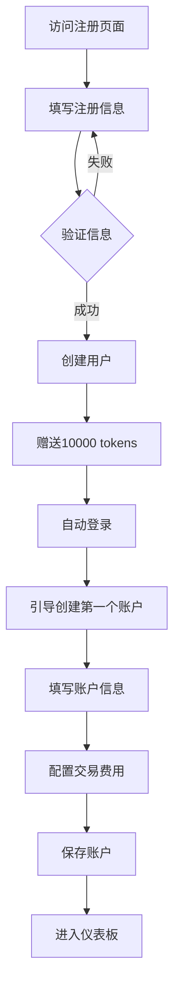

---

#### 3.2.2 持仓导入与价格刷新流程

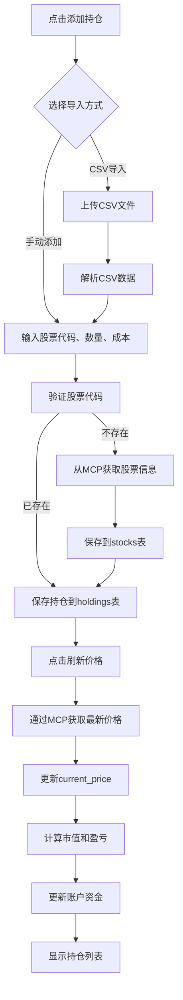

---

#### 3.2.3 AI整体持仓分析流程

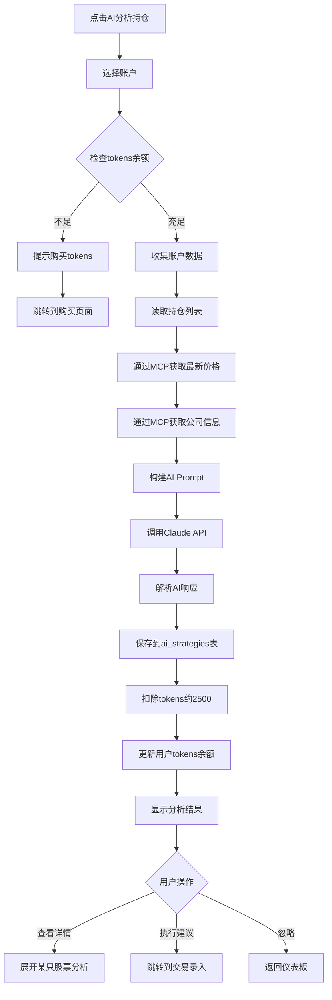

---

#### 3.2.4 交易录入与费用计算流程

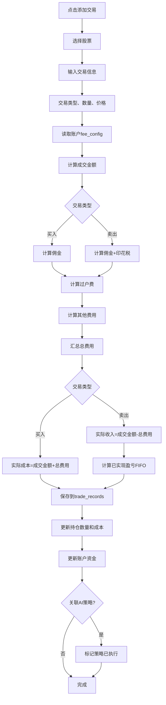

---

#### 3.2.5 AI策略复盘流程

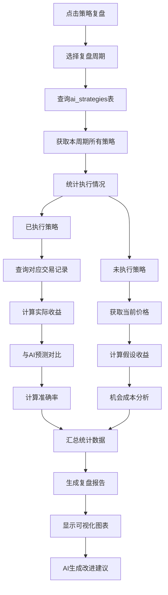

---

#### 3.2.6 手动刷新价格流程

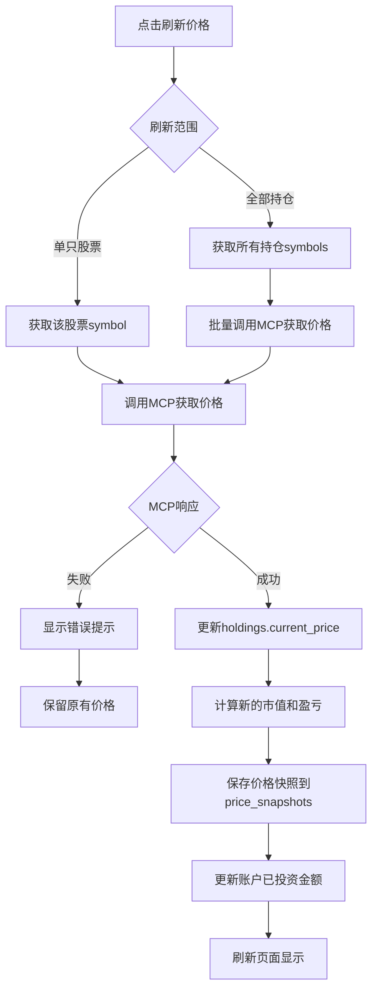

---

#### 3.2.7 策略执行标记流程

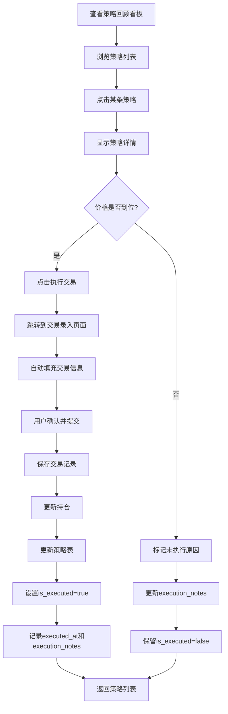

---

#### 3.2.8 费用配置与预估流程

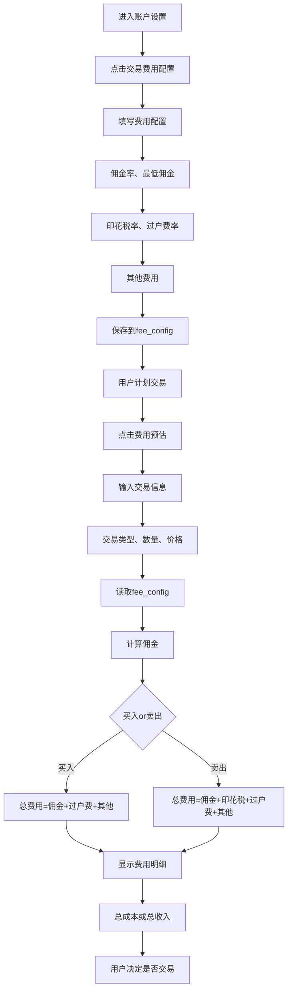

---

### 3.3 关键时序图

#### 3.3.1 AI分析请求时序图

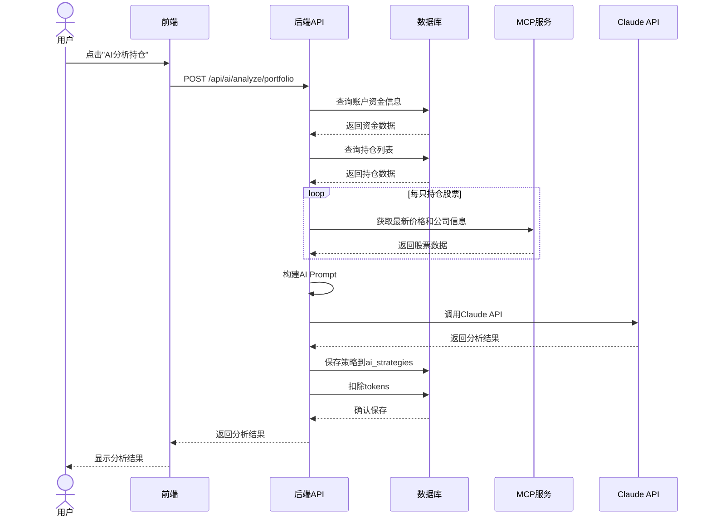

---

#### 3.3.2 交易录入与更新时序图

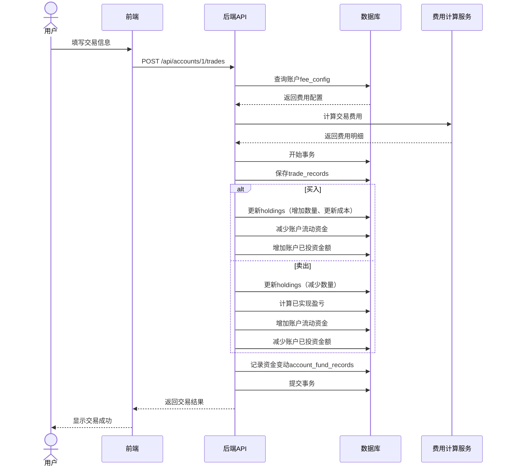

---

### 3.4 状态机图

#### 3.4.1 AI策略状态流转

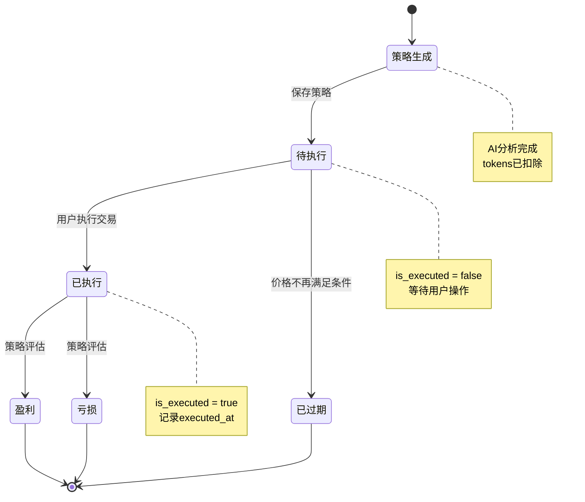

---

#### 3.4.2 交易记录状态流转

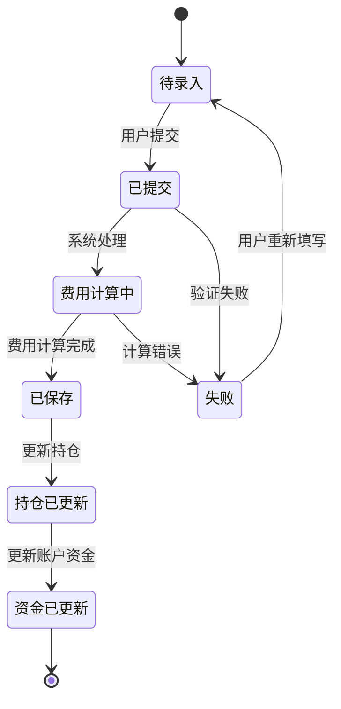

---

### 3.5 数据流图

#### 3.5.1 持仓盈亏计算数据流

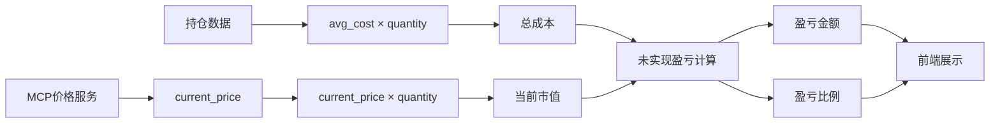

---

#### 3.5.2 账户资金流动数据流

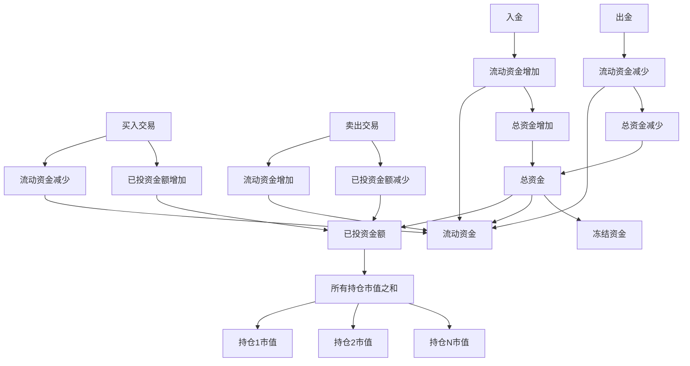

---

## 4. 数据库设计

### 3.1 核心表结构

#### users（用户表）
```sql
CREATE TABLE users (
    id SERIAL PRIMARY KEY,
    username VARCHAR(50) UNIQUE NOT NULL,
    email VARCHAR(100) UNIQUE NOT NULL,
    password_hash VARCHAR(255) NOT NULL,
    full_name VARCHAR(100),

    -- AI Token管理
    ai_tokens_total BIGINT DEFAULT 0,          -- 总购买tokens
    ai_tokens_used BIGINT DEFAULT 0,           -- 已使用tokens
    ai_tokens_remaining BIGINT DEFAULT 0,      -- 剩余tokens

    is_active BOOLEAN DEFAULT TRUE,
    created_at TIMESTAMPTZ DEFAULT NOW(),
    last_login TIMESTAMPTZ,

    INDEX idx_username (username),
    INDEX idx_email (email)
);
```

#### ai_token_transactions（Token交易记录）
```sql
CREATE TABLE ai_token_transactions (
    id SERIAL PRIMARY KEY,
    user_id INTEGER REFERENCES users(id),

    transaction_type VARCHAR(20) NOT NULL,     -- 'purchase', 'consume', 'refund'
    amount BIGINT NOT NULL,                    -- 正数=充值，负数=消耗
    balance_after BIGINT NOT NULL,             -- 交易后余额

    -- 消耗详情（当transaction_type='consume'时）
    related_analysis_id INTEGER,               -- 关联的AI分析记录

    description TEXT,                          -- 描述
    created_at TIMESTAMPTZ DEFAULT NOW(),

    INDEX idx_user_id (user_id),
    INDEX idx_created_at (created_at)
);
```

#### accounts（账户表）
```sql
CREATE TABLE accounts (
    id SERIAL PRIMARY KEY,
    user_id INTEGER REFERENCES users(id) ON DELETE CASCADE,

    name VARCHAR(100) NOT NULL,                -- 账户名称
    broker VARCHAR(100),                       -- 券商
    account_number_last4 VARCHAR(4),           -- 账号后四位

    -- 资金管理
    total_capital NUMERIC(15,2) NOT NULL,      -- 总资金
    invested_amount NUMERIC(15,2) DEFAULT 0,   -- 已投资金额（持仓市值）
    liquid_funds NUMERIC(15,2) DEFAULT 0,      -- 流动资金
    frozen_funds NUMERIC(15,2) DEFAULT 0,      -- 冻结资金

    -- 交易费用配置（JSONB存储，便于扩展）
    fee_config JSONB,                          -- 交易费用配置
    /*
    {
      "commission_rate": 0.0003,       // 佣金率（万3）
      "min_commission": 5.0,           // 最低佣金
      "stamp_duty_rate": 0.001,        // 印花税率（卖出）
      "transfer_fee_rate": 0.00001,    // 过户费率
      "other_fees": {
        "regulatory_fee": 0.00002,     // 证管费
        "handling_fee": 0.0000487      // 经手费
      }
    }
    */

    status VARCHAR(20) DEFAULT 'active',       -- 'active', 'archived'
    created_at TIMESTAMPTZ DEFAULT NOW(),
    updated_at TIMESTAMPTZ DEFAULT NOW(),

    INDEX idx_user_id (user_id),
    INDEX idx_status (status)
);
```

#### stocks（股票信息表）- 全局共享
```sql
CREATE TABLE stocks (
    id SERIAL PRIMARY KEY,
    symbol VARCHAR(20) UNIQUE NOT NULL,        -- 股票代码
    name VARCHAR(100) NOT NULL,
    name_cn VARCHAR(100),

    -- 市场信息
    market VARCHAR(20) NOT NULL,               -- 'A', 'HK', 'US', 'JP'等
    exchange VARCHAR(50),                      -- 交易所：'SSE', 'SZSE', 'HKEX', 'NASDAQ'
    sector VARCHAR(50),                        -- 行业
    industry VARCHAR(100),                     -- 细分行业

    -- 交易规则
    lot_size INTEGER DEFAULT 1,                -- 最小交易单位（A股=100，港股不同，美股=1）
    price_limit_up NUMERIC(5,2),               -- 涨幅限制（A股=10.00，港股/美股=NULL）
    price_limit_down NUMERIC(5,2),             -- 跌幅限制
    currency VARCHAR(3) NOT NULL,              -- 'CNY', 'HKD', 'USD'

    -- 交易时间
    trading_hours JSONB,                       -- {open: "09:30", close: "15:00"}

    -- 公司信息
    company_info JSONB,                        -- {business, advantage, risk, ...}
    financial_data JSONB,                      -- {market_cap, pe_ratio, roe, ...}

    added_by INTEGER REFERENCES users(id),
    created_at TIMESTAMPTZ DEFAULT NOW(),
    updated_at TIMESTAMPTZ DEFAULT NOW(),

    INDEX idx_symbol (symbol),
    INDEX idx_market (market),
    INDEX idx_sector (sector)
);
```

#### holdings（持仓表）
```sql
CREATE TABLE holdings (
    id SERIAL PRIMARY KEY,
    account_id INTEGER REFERENCES accounts(id) ON DELETE CASCADE,
    symbol VARCHAR(20) REFERENCES stocks(symbol),

    -- 持仓数量
    quantity NUMERIC(15,4) NOT NULL,           -- 持仓数量
    available_quantity NUMERIC(15,4) NOT NULL, -- 可用数量

    -- 成本与价格
    avg_cost NUMERIC(15,4) NOT NULL,           -- 平均成本
    current_price NUMERIC(15,4),               -- 当前价格

    -- 盈亏
    market_value NUMERIC(15,2),                -- 市值 = quantity × current_price
    unrealized_pnl NUMERIC(15,2),              -- 未实现盈亏
    unrealized_pnl_pct NUMERIC(8,4),           -- 盈亏比例
    position_ratio NUMERIC(8,4),               -- 持仓占比（占账户总资金）

    -- 标签
    user_tags JSONB,                           -- ['核心持仓', '长期持有']
    ai_tags JSONB,                             -- ['core_long_term', 'watch_carefully']
    ai_reason TEXT,                            -- AI标签理由

    status VARCHAR(20) DEFAULT 'holding',      -- 'holding', 'closed'
    notes TEXT,

    created_at TIMESTAMPTZ DEFAULT NOW(),
    updated_at TIMESTAMPTZ DEFAULT NOW(),

    UNIQUE (account_id, symbol, status),       -- 同一账户同一股票只有一条持仓记录
    INDEX idx_account_id (account_id),
    INDEX idx_symbol (symbol),
    INDEX idx_status (status)
);
```

#### watchlist（关注列表）
```sql
CREATE TABLE watchlist (
    id SERIAL PRIMARY KEY,
    user_id INTEGER REFERENCES users(id) ON DELETE CASCADE,
    account_id INTEGER REFERENCES accounts(id) ON DELETE CASCADE,
    symbol VARCHAR(20) REFERENCES stocks(symbol),

    target_price NUMERIC(15,4),                -- 目标买入价
    notes TEXT,                                -- 关注理由

    created_at TIMESTAMPTZ DEFAULT NOW(),
    updated_at TIMESTAMPTZ DEFAULT NOW(),

    UNIQUE (user_id, account_id, symbol),
    INDEX idx_user_id (user_id),
    INDEX idx_symbol (symbol)
);
```

#### trade_records（交易记录）
```sql
CREATE TABLE trade_records (
    id SERIAL PRIMARY KEY,
    account_id INTEGER REFERENCES accounts(id) ON DELETE CASCADE,
    symbol VARCHAR(20) REFERENCES stocks(symbol),

    trade_type VARCHAR(20) NOT NULL,           -- 'buy', 'sell', 'dividend', 'split'
    trade_date DATE NOT NULL,
    trade_time TIME,

    quantity NUMERIC(15,4) NOT NULL,           -- 数量
    price NUMERIC(15,4) NOT NULL,              -- 价格
    amount NUMERIC(15,2) NOT NULL,             -- 总金额

    -- 费用
    commission NUMERIC(15,2) DEFAULT 0,        -- 佣金
    stamp_duty NUMERIC(15,2) DEFAULT 0,        -- 印花税
    transfer_fee NUMERIC(15,2) DEFAULT 0,      -- 过户费
    total_fee NUMERIC(15,2) DEFAULT 0,         -- 总费用

    -- 已实现盈亏（卖出时）
    realized_pnl NUMERIC(15,2),
    realized_pnl_pct NUMERIC(8,4),

    notes TEXT,
    idempotency_key VARCHAR(64) UNIQUE,        -- 幂等键

    created_at TIMESTAMPTZ DEFAULT NOW(),

    INDEX idx_account_id (account_id),
    INDEX idx_symbol (symbol),
    INDEX idx_trade_date (trade_date),
    INDEX idx_trade_type (trade_type)
);
```

#### ai_strategies（AI策略记录）
```sql
CREATE TABLE ai_strategies (
    id SERIAL PRIMARY KEY,
    user_id INTEGER REFERENCES users(id) ON DELETE CASCADE,
    account_id INTEGER REFERENCES accounts(id),
    symbol VARCHAR(20) REFERENCES stocks(symbol),  -- NULL表示整体分析

    strategy_type VARCHAR(50) NOT NULL,        -- 'portfolio', 'single_stock', 'discovery'

    -- 策略内容
    recommendation JSONB NOT NULL,             -- AI建议（结构化）
    /*
    {
      "action": "buy|sell|hold|add|reduce",
      "target_price_min": 62.0,
      "target_price_max": 64.0,
      "stop_loss": 58.0,
      "target_profit": 85.0,
      "suggested_quantity": 500,
      "suggested_amount": 31500,
      "reason": "消费底部，估值修复空间大",
      "risk_level": "medium"
    }
    */

    -- 当时的快照
    holding_snapshot JSONB,                    -- 持仓快照
    price_snapshot JSONB,                      -- 价格快照
    account_snapshot JSONB,                    -- 资金快照

    -- Token消耗
    tokens_used INTEGER NOT NULL,              -- 本次消耗tokens

    -- 执行情况
    is_executed BOOLEAN DEFAULT FALSE,         -- 是否已执行
    executed_at TIMESTAMPTZ,                   -- 执行时间
    execution_notes TEXT,                      -- 执行备注（如：未执行原因）

    created_at TIMESTAMPTZ DEFAULT NOW(),

    INDEX idx_user_id (user_id),
    INDEX idx_symbol (symbol),
    INDEX idx_strategy_type (strategy_type),
    INDEX idx_created_at (created_at),
    INDEX idx_is_executed (is_executed)
);
```

#### strategy_evaluations（策略评估）
```sql
CREATE TABLE strategy_evaluations (
    id SERIAL PRIMARY KEY,
    strategy_id INTEGER REFERENCES ai_strategies(id) ON DELETE CASCADE,

    -- 评估时间
    evaluation_date DATE NOT NULL,

    -- 策略结果
    actual_action VARCHAR(20),                 -- 实际执行的操作
    actual_price NUMERIC(15,4),                -- 实际执行价格
    actual_quantity NUMERIC(15,4),             -- 实际数量

    -- 收益评估
    profit_loss NUMERIC(15,2),                 -- 盈亏金额
    profit_loss_pct NUMERIC(8,4),              -- 盈亏比例

    -- 如果没执行，假设执行的收益
    hypothetical_pnl NUMERIC(15,2),            -- 假设执行的收益

    evaluation_notes TEXT,                     -- 评估备注

    created_at TIMESTAMPTZ DEFAULT NOW(),

    INDEX idx_strategy_id (strategy_id),
    INDEX idx_evaluation_date (evaluation_date)
);
```

#### price_snapshots（价格快照）
```sql
CREATE TABLE price_snapshots (
    id SERIAL PRIMARY KEY,
    symbol VARCHAR(20) REFERENCES stocks(symbol),

    snapshot_time TIMESTAMPTZ NOT NULL,
    snapshot_type VARCHAR(20) DEFAULT 'manual',  -- 'manual', 'scheduled'

    open NUMERIC(15,4),
    high NUMERIC(15,4),
    low NUMERIC(15,4),
    close NUMERIC(15,4),
    volume BIGINT,

    created_at TIMESTAMPTZ DEFAULT NOW(),

    INDEX idx_symbol (symbol),
    INDEX idx_snapshot_time (snapshot_time)
);
```

#### company_events（公司重大事件表）
```sql
CREATE TABLE company_events (
    id SERIAL PRIMARY KEY,
    user_id INTEGER REFERENCES users(id) ON DELETE CASCADE,
    symbol VARCHAR(20) REFERENCES stocks(symbol),

    -- 事件基本信息
    event_type VARCHAR(50) NOT NULL,           -- 事件类型
    /* event_type枚举值：
       财务类: 'earnings', 'dividend', 'profit_forecast'
       治理类: 'management_change', 'shareholder_change', 'board_resolution'
       业务类: 'major_contract', 'product_launch', 'capacity_expansion'
       市场类: 'merger', 'partnership', 'financing', 'ipo'
       风险类: 'penalty', 'lawsuit', 'fraud', 'warning'
       政策类: 'policy_change', 'subsidy', 'regulation'
    */

    event_date DATE NOT NULL,                  -- 事件发生日期
    event_title VARCHAR(200) NOT NULL,         -- 事件标题
    event_description TEXT,                    -- 事件详情

    -- 影响评估
    price_impact VARCHAR(20),                  -- 'positive', 'negative', 'neutral'
    short_term_impact TEXT,                    -- 短期影响描述
    mid_term_impact TEXT,                      -- 中期影响描述
    long_term_impact TEXT,                     -- 长期影响描述
    ai_score INTEGER,                          -- AI评分 0-100

    -- 股价数据
    price_before NUMERIC(15,4),                -- 事件前股价
    price_after NUMERIC(15,4),                 -- 事件后股价（T+1）
    price_change_pct NUMERIC(8,4),             -- 涨跌幅%

    -- 关联操作
    related_trade_id INTEGER,                  -- 关联的交易记录
    triggered_ai_analysis BOOLEAN DEFAULT FALSE, -- 是否触发了AI分析

    -- 用户备注
    user_notes TEXT,                           -- 用户备注

    -- 提醒设置
    reminder_date DATE,                        -- 提醒日期
    is_reminded BOOLEAN DEFAULT FALSE,         -- 是否已提醒

    created_at TIMESTAMPTZ DEFAULT NOW(),
    updated_at TIMESTAMPTZ DEFAULT NOW(),

    INDEX idx_user_id (user_id),
    INDEX idx_symbol (symbol),
    INDEX idx_event_type (event_type),
    INDEX idx_event_date (event_date),
    INDEX idx_reminder_date (reminder_date)
);
```

#### event_analysis（事件AI分析记录）
```sql
CREATE TABLE event_analysis (
    id SERIAL PRIMARY KEY,
    event_id INTEGER REFERENCES company_events(id) ON DELETE CASCADE,
    user_id INTEGER REFERENCES users(id),

    -- AI分析结果
    analysis_content JSONB NOT NULL,           -- AI分析内容（结构化）
    /*
    {
      "short_term": {
        "prediction": "下跌5-8%",
        "reason": "业绩低于预期",
        "action": "观望"
      },
      "mid_term": {
        "prediction": "Q4改善",
        "reason": "消费旺季",
        "action": "回调后加仓"
      },
      "long_term": {
        "trend": "高端化转型",
        "risk": "成本压力",
        "action": "长期持有"
      },
      "scores": {
        "financial_health": 75,
        "growth": 60,
        "valuation": 70,
        "overall": 65
      }
    }
    */

    tokens_used INTEGER NOT NULL,              -- 消耗的tokens

    created_at TIMESTAMPTZ DEFAULT NOW(),

    INDEX idx_event_id (event_id),
    INDEX idx_created_at (created_at)
);
```

#### macro_events（宏观政策事件表）
```sql
CREATE TABLE macro_events (
    id SERIAL PRIMARY KEY,
    user_id INTEGER REFERENCES users(id) ON DELETE CASCADE,

    -- 事件基本信息
    event_category VARCHAR(50) NOT NULL,       -- 事件大类
    /* event_category枚举值：
       'monetary_policy' - 货币政策
       'economic_data' - 经济数据
       'fiscal_policy' - 财政政策
       'trade_policy' - 贸易政策
       'regulatory_policy' - 监管政策
    */

    event_type VARCHAR(50) NOT NULL,           -- 具体事件类型
    /* event_type示例：
       货币政策: 'fed_rate_hike', 'fed_rate_cut', 'pboc_rrr_cut', 'lpr_adjustment'
       经济数据: 'us_cpi', 'us_ppi', 'us_nonfarm', 'cn_cpi', 'cn_pmi', 'cn_gdp'
       财政政策: 'stimulus_plan', 'tax_policy'
       贸易政策: 'trade_negotiation', 'tariff'
       监管政策: 'industry_regulation', 'antitrust'
    */

    country VARCHAR(20) NOT NULL,              -- 国家/地区：'US', 'CN', 'EU', 'JP'等
    event_date DATE NOT NULL,                  -- 事件发生日期
    event_title VARCHAR(200) NOT NULL,         -- 事件标题
    event_description TEXT,                    -- 事件详情

    -- 数据具体值（针对经济数据）
    data_value NUMERIC(15,4),                  -- 数据值（如CPI 3.7%）
    data_previous NUMERIC(15,4),               -- 前值
    data_expected NUMERIC(15,4),               -- 预期值
    data_unit VARCHAR(20),                     -- 单位：'%', 'bp', '万人'等

    -- 市场影响
    impact_scope VARCHAR(50),                  -- 影响范围：'global', 'regional', 'domestic'
    affected_markets JSONB,                    -- 受影响市场及涨跌幅
    /*
    {
      "US": {"sp500": -1.5, "nasdaq": -2.3},
      "HK": {"hsi": -1.8, "hscei": -2.5},
      "CN": {"sse": -0.8, "szse": -1.2}
    }
    */

    affected_sectors JSONB,                    -- 受影响行业
    /*
    {
      "technology": {"impact": "negative", "change_pct": -2.5},
      "financials": {"impact": "positive", "change_pct": 1.5},
      "consumer": {"impact": "neutral", "change_pct": -0.5},
      "realestate": {"impact": "negative", "change_pct": -3.0}
    }
    */

    -- 对持仓的影响
    portfolio_impact JSONB,                    -- 对我的持仓的影响
    /*
    {
      "overall_impact": -1.2,
      "stocks": {
        "600600": {"impact": "neutral", "change_pct": -0.5, "notes": "国内为主"},
        "00700": {"impact": "negative", "change_pct": -2.5, "notes": "港股科技股"}
      }
    }
    */

    -- 我的应对
    my_response TEXT,                          -- 我的应对措施
    related_trade_ids TEXT[],                  -- 关联的交易ID数组
    triggered_ai_analysis BOOLEAN DEFAULT FALSE,

    -- 提醒设置
    reminder_date DATE,                        -- 提醒日期
    is_reminded BOOLEAN DEFAULT FALSE,
    importance_level INTEGER,                  -- 重要性：1-5星

    created_at TIMESTAMPTZ DEFAULT NOW(),
    updated_at TIMESTAMPTZ DEFAULT NOW(),

    INDEX idx_user_id (user_id),
    INDEX idx_event_category (event_category),
    INDEX idx_event_type (event_type),
    INDEX idx_country (country),
    INDEX idx_event_date (event_date),
    INDEX idx_reminder_date (reminder_date)
);
```

#### macro_event_analysis（宏观事件AI分析）
```sql
CREATE TABLE macro_event_analysis (
    id SERIAL PRIMARY KEY,
    macro_event_id INTEGER REFERENCES macro_events(id) ON DELETE CASCADE,
    user_id INTEGER REFERENCES users(id),

    -- AI分析结果
    analysis_content JSONB NOT NULL,
    /*
    {
      "market_impact": {
        "US": {"forecast": "-2%~-3%", "reason": "高估值压力"},
        "HK": {"forecast": "-1.5%~-2%", "reason": "资金外流"},
        "CN": {"forecast": "-0.5%~-1%", "reason": "人民币贬值压力"}
      },
      "sector_impact": {
        "technology": {"impact": "negative", "forecast": -2.5},
        "financials": {"impact": "positive", "forecast": 1.5},
        "consumer": {"impact": "neutral", "forecast": -0.5}
      },
      "portfolio_impact": {
        "600600": {
          "impact_level": "minor_negative",
          "forecast": -0.5,
          "reason": "主要市场在中国",
          "recommendation": "继续持有"
        },
        "00700": {
          "impact_level": "major_negative",
          "forecast": -2.5,
          "reason": "港股科技股承压",
          "recommendation": "考虑减仓10-20%"
        }
      },
      "strategy_recommendations": {
        "short_term": ["减仓港股科技股", "增持防御板块"],
        "mid_term": ["等待暂停加息信号", "关注国内政策"],
        "risk_control": ["降低Beta", "提高现金仓位"]
      },
      "portfolio_forecast": {
        "before_action": "-1.5%~-2%",
        "after_action": "-0.8%~-1%"
      }
    }
    */

    tokens_used INTEGER NOT NULL,

    created_at TIMESTAMPTZ DEFAULT NOW(),

    INDEX idx_macro_event_id (macro_event_id),
    INDEX idx_created_at (created_at)
);
```

#### account_fund_records（账户资金变动记录）
```sql
CREATE TABLE account_fund_records (
    id SERIAL PRIMARY KEY,
    account_id INTEGER REFERENCES accounts(id) ON DELETE CASCADE,

    record_type VARCHAR(20) NOT NULL,          -- 'deposit', 'withdraw', 'buy', 'sell'
    amount NUMERIC(15,2) NOT NULL,             -- 变动金额（正=入金，负=出金）

    balance_before NUMERIC(15,2),              -- 变动前余额
    balance_after NUMERIC(15,2),               -- 变动后余额

    related_trade_id INTEGER,                  -- 关联的交易记录
    notes TEXT,

    created_at TIMESTAMPTZ DEFAULT NOW(),

    INDEX idx_account_id (account_id),
    INDEX idx_record_type (record_type),
    INDEX idx_created_at (created_at)
);
```

---

## 4. API设计

### 4.1 认证相关
- `POST /api/auth/register` - 注册
- `POST /api/auth/login` - 登录
- `GET /api/auth/me` - 获取当前用户信息
- `PUT /api/auth/password` - 修改密码

### 4.2 AI Token管理
- `GET /api/tokens/balance` - 获取Token余额
- `POST /api/tokens/purchase` - 购买Token
- `GET /api/tokens/transactions` - Token交易记录

### 4.3 账户管理
- `GET /api/accounts` - 获取所有账户
- `POST /api/accounts` - 创建账户
- `GET /api/accounts/:id` - 获取账户详情
- `PUT /api/accounts/:id` - 更新账户
- `DELETE /api/accounts/:id` - 删除账户
- `GET /api/accounts/:id/summary` - 账户汇总（资金、持仓）
- `PUT /api/accounts/:id/fee-config` - 更新交易费用配置
  ```json
  Request: {
    "commission_rate": 0.0003,
    "min_commission": 5.0,
    "stamp_duty_rate": 0.001,
    "transfer_fee_rate": 0.00001,
    "other_fees": {
      "regulatory_fee": 0.00002,
      "handling_fee": 0.0000487
    }
  }
  ```
- `POST /api/accounts/:id/calculate-fee` - 预估交易费用
  ```json
  Request: {
    "trade_type": "buy",
    "quantity": 1000,
    "price": 65.8
  }
  Response: {
    "amount": 65800,
    "commission": 19.74,
    "stamp_duty": 0,
    "transfer_fee": 0.66,
    "other_fees": 3.53,
    "total_fee": 23.93,
    "total_cost": 65823.93
  }
  ```

### 4.4 股票信息
- `GET /api/stocks` - 获取股票列表（分页、搜索、按市场筛选）
- `POST /api/stocks` - 添加新股票
- `GET /api/stocks/:symbol` - 获取股票详情
- `PUT /api/stocks/:symbol` - 更新股票信息

### 4.5 持仓管理
- `GET /api/accounts/:id/holdings` - 获取账户持仓
- `POST /api/accounts/:id/holdings` - 添加持仓
- `PUT /api/holdings/:id` - 更新持仓
- `DELETE /api/holdings/:id` - 删除持仓
- `POST /api/holdings/refresh-price` - 刷新价格（批量）
- `POST /api/holdings/:id/refresh-price` - 刷新单只股票价格

### 4.6 交易记录
- `GET /api/accounts/:id/trades` - 获取交易记录
- `POST /api/accounts/:id/trades` - 添加交易记录（自动计算费用）
  ```json
  Request: {
    "symbol": "600600",
    "trade_type": "buy",
    "quantity": 1000,
    "price": 65.8,
    "trade_date": "2025-01-13",
    "notes": "建仓"
  }
  Response: {
    "id": 123,
    "symbol": "600600",
    "quantity": 1000,
    "price": 65.8,
    "amount": 65800,
    "commission": 19.74,        // 自动计算
    "stamp_duty": 0,            // 买入无印花税
    "transfer_fee": 0.66,       // 自动计算
    "total_fee": 23.93,         // 自动计算
    "total_cost": 65823.93,     // 成交金额 + 总费用
    "created_at": "2025-01-13T10:30:00Z"
  }
  ```
- `POST /api/accounts/:id/trades/import` - 批量导入交易记录
- `GET /api/accounts/:id/trades/fees-summary` - 费用统计
  ```json
  Response: {
    "period": "2025-01",
    "total_commission": 1234.56,
    "total_stamp_duty": 876.54,
    "total_transfer_fee": 12.34,
    "total_fees": 2123.44,
    "trade_count": 48
  }
  ```

### 4.7 关注列表
- `GET /api/watchlist` - 获取关注列表
- `POST /api/watchlist` - 添加关注
- `DELETE /api/watchlist/:id` - 移除关注

### 4.8 AI分析
- `POST /api/ai/analyze/portfolio` - 分析整体持仓
  ```json
  Request: {
    "account_id": 1,
    "depth": "detailed"
  }
  Response: {
    "tokens_used": 2500,
    "tokens_remaining": 97500,
    "analysis": {
      "account_summary": {...},
      "holdings_analysis": [...],
      "fund_usage_advice": {...},
      "portfolio_advice": {...}
    }
  }
  ```

- `POST /api/ai/analyze/stock` - 分析单只股票
  ```json
  Request: {
    "symbol": "600600",
    "account_id": 1
  }
  Response: {
    "tokens_used": 5000,
    "tokens_remaining": 92500,
    "analysis": {
      "my_position": {...},
      "fundamental": {...},
      "technical": {...},
      "recommendation": {...}
    }
  }
  ```

- `POST /api/ai/discover` - 发现投资机会
  ```json
  Request: {
    "account_id": 1,
    "sector": "科技",
    "risk_preference": "稳健",
    "max_investment": 50000
  }
  Response: {
    "tokens_used": 3000,
    "tokens_remaining": 89500,
    "recommendations": [...]
  }
  ```

### 4.9 策略管理
- `GET /api/strategies` - 获取策略列表（支持筛选、分页）
- `GET /api/strategies/:id` - 获取策略详情
- `PUT /api/strategies/:id/execution` - 更新策略执行情况
  ```json
  {
    "is_executed": true,
    "executed_at": "2025-11-05T10:30:00Z",
    "execution_notes": "按建议在63元买入500股"
  }
  ```

### 4.10 策略复盘
- `GET /api/review/strategies` - 策略回顾看板（列表）
- `GET /api/review/summary` - 复盘汇总
  ```json
  {
    "period": "weekly",
    "date_range": ["2025-11-01", "2025-11-07"],
    "execution_rate": {...},
    "accuracy_rate": {...},
    "fund_utilization": {...},
    "improvements": [...]
  }
  ```
- `POST /api/review/evaluate/:strategyId` - 评估策略效果

### 4.11 公司事件管理
- `GET /api/stocks/:symbol/events` - 获取股票的事件列表
- `POST /api/stocks/:symbol/events` - 添加重大事件
  ```json
  Request: {
    "event_type": "earnings",
    "event_date": "2025-10-29",
    "event_title": "Q3财报：营收+5%，净利润-3%",
    "event_description": "营收120亿元(+5%),净利润8.5亿元(-3%),毛利率42%(-1.2pct)",
    "price_impact": "negative",
    "price_before": 68.5,
    "price_after": 65.8,
    "user_notes": "业绩略低于预期，等待Q4表现",
    "trigger_ai_analysis": true
  }
  Response: {
    "id": 456,
    "event_type": "earnings",
    "event_title": "Q3财报：营收+5%，净利润-3%",
    "price_change_pct": -3.94,
    "ai_analysis": {
      "short_term": {...},
      "mid_term": {...},
      "long_term": {...},
      "scores": {...}
    },
    "tokens_used": 3500,
    "created_at": "2025-10-29T15:00:00Z"
  }
  ```
- `PUT /api/events/:id` - 更新事件信息
- `DELETE /api/events/:id` - 删除事件
- `GET /api/events/:id` - 获取事件详情（含AI分析）
- `POST /api/events/:id/analyze` - 对已有事件进行AI分析
  ```json
  Response: {
    "analysis": {
      "short_term": {
        "prediction": "下跌5-8%",
        "reason": "业绩低于预期，市场情绪偏负面",
        "action": "观望，等待回调至62-64元"
      },
      "mid_term": {
        "prediction": "Q4业绩有望改善",
        "reason": "进入消费旺季，高端产品放量",
        "action": "回调后可考虑加仓"
      },
      "long_term": {
        "trend": "高端化转型继续推进",
        "risk": "原材料成本压力持续",
        "action": "长期持有，关注成本控制进展"
      },
      "scores": {
        "financial_health": 75,
        "growth": 60,
        "valuation": 70,
        "overall": 65
      }
    },
    "tokens_used": 3500
  }
  ```
- `GET /api/events/timeline` - 事件时间线（多只股票）
  ```json
  Request: {
    "symbols": ["600600", "00700"],
    "start_date": "2025-01-01",
    "end_date": "2025-12-31",
    "event_types": ["earnings", "dividend"]
  }
  Response: {
    "events": [
      {
        "date": "2025-10-29",
        "symbol": "600600",
        "name": "青岛啤酒",
        "event_type": "earnings",
        "event_title": "Q3财报",
        "price_impact": "negative",
        "price_change_pct": -3.94,
        "related_trade_id": null
      },
      ...
    ]
  }
  ```
- `GET /api/events/statistics` - 事件统计分析
  ```json
  Request: {
    "symbol": "600600",
    "period": "1year"
  }
  Response: {
    "symbol": "600600",
    "total_events": 9,
    "by_type": {
      "earnings": {"count": 4, "avg_impact": -1.2},
      "dividend": {"count": 2, "avg_impact": -2.0},
      "management_change": {"count": 1, "avg_impact": 3.5},
      "product_launch": {"count": 1, "avg_impact": 2.0},
      "shareholder_change": {"count": 1, "avg_impact": 3.0}
    },
    "user_response_rate": 22,
    "trades_after_events": 2
  }
  ```
- `GET /api/events/reminders` - 获取待提醒事件
- `PUT /api/events/:id/remind` - 设置事件提醒

### 4.12 宏观事件管理
- `GET /api/macro-events` - 获取宏观事件列表
  ```json
  Request: {
    "category": "monetary_policy",
    "country": "US",
    "start_date": "2025-01-01",
    "end_date": "2025-12-31"
  }
  ```
- `POST /api/macro-events` - 添加宏观事件
  ```json
  Request: {
    "event_category": "monetary_policy",
    "event_type": "fed_rate_hike",
    "country": "US",
    "event_date": "2025-11-07",
    "event_title": "美联储加息25个基点至5.25%-5.50%",
    "event_description": "加息25bp，投票11-1，鲍威尔表态通胀需进一步降温",
    "data_value": 5.375,
    "data_previous": 5.125,
    "data_unit": "%",
    "impact_scope": "global",
    "affected_markets": {
      "US": {"sp500": -1.5, "nasdaq": -2.3},
      "HK": {"hsi": -1.8},
      "CN": {"sse": -0.8}
    },
    "affected_sectors": {
      "technology": {"impact": "negative", "change_pct": -2.5},
      "financials": {"impact": "positive", "change_pct": 1.5}
    },
    "my_response": "减仓腾讯控股",
    "related_trade_ids": ["123"],
    "trigger_ai_analysis": true,
    "importance_level": 5
  }
  Response: {
    "id": 789,
    "event_title": "美联储加息25个基点至5.25%-5.50%",
    "ai_analysis": {
      "market_impact": {...},
      "sector_impact": {...},
      "portfolio_impact": {...}
    },
    "tokens_used": 4500,
    "created_at": "2025-11-07T15:00:00Z"
  }
  ```
- `PUT /api/macro-events/:id` - 更新宏观事件
- `DELETE /api/macro-events/:id` - 删除宏观事件
- `GET /api/macro-events/:id` - 获取事件详情（含AI分析）
- `POST /api/macro-events/:id/analyze` - AI分析宏观事件影响
  ```json
  Response: {
    "market_impact": {
      "US": {"forecast": "-2%~-3%", "reason": "高估值压力"},
      "HK": {"forecast": "-1.5%~-2%", "reason": "资金外流"},
      "CN": {"forecast": "-0.5%~-1%", "reason": "人民币贬值"}
    },
    "sector_impact": {
      "technology": {"impact": "negative", "forecast": -2.5, "reason": "融资成本上升"},
      "financials": {"impact": "positive", "forecast": 1.5, "reason": "利差扩大"}
    },
    "portfolio_impact": {
      "600600": {
        "impact_level": "minor_negative",
        "forecast": -0.5,
        "reason": "主要市场在中国，美联储影响有限",
        "recommendation": "继续持有，影响可忽略"
      },
      "00700": {
        "impact_level": "major_negative",
        "forecast": -2.5,
        "reason": "港股科技股，高估值压力大",
        "recommendation": "考虑减仓10-20%，降低风险敞口"
      }
    },
    "strategy_recommendations": {
      "short_term": ["减仓港股科技股（腾讯）10-20%", "增持防御性板块"],
      "mid_term": ["等待暂停加息信号", "关注国内反向政策"],
      "risk_control": ["降低组合Beta值", "提高现金仓位至40%"]
    },
    "portfolio_forecast": {
      "before_action": "-1.5%~-2%",
      "after_action": "-0.8%~-1%"
    },
    "tokens_used": 4500
  }
  ```
- `GET /api/macro-events/timeline` - 宏观事件时间线
  ```json
  Request: {
    "categories": ["monetary_policy", "economic_data"],
    "countries": ["US", "CN"],
    "start_date": "2025-01-01",
    "end_date": "2025-12-31"
  }
  Response: {
    "events": [
      {
        "date": "2025-11-07",
        "country": "US",
        "category": "monetary_policy",
        "event_type": "fed_rate_hike",
        "event_title": "美联储加息25bp",
        "importance_level": 5,
        "market_impact": {"US": -1.5, "HK": -1.8, "CN": -0.8},
        "my_response": "减仓腾讯控股",
        "related_trades_count": 1
      },
      ...
    ]
  }
  ```
- `GET /api/macro-events/statistics` - 宏观事件统计分析
  ```json
  Request: {
    "period": "1year"
  }
  Response: {
    "total_events": 23,
    "by_category": {
      "monetary_policy": {"count": 5, "avg_portfolio_impact": -1.2},
      "economic_data": {"count": 12, "avg_portfolio_impact": -0.3},
      "fiscal_policy": {"count": 3, "avg_portfolio_impact": 0.8},
      "trade_policy": {"count": 2, "avg_portfolio_impact": -0.8},
      "regulatory_policy": {"count": 1, "avg_portfolio_impact": -1.5}
    },
    "portfolio_sensitivity": {
      "us_monetary_policy": -1.2,
      "cn_monetary_policy": 1.8,
      "us_cpi": -0.5,
      "cn_gdp": 0.6
    },
    "my_response_rate": 35,
    "trades_after_events": 8
  }
  ```
- `GET /api/macro-events/calendar` - 重要数据发布日历
  ```json
  Request: {
    "month": "2025-11",
    "importance_level": 4
  }
  Response: {
    "upcoming_events": [
      {
        "date": "2025-11-14",
        "time": "21:30",
        "country": "US",
        "event_type": "us_cpi",
        "event_title": "美国10月CPI数据",
        "importance_level": 5,
        "expected_value": 3.3,
        "previous_value": 3.7,
        "unit": "%",
        "market_consensus": "通胀回落",
        "reminder_set": true
      },
      {
        "date": "2025-11-22",
        "time": "03:00",
        "country": "US",
        "event_type": "fed_minutes",
        "event_title": "美联储11月会议纪要",
        "importance_level": 4,
        "reminder_set": false
      },
      ...
    ]
  }
  ```
- `GET /api/macro-events/impact-backtest` - 历史影响回测
  ```json
  Request: {
    "event_type": "fed_rate_hike",
    "lookback_period": "2years"
  }
  Response: {
    "event_type": "fed_rate_hike",
    "occurrence_count": 8,
    "avg_market_impact": {
      "US": -1.8,
      "HK": -1.5,
      "CN": -0.6
    },
    "my_portfolio_impact": {
      "avg": -1.2,
      "max": -2.5,
      "min": -0.3,
      "beta": 1.2
    },
    "best_performing_stocks": [
      {"symbol": "600036", "name": "招商银行", "avg_change": 1.2}
    ],
    "worst_performing_stocks": [
      {"symbol": "00700", "name": "腾讯控股", "avg_change": -2.8}
    ],
    "recommendations": [
      "降低组合对美联储政策的敏感度（Beta 1.2 → 1.0）",
      "加息周期降低仓位或增持防御股",
      "提前减仓高估值科技股"
    ]
  }
  ```
- `PUT /api/macro-events/:id/remind` - 设置事件提醒

---

## 5. 技术架构

### 5.1 技术栈
**后端**：
- TypeScript + NestJS
- PostgreSQL 14+
- Prisma ORM
- JWT认证
- Claude API（AI分析）
- MCP客户端（股票数据）
- BullMQ（可选，定时任务）
- Redis（缓存、会话）

**前端**：
- React 18 + TypeScript
- Ant Design / shadcn/ui
- Zustand / Redux Toolkit
- Apache ECharts（图表）
- Axios

**部署**：
- Docker + Docker Compose
- Nginx

### 5.2 MCP集成
- **A股数据**：akshare MCP服务器
- **港股/美股数据**：自建或第三方MCP服务器
- **数据刷新**：用户手动触发，通过MCP获取最新价格

---

## 6. 实施计划

### Phase 1：基础框架（2周）
- [ ] 项目搭建（NestJS + React）
- [ ] 数据库设计 + Prisma Schema
- [ ] 用户认证（注册/登录/JWT）
- [ ] AI Token管理
- [ ] 前端布局框架

### Phase 2：账户与持仓（2周）
- [ ] 账户管理CRUD
- [ ] 资金管理（总资金、已投资、流动资金）
- [ ] 股票信息库（多市场支持）
- [ ] 持仓管理CRUD
- [ ] 手动刷新价格（MCP集成）

### Phase 3：交易与关注（1周）
- [ ] 交易记录管理
- [ ] 关注列表管理
- [ ] 已实现盈亏计算

### Phase 4：AI集成（2周）
- [ ] Claude API集成
- [ ] 整体持仓分析
- [ ] 单股深度分析
- [ ] 投资机会发现
- [ ] Token消耗追踪

### Phase 5：策略与复盘（2周）
- [ ] 策略记录（自动保存AI分析结果）
- [ ] 策略回顾看板
- [ ] 策略执行标记
- [ ] 复盘功能
  - 执行率统计
  - 准确率统计
  - 资金利用率分析
- [ ] 策略评估

### Phase 6：可视化与优化（2周）
- [ ] 仪表板（总览、账户列表、AI提醒）
- [ ] 持仓页面（表格、图表）
- [ ] 策略回顾可视化
- [ ] 复盘报告可视化
- [ ] 性能优化

### Phase 7：测试与上线（1周）
- [ ] 测试（单元、集成、端到端）
- [ ] Docker部署
- [ ] 数据备份策略
- [ ] 上线

---

## 7. 关键功能示例

### 7.1 AI分析流程（基于流动资金）

```
用户点击"分析持仓"
  ↓
1. 后端读取账户数据
   - 总资金：30万
   - 已投资：14.5万（48.3%）
   - 流动资金：15.5万（51.7%）
  ↓
2. 读取持仓列表
   - 青岛啤酒：1600股 @ 78.4元，现价65.8元
   - 腾讯控股：100股 @ 632港元，现价650港元
   - ...
  ↓
3. 通过MCP获取最新数据
   - 实时价格
   - 公司财报
   - 近期新闻
  ↓
4. 构建AI Prompt
   """
   你是投资顾问。分析以下账户：

   【账户信息】
   - 总资金：30万
   - 已投资：14.5万（48.3%）
   - 流动资金：15.5万（51.7%）← 重点

   【持仓明细】
   1. 青岛啤酒（600600）
      - 数量：1600股，成本：78.4元，现价：65.8元
      - 盈亏：-20,169元（-16.1%）
      - 最小交易单位：100股
   ...

   请提供：
   1. 每只股票的操作建议（结合流动资金）
   2. 流动资金使用建议（应该买什么、买多少）
   3. 组合优化建议
   """
  ↓
5. 调用Claude API
   - 消耗tokens：2500
   - 更新用户余额：100,000 → 97,500
  ↓
6. 解析AI响应
  ↓
7. 保存到ai_strategies表
   - 记录建议内容
   - 记录持仓快照
   - 记录资金快照
   - 记录tokens消耗
  ↓
8. 返回结果给前端
```

### 7.2 策略复盘流程

```
用户点击"周度复盘"
  ↓
1. 查询本周所有AI策略
   - 时间范围：2025-11-01 ~ 2025-11-07
   - 总策略数：20条
  ↓
2. 统计执行情况
   - 已执行：12条（60%）
   - 未执行：8条（40%）
     * 价格未到：5条
     * 资金不足：2条
     * 手动放弃：1条
  ↓
3. 评估已执行策略
   - 对每条已执行策略：
     * 查询当时建议价格
     * 查询实际执行价格
     * 查询当前价格
     * 计算收益率
  ↓
4. 评估未执行策略
   - 对每条未执行策略：
     * 假设按建议价格执行
     * 计算假设收益
     * 对比实际情况（错过or避免亏损）
  ↓
5. 生成复盘报告
   - 执行率：60%
   - 准确率：66.7%
   - 平均收益：+3.2%
   - 资金利用率：55%
   - 改进建议：...
  ↓
6. 可视化展示
   - 图表：执行率饼图、收益柱状图、净值曲线
```

---

## 8. 风险与挑战

### 8.1 技术风险
| 风险 | 影响 | 缓解措施 |
|------|------|----------|
| MCP服务不稳定 | 价格获取失败 | 多MCP源备份、手动输入降级 |
| Claude API限流 | AI功能不可用 | 重试机制、队列 |
| 数据库性能 | 查询慢 | 索引优化、缓存 |
| 汇率转换 | 跨市场资金计算不准 | 接入汇率API |

### 8.2 产品风险
| 风险 | 影响 | 缓解措施 |
|------|------|----------|
| AI建议不准确 | 用户亏损 | 免责声明、用户教育 |
| 流动资金计算错误 | 操作建议失误 | 严格测试、人工审核 |
| Token消耗过快 | 成本高 | 限制调用频率、提供套餐 |

---

## 9. 成功指标

### MVP阶段（3个月）
- 注册用户：100+
- 日活用户：20+
- AI分析调用：200+/周
- 策略记录：500+条
- 用户留存（7日）：40%+

### 产品成熟期（6个月）
- 注册用户：500+
- 月活用户：100+
- AI策略准确率：60%+
- 用户平均收益率：正收益
- Token购买转化率：30%+

---

## 10. 未来扩展

### Phase 2（6个月后）
- [ ] OCR导入持仓
- [ ] 移动端App
- [ ] 策略回测（历史数据回测）
- [ ] 智能提醒（价格到达、止损触发）
- [ ] 社区功能（分享策略）

### Phase 3（12个月后）
- [ ] 量化策略（简化版PRD v2）
- [ ] 多用户协作（家庭账户）
- [ ] 付费订阅模式
- [ ] 开放API（第三方接入）

---

## 11. 附录

### 11.1 交易规则参考
**A股：**
- 最小单位：100股（1手）
- 涨跌幅：±10%（ST股±5%，科创板/创业板±20%）
- 交易时间：9:30-11:30, 13:00-15:00

**港股：**
- 最小单位：不固定（每只股票不同）
  - 腾讯（00700）：100股
  - 阿里（09988）：100股
  - 比亚迪（01211）：500股
- 涨跌幅：无限制
- 交易时间：9:30-12:00, 13:00-16:00

**美股：**
- 最小单位：1股
- 涨跌幅：无限制
- 交易时间：09:30-16:00 ET（夏令时）

---

**变更记录**
| 版本 | 日期 | 变更内容 | 作者 |
|------|------|----------|------|
| v3.0 | 2025-01-13 | 基于用户反馈重新设计 | Claude |

---
