# PRD v3 — AI驱动的个人投资管理与复盘系统

**版本**: v3.1
**状态**: 待评审
**日期**: 2025-01-14
**范围**: 多账户投资管理、AI策略生成、策略复盘、资金流动性管理、事件分析与追踪

**v3.1 更新**:
- ✨ 新增完整的事件分析与追踪体系（2.9章节）
  - 四大类事件（政策/公司/市场/行业）、16种子类型
  - AI事件影响分析与预测
  - 事件时间线与可视化
  - 事件与持仓/策略的深度集成
  - 定时任务与智能提醒

---
## 3. 场景用例与流程图

### 3.1 用户故事（User Stories）

#### 3.1.1 新用户注册与首次使用
**作为** 一个新用户
**我想要** 注册账号并创建我的第一个账户
**以便于** 开始管理我的股票投资

**验收标准**：
- 用户可以通过邮箱注册
- 注册后自动登录
- 引导用户创建第一个账户（券商账户）
- 配置交易费用
- 赠送1万tokens试用

**流程**：
1. 访问注册页面
2. 输入用户名、邮箱、密码
3. 验证邮箱（可选）
4. 自动登录
5. 引导页："创建你的第一个账户"
6. 输入账户信息（华泰证券、总资金30万、佣金万3）
7. 完成，进入仪表板

---

#### 3.1.2 导入现有持仓
**作为** 一个已有持仓的投资者
**我想要** 快速导入我的持仓信息
**以便于** 立即开始使用AI分析

**验收标准**：
- 支持手动逐条添加
- 支持CSV批量导入
- 自动计算持仓市值和盈亏
- 自动更新账户的已投资金额和流动资金

**流程**：
1. 进入"华泰证券"账户
2. 点击"添加持仓"或"批量导入"
3. 手动输入：
   - 股票代码：600600
   - 数量：1600股
   - 平均成本：78.4元
4. 点击"刷新价格"（通过MCP获取当前价：65.8元）
5. 系统自动计算：
   - 市值：105,280元
   - 盈亏：-20,169元（-16.1%）
6. 更新账户资金：
   - 已投资金额增加105,280元
   - 流动资金减少105,280元

---

#### 3.1.3 AI分析整体持仓
**作为** 一个持有多只股票的投资者
**我想要** AI分析我的整体持仓并给出操作建议
**以便于** 做出更好的投资决策

**验收标准**：
- AI分析所有持仓股票
- 基于流动资金给出操作建议
- 显示组合层面的风险提示
- 记录策略到数据库供后续复盘
- 扣除相应tokens

**流程**：
1. 点击"AI分析持仓"
2. 选择账户（或分析所有账户）
3. 系统收集数据：
   - 账户资金情况（总资金、已投资、流动资金）
   - 所有持仓信息
   - 通过MCP获取最新价格和公司信息
4. 调用Claude API分析
5. 显示分析结果：
   - 每只股票的操作建议
   - 流动资金使用建议
   - 组合优化建议
6. 保存策略到ai_strategies表
7. 扣除tokens（约2500）
8. 提示：剩余97,500 tokens

---

#### 3.1.4 执行AI建议并记录
**作为** 一个认同AI建议的投资者
**我想要** 执行AI建议并记录交易
**以便于** 后续复盘策略效果

**验收标准**：
- 可以查看AI历史建议
- 执行交易时自动计算费用
- 交易完成后可以标记对应策略为"已执行"
- 更新持仓和账户资金

**流程**：
1. 查看策略回顾看板
2. 找到"2025-01-13的建议：青岛啤酒62-64元加仓500股"
3. 当前价格：63元（满足条件）
4. 点击"执行交易"
5. 跳转到交易录入页面（自动填充）：
   - 股票：600600
   - 操作：买入
   - 数量：500股
   - 价格：63元
6. 系统自动计算费用：
   - 成交金额：31,500元
   - 佣金：9.45元
   - 总费用：12.06元
   - 实际成本：31,512.06元
7. 确认提交
8. 更新持仓：
   - 原有：1600股 @ 78.4元
   - 新增：500股 @ 63元
   - 新平均成本：75.72元（加权平均）
9. 标记策略"已执行"
10. 记录执行信息供复盘

---

#### 3.1.5 周度复盘
**作为** 一个注重复盘的投资者
**我想要** 每周复盘AI策略的执行情况和效果
**以便于** 改进我的投资纪律和决策质量

**验收标准**：
- 显示本周所有AI策略
- 统计执行率和准确率
- 计算已执行策略的实际收益
- 分析未执行策略的机会成本
- 给出改进建议

**流程**：
1. 点击"策略复盘"
2. 选择"本周（2025-01-06至2025-01-12）"
3. 显示统计：
   - 总策略数：20条
   - 已执行：12条（60%）
   - 未执行：8条（40%）
     * 价格未到：5条
     * 资金不足：2条
     * 手动放弃：1条
4. 已执行策略效果：
   - 盈利：8条（66.7%）
   - 亏损：4条（33.3%）
   - 平均收益：+3.2%
5. 未执行策略分析：
   - 错过机会：宁德时代建议买入未执行，错过+5.2%
   - 避免亏损：万科A建议加仓未执行，避免-8%
6. 改进建议：
   - 提高执行纪律，特别是价格到位时
   - 保持充足流动资金（当前45%）
   - 设置价格提醒避免错过

---

### 3.2 核心流程图

#### 3.2.1 用户注册与账户创建流程

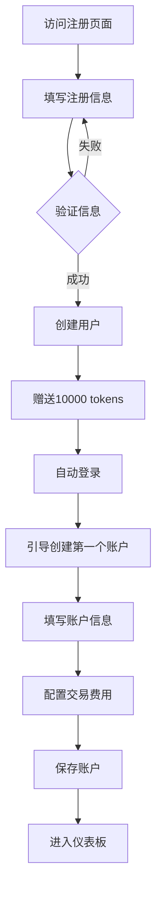

---

#### 3.2.2 持仓导入与价格刷新流程

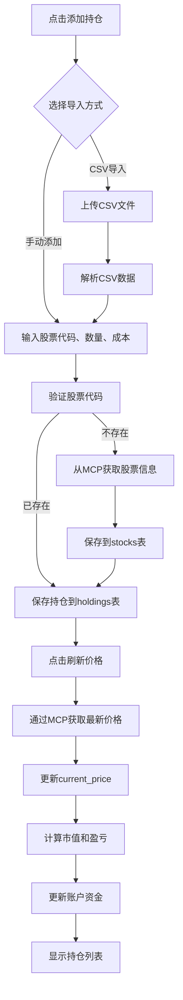

---

#### 3.2.3 AI整体持仓分析流程

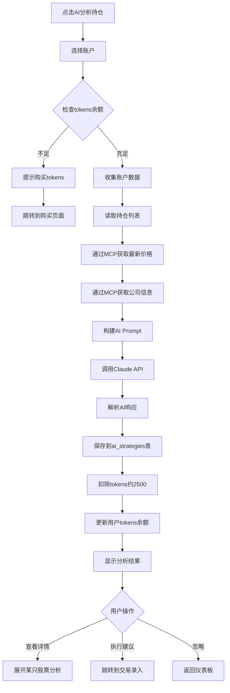

---

#### 3.2.4 交易录入与费用计算流程

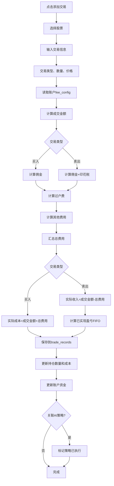

---

#### 3.2.5 AI策略复盘流程

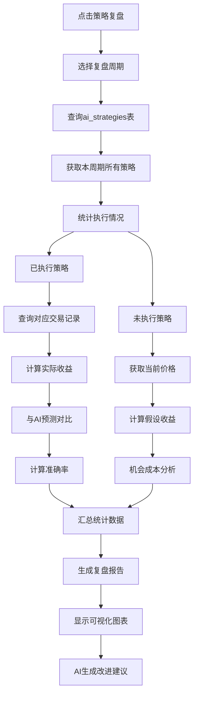

---

#### 3.2.6 手动刷新价格流程

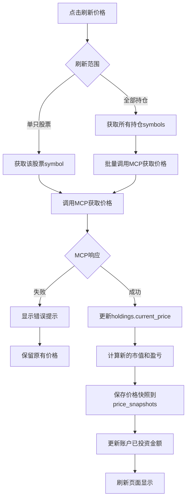

---

#### 3.2.7 策略执行标记流程

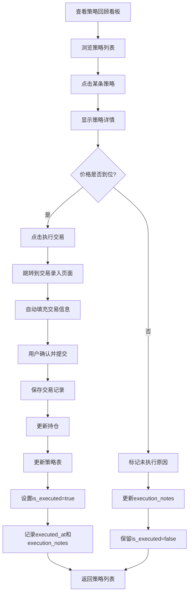

---

#### 3.2.8 费用配置与预估流程

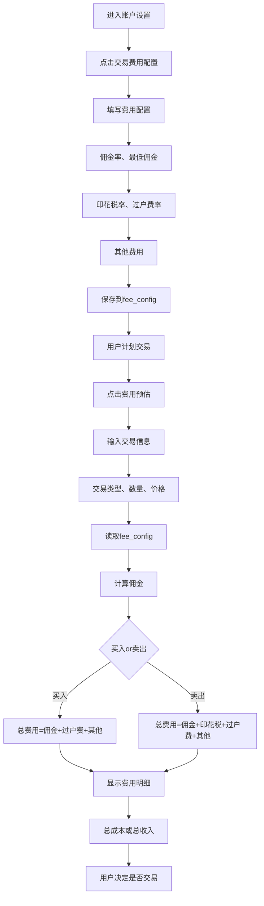

---

### 3.3 关键时序图

#### 3.3.1 AI分析请求时序图

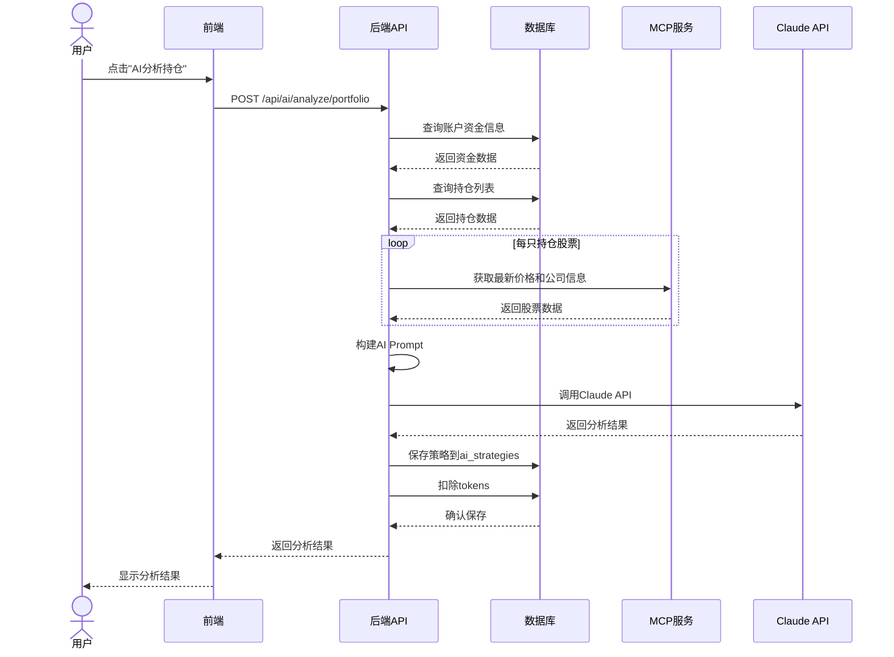

---

#### 3.3.2 交易录入与更新时序图

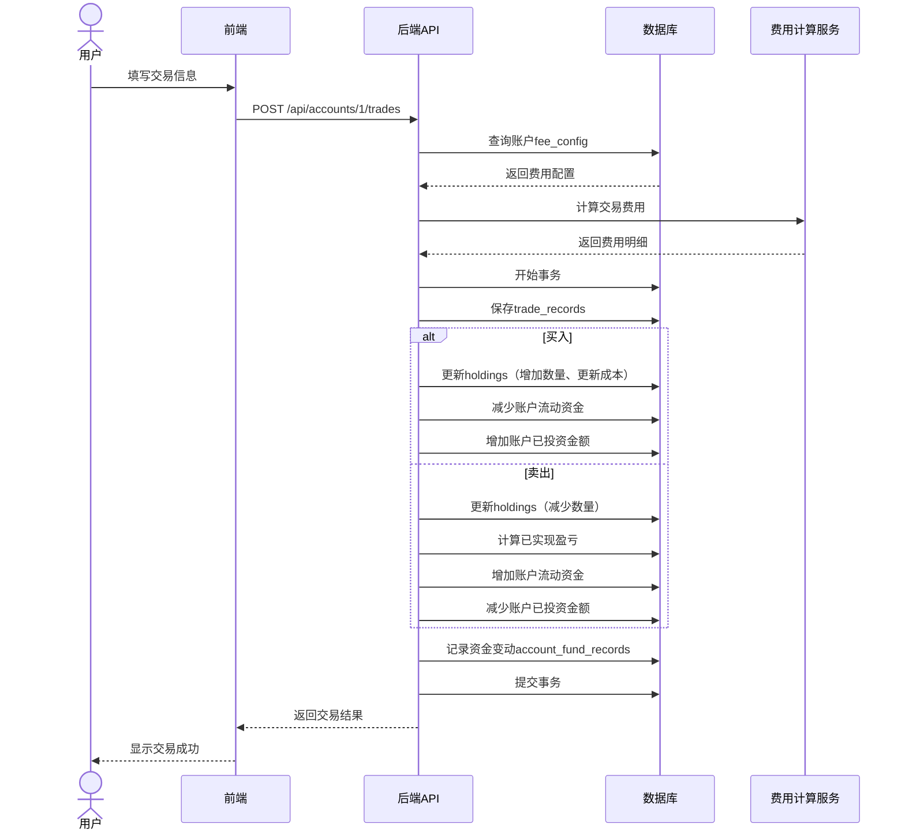

---

### 3.4 状态机图

#### 3.4.1 AI策略状态流转

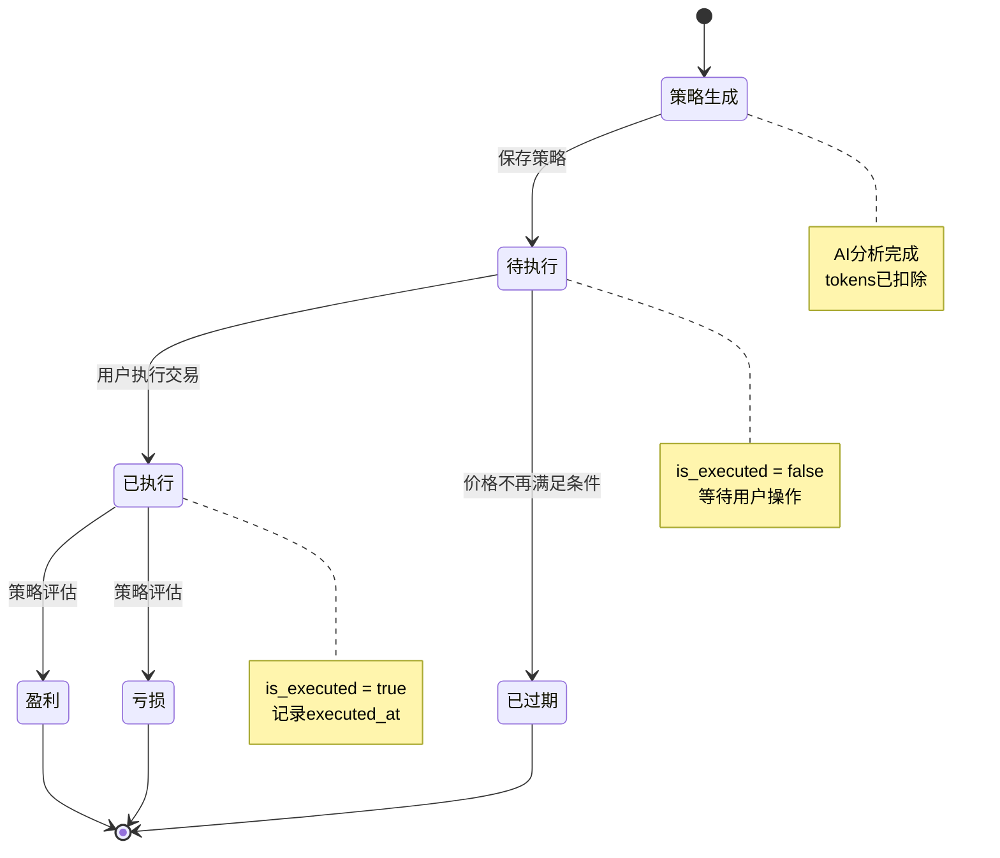

---

#### 3.4.2 交易记录状态流转

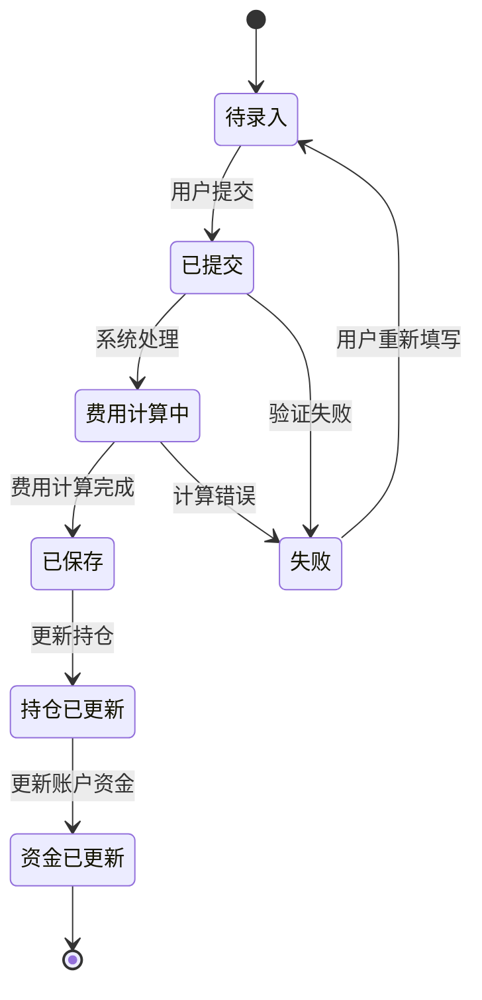

---

### 3.5 数据流图

#### 3.5.1 持仓盈亏计算数据流

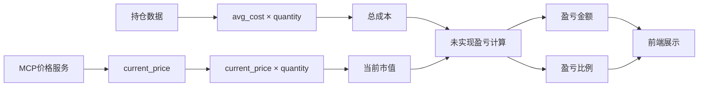

---

#### 3.5.2 账户资金流动数据流

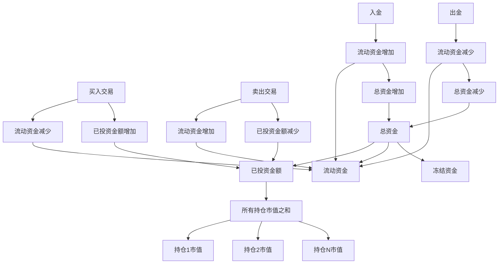

---

